# Автостопом по веб-платформе

  
  

    
Мария Кондаурова

    
BIOCAD

  

---
layout: section
sectionNumber: '1'
docNumber: "Автостопом по веб-платформе"
---

# Глава 1

## Что такое веб-платформа?

<template v-slot:descriptor>
Или как зарождался веб
</template>

---

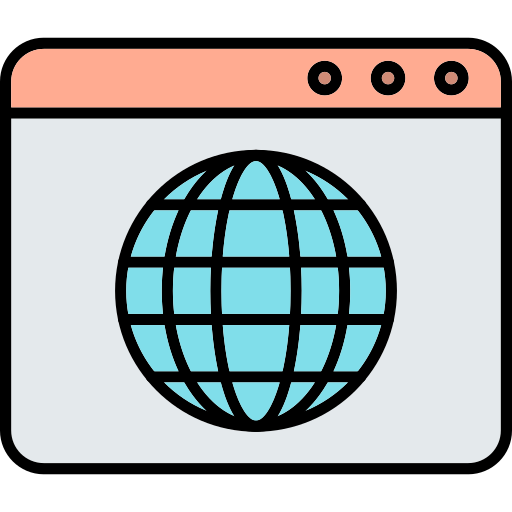

Веб-платформа = Браузер + API + стандарты + тесты + комитеты

---
layout: statement
---

# Но с чего всё начиналось?
---
layout: image-full
---
<template v-slot:image>
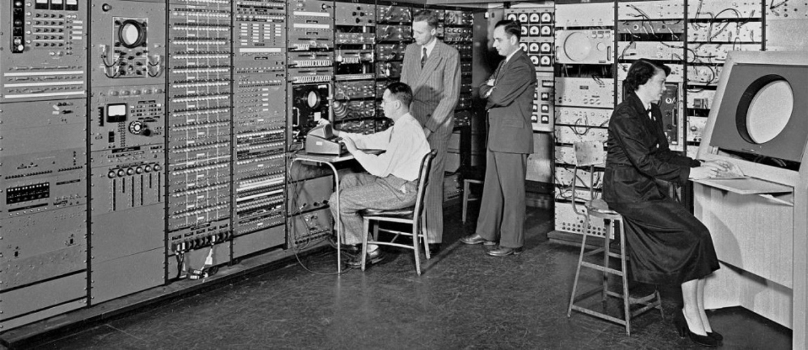
</template>

# Первый в мире компьютер Eniac
---
layout: image-full
---
<template v-slot:image>

</template>

# Современный компьютер
---

| Параметр            | ENIAC (1945)                                | iPhone 17 Pro (2025)                      |
|:--------------------|:--------------------------------------------|:------------------------------------------|
| Операций в секунду  | ≈5 000 сложений/сек ≈357 умножений/сек   | ≥6 000 000 000 000 операций/сек           |
| Память              | **20 слов** (10‑разрядные десятичные числа) | **6–8 ГБ** ОЗУ, до 1 ТБ постоянной памяти |
| Потребление энергии | ≈174 кВт                                    | ~10 Вт (пиковая нагрузка SoC)             |

---
layout: statement
---
## World Wide Web
---
layout: image-right
figNumber: 1-1
figLabel: BRIEFING ROOM — STANDARD CONFIGURATION
---

# Тим Бернерс-Ли

## Создал первый браузер в **1990 году**

<template v-slot:image>
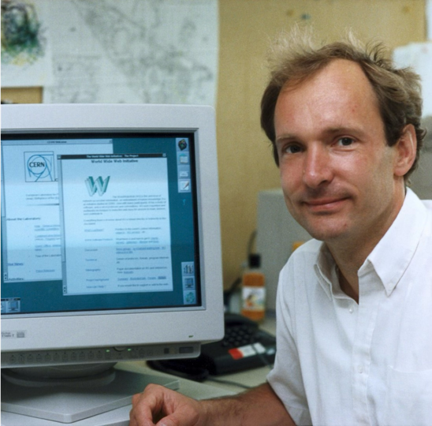
</template>

---

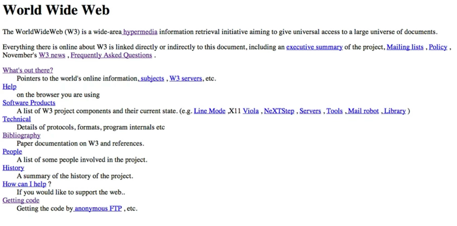
## Первый в мире сайт

---
layout: statement
---
## Изначальная идея веба как **гипертекстовой системы** для обмена знаниями
---
layout: image-right
figNumber: 1-1
figLabel: BRIEFING ROOM — STANDARD CONFIGURATION
---

## Эра «Невинного» веба

- Статичные HTML-страницы
- Документы, ссылки, немного картинок
- Табличная вёрстка

<template v-slot:image>
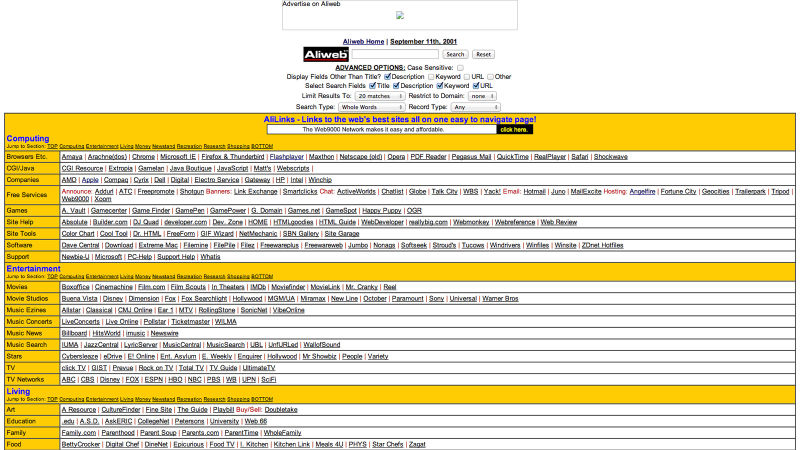
</template>

---

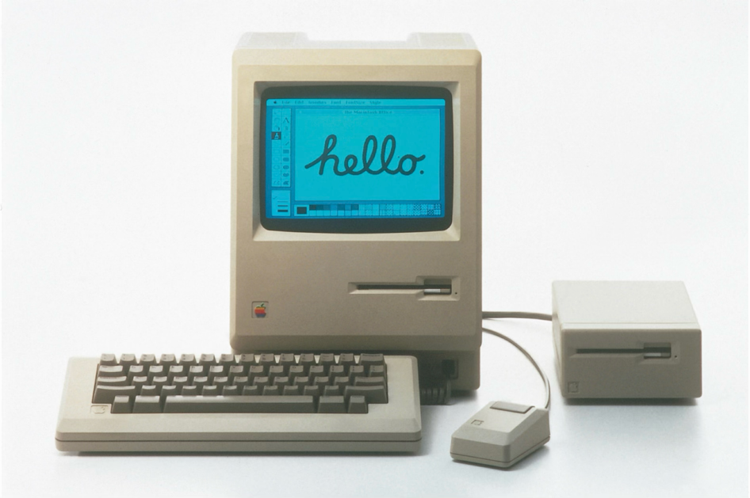

## ПК —> Веб стал доступен каждому

---
layout: statement
---

## Люди стали генерировать контент и самовыражаться

---

<SlidevVideo autoplay>
  <source src="./mov/cameron1.mov"  />
</SlidevVideo>

---
layout: image-full
---
<template v-slot:image>
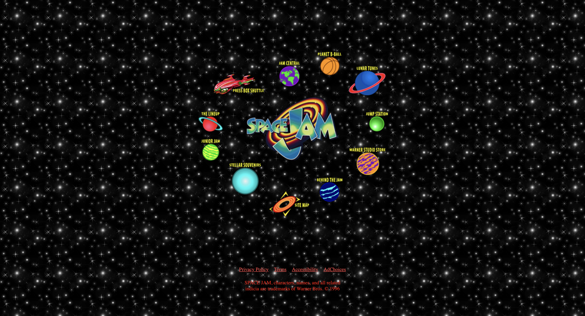
</template>

# Сайт — как пиар компания фильма: Space Jam(1996)

---
layout: image-full
---

<template v-slot:image>

</template>

# Сайт — как заработок: The million dollars homepage (2005)

---
layout: statement
---

## Интернет взрослеет

---

# Самовыражение → сервис

- Почта в браузере (Gmail)
- Карты и навигация (Google Maps)
- Соцсети, мессенджеры, онлайн-документы

---
layout: statement
---

### Веб перестаёт быть просто страницами и становится средой для жизни

<v-click>

## Браузер уже не тянет «старым» способом

</v-click>

---

### Появляется запрос на

- Быструю реакцию без полной перезагрузки
- Сложные интерфейсы (как в десктопных приложениях)
- Работу с большим количеством данных прямо в браузере

---
layout: section
sectionNumber: '2'
---

# Глава 2

## Эволюция веб-платформы

<template v-slot:descriptor>
Или как веб пытался догнать ожидания пользователей
</template>

---
layout: statement
---

### "Фронтенд развивается скачкообразно"

---

## Скачок 1:  Статичный HTML → Динамический веб

  

    

      До 2004
    

      - Каждое действие — новая страница
      - Обновить статус — рефреш

  

  

    

      Gmail + AJAX
    

      - Частичное обновление страницы
      - Мгновенные ответы

  

---
sectionNumber: '2'
---

## AJAX принес скорость, но создал новые проблемы

<v-clicks>

- Управление состоянием вручную
- "Спагетти‑код" повсюду  **(привет, jquery!)**
- Каждый разработчик делает свой велосипед
  
</v-clicks>

<v-click>

### Нужна реиспользуемость

</v-click>

---
sectionNumber: '2'
---

## Скачок 2: Страницы → SPA и фреймворки

  

    

      Было (MPA)
    

      - Каждый экран — отдельный HTML
      - Сервер рендерит всю страницу
      - Ограниченная интерактивность
      - Много кода

  

  

    

      Стало (SPA)
    

      - Angular/React/Vue/Svelte
      - Клиент — UI-машина
      - Сервер — только API

  

---
sectionNumber: '2'
---

## Но телефоны не стоят на месте

  

    

      Кнопочные (2000–2007)
    

    

      
      
      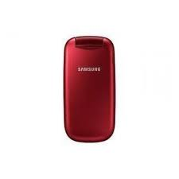
      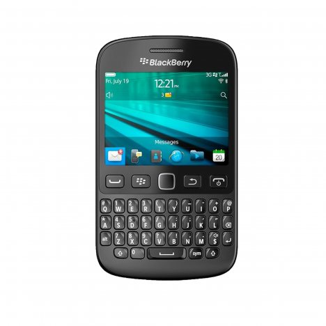
    

  

  

    

      Сенсорные (2007+)
    

    

      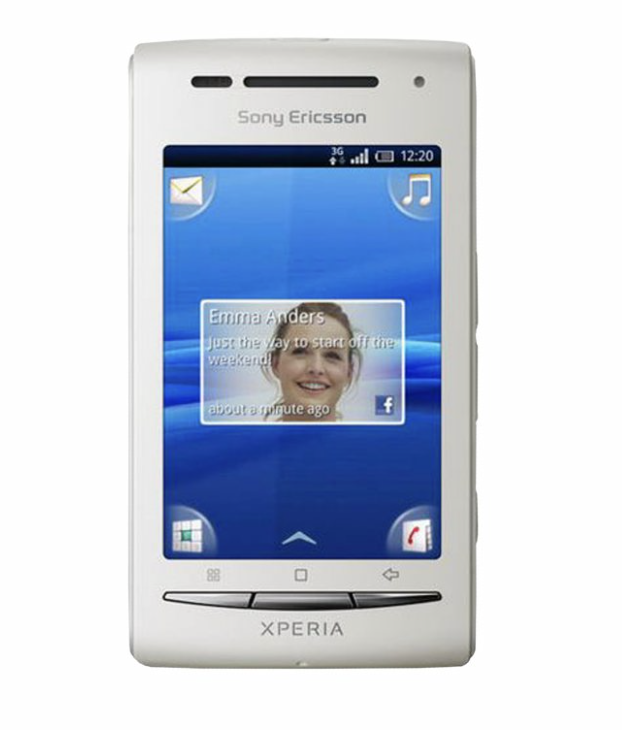
      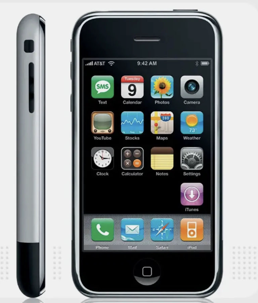
      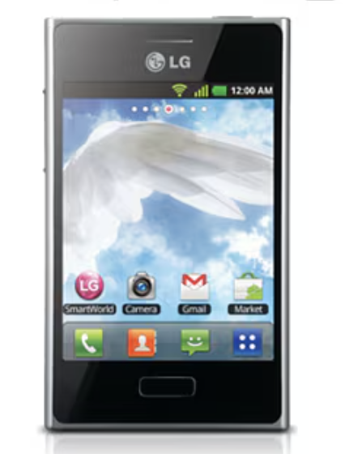
      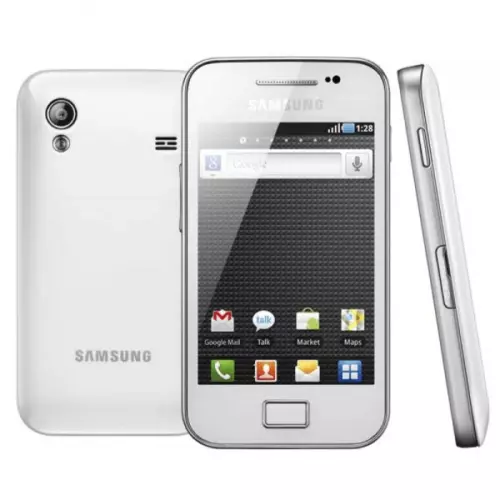
    

  

---
sectionNumber: '2'
---

## Контекст: Мобильные телефоны развиваются

  

    <ul class="space-y-2 text-sm">
      <li class="flex items-start">
        •
        <strong>Тяжёлый JS</strong> тормозит на слабых устройствах
      </li>
      <li class="flex items-start">
        •
        <strong>Touch UI</strong> вместо hover/click
      </li>
      <li class="flex items-start">
        •
        <strong>3G/4G</strong> вместо оптоволокна
      </li>
      <li class="flex items-start">
        •
        Экраны <strong>от 320px до 4K</strong>
      </li>
    </ul>
  

---
sectionNumber: '2'
---

## Скачок 4: Десктоп → Mobile-first

  

    

      Десктоп-first (2010)
    

      - Фиксированная ширина 1024px
      - Hover и курсор мыши
      - Быстрый интернет (DSL)
      - Мощные ПК

  

  

    

      Mobile-first (2012+)
    

      - **Адаптивность** 320px–4K
      - **Touch** интерфейсы
      - **Производительность** (lazy load)
      - Сети **3G/4G**

  

---
sectionNumber: '2'
---

## Mobile-first решили адаптивность, но...

  

    

      Боли нативных приложений
    

    <ul class="space-y-2 text-sm">
      <li class="flex items-start">
        •
        <strong>App Store</strong> модерация (недели)
      </li>
      <li class="flex items-start">
        •
        <strong>Обновления</strong> только через стор
      </li>
      <li class="flex items-start">
        •
        <strong>Офлайн</strong> недоступен
      </li>
      <li class="flex items-start">
        •
        Push только <strong>через натив</strong>
      </li>
    </ul>
  

---
sectionNumber: '2'
---

## Скачок 5: Веб → PWA

  

    

      Обычный веб
    

      - Только онлайн
      - Не устанавливается
      - Нет push
      - Зависит от сети

  

  

    

      PWA
    

      - **Offline-first**
      - **Установка** без стора
      - **Push** уведомления
      - Кэш + Service Workers

  

<v-click>

Service Worker = прокси между сетью и кэшем

</v-click>

---
sectionNumber: '2'
---

## ...но вылезли рендерные боли (опять)

  

    <ul class="space-y-2 text-sm">
      <li class="flex items-start">
        •
        <strong>Тяжёлый JS</strong> на клиенте
      </li>
      <li class="flex items-start">
        •
        <strong>SEO</strong> страдает (SPA)
      </li>
      <li class="flex items-start">
        •
        <strong>TTFB</strong> медленный
      </li>
      <li class="flex items-start">
        •
        Сложно <strong>гибрид</strong> сервер/клиент
      </li>
    </ul>
  

---
sectionNumber: '2'
---

## Скачок 6: Клиент/Сервер → Server Components

  

    

      Классика
    

      - Всё на **клиенте** (SPA)
      - Или всё на **сервере** (MPA)
      - Два **кода**
      - SEO или **скорость**

  

  

    

      RSC (React Server Components)
    

      - **Серверный** рендер статичного
      - **Клиентский** только интерактив
      - **Один код** (async/await)
      - SEO + **скорость** + PWA

  

<v-click>

Сервер рендерит → Streaming → Клиент "оживляет"

</v-click>

---
layout: timeline
title: ЭВОЛЮЦИЯ ВЕБА — ХРОНОЛОГИЯ
sectionNumber: '2'
docNumber: "Автостопом по веб-платформе"
direction: horizontal
---

  

  

    
2007

    
iPhone

    
Мобильные боли: 320px, touch, 3G

  

  

  

    
2007-2012

    
Mobile-first

    
Адаптив, responsive дизайн

  

  

  

    
2010-2013

    
SPA бум

    
AngularJS, React —> PWA —> RSC

  

---
layout: section
sectionNumber: '3'
docNumber: FM 00-0
---

# Глава 3

## Современная Web Platform

<template v-slot:descriptor>
Или зоопарк комитетов
</template>

---

[//]: # (sectionNumber: '2')

[//]: # (---)

[//]: # ()

[//]: # (### **150** Web API в браузере)

[//]: # ()

[//]: # (Это полноценная **платформа** с доступом к железу, офлайну, пушам.)

[//]: # ()

[//]: # (<video src="./mov/mdn.mov" autoplay loop muted rounded-xl/>)

[//]: # ()

[//]: # (---)

[//]: # (sectionNumber: '2')

[//]: # (---)

[//]: # ()

[//]: # (### **3D музей** в браузере &#40;React и Three.js&#41;)

[//]: # ()

[//]: # (<video src="./mov/samokat.mov" autoplay loop muted rounded-xl/>)

[//]: # ()

[//]: # ([https://museum.samokat.ru/]&#40;https://museum.samokat.ru/&#41;)

[//]: # ()

[//]: # (---)

[//]: # (sectionNumber: '2')

[//]: # (---)

[//]: # ()

[//]: # (### Многопользовательская игра в браузере &#40;webGL&#41;)

[//]: # ()

[//]: # (<video src="./mov/messanger.mov" autoplay loop muted rounded-xl/>)

[//]: # ([https://messenger.abeto.co/]&#40;https://messenger.abeto.co/&#41;)

[//]: # (# Глава 4)

[//]: # ()

[//]: # (## Будущее)

[//]: # ()

[//]: # (<i>&#40;никто точно не знает&#41;</i>)

[//]: # ()

[//]: # (---)

[//]: # ()

[//]: # (### Итоги эволюции)

[//]: # ()

[//]: # ( )

[//]: # ()

[//]: # (`HTML → Динамика → SPA → Мобильный → PWA → Гибриды`)

[//]: # ()

[//]: # (  )

[//]: # ()

[//]: # (Таймлайн эволюции веба )

[//]: # (от 1990 до наших дней)

[//]: # ()

[//]: # (---)

[//]: # ()

[//]: # (### A2UI — AI-Adaptative UI)

[//]: # ()

[//]: # ( )

[//]: # ()

[//]: # (- Интерфейсы, которые строятся и адаптируются )

[//]: # (  с участием **ИИ-моделей**)

[//]: # (- Браузер как фронтенд для **ИИ-агентов**)

[//]: # (- Новый слой абстракции)

[//]: # ()

[//]: # ( )

[//]: # ()

[//]: # (Концепт A2UI )

[//]: # (или схема взаимодействия ИИ-агента с браузером)

[//]: # ()

[//]: # (---)

[//]: # ()

[//]: # (### Вопросы для размышления)

[//]: # ()

[//]: # ( )

[//]: # ()

[//]: # (- Какие новые **Web API** понадобятся?)

[//]: # (- Как снова поменяется роль браузера?)

[//]: # (- Как изменится фронтенд?)

[//]: # ()

[//]: # (---)

[//]: # (layout: section)

[//]: # (sectionNumber: '5')

[//]: # (docNumber: "Автостопом по веб-платформе")

[//]: # (---)

[//]: # ()

[//]: # (# Эпилог)

[//]: # ()

[//]: # (---)

[//]: # ()

[//]: # (### Ключевые мысли)

[//]: # ()

[//]: # ( )

[//]: # ()

[//]: # (- Веб давно перестал быть **«просто сайтами»**)

[//]: # (- Браузер — одна из самых **сложных** и )

[//]: # (  самых **согласованных** систем)

[//]: # (- Каждый новый слой добавляет сложность, )

[//]: # (  но остаётся в том же окне — вкладке браузера)

[//]: # ()

[//]: # (---)

[//]: # ()

[//]: # (### Напоследок)

[//]: # ()

[//]: # ( )

[//]: # ()

[//]: # (Если вы в какой-то момент поймаете себя на рефлексии )

[//]: # (типа «мне скучно»,  )

[//]: # (вспомните, с какой **ахренительно сложной системой** )

[//]: # (вы работаете :&#41;)

[//]: # ()

[//]: # (---)

[//]: # (layout: end)

[//]: # (docNumber: "Автостопом по веб-платформе")

[//]: # (classification: UNCLASSIFIED)

[//]: # (photo: ./img/me.jpg)

[//]: # (---)

[//]: # ()

[//]: # (<template v-slot:title>Вопросы?</template>)

[//]: # ()

[//]: # (<template v-slot:contact>)

[//]: # (Мария Кондаурова )

[//]: # (BIOCAD)

[//]: # (</template>)

---
layout: end
docNumber: FM 24-SLIDE
classification: FOR TRAINING USE ONLY
unit: HQ, DEPT OF THE PRESENTATION
photo: ./img/me.jpg
---

<template v-slot:title>Спасибо</template>

<template v-slot:contact>

**Мария Кондаурова**

BIOCAD

t.me/Momomash

</template>