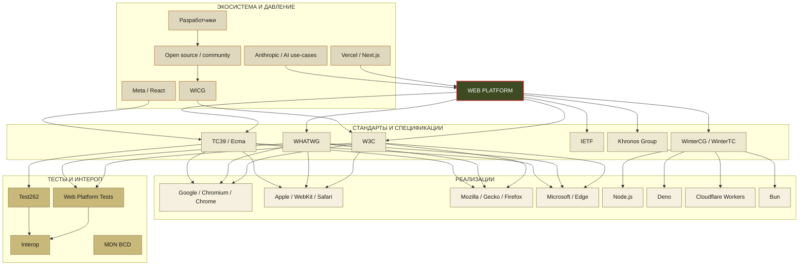
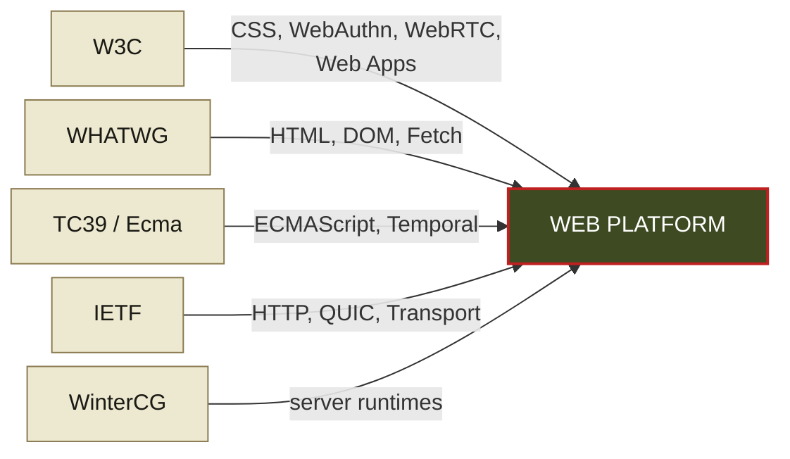
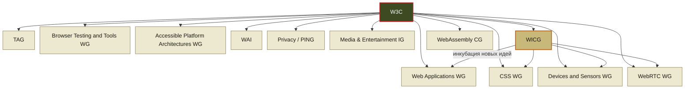
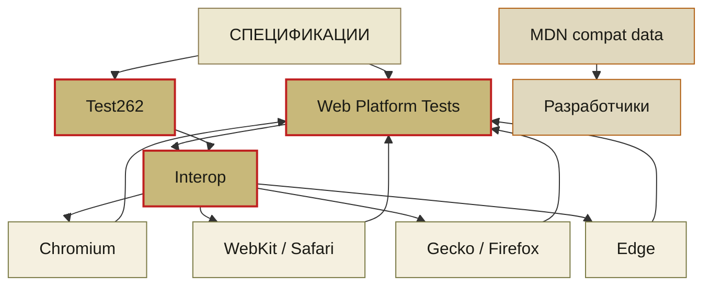
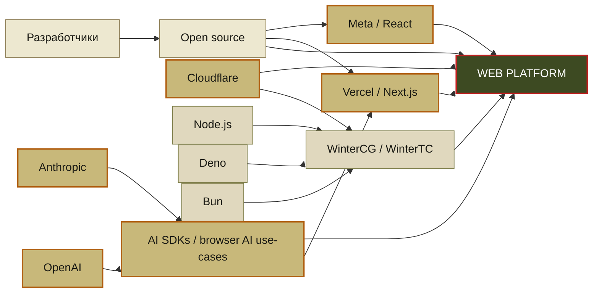

# Автостопом по веб-платформе

  
  

    
Мария Кондаурова

    
BIOCAD

  

---
layout: section
sectionNumber: '1'
docNumber: "Автостопом по веб-платформе"
---

# Глава 1

## Что такое веб-платформа?

<template v-slot:descriptor>
Или как зарождался веб
</template>

---

Веб-платформа = Браузер + API + стандарты + тесты + комитеты

---
layout: statement
---

# Но с чего всё начиналось?
---
layout: image-full
---
<template v-slot:image>

</template>

# Первый в мире компьютер Eniac
---
layout: image-full
---
<template v-slot:image>

</template>

# Современный компьютер
---

| Параметр            | ENIAC (1945)                                | iPhone 17 Pro (2025)                      |
|:--------------------|:--------------------------------------------|:------------------------------------------|
| Операций в секунду  | ≈5 000 сложений/сек ≈357 умножений/сек   | ≥6 000 000 000 000 операций/сек           |
| Память              | **20 слов** (10‑разрядные десятичные числа) | **6–8 ГБ** ОЗУ, до 1 ТБ постоянной памяти |
| Потребление энергии | ≈174 кВт                                    | ~10 Вт (пиковая нагрузка SoC)             |

---
layout: statement
---
## World Wide Web
---
layout: image-right
figNumber: 1-1
figLabel: BRIEFING ROOM — STANDARD CONFIGURATION
---

# Тим Бернерс-Ли

## Создал первый браузер в **1990 году**

<template v-slot:image>

</template>

---

## Первый в мире сайт

---
layout: statement
---
## Изначальная идея веба как **гипертекстовой системы** для обмена знаниями
---
layout: image-right
figNumber: 1-1
figLabel: BRIEFING ROOM — STANDARD CONFIGURATION
---

## Эра «Невинного» веба

- Статичные HTML-страницы
- Документы, ссылки, немного картинок
- Табличная вёрстка

<template v-slot:image>

</template>

---

## ПК —> Веб стал доступен каждому

---
layout: statement
---

## Люди стали генерировать контент и самовыражаться

---

<SlidevVideo autoplay>
  <source src="./mov/cameron1.mov"  />
</SlidevVideo>

---
layout: image-full
---
<template v-slot:image>

</template>

# Сайт — как пиар компания фильма: Space Jam(1996)

---
layout: image-full
---

<template v-slot:image>

</template>

# Сайт — как заработок: The million dollars homepage (2005)

---
layout: statement
---

## Интернет взрослеет

---

# Самовыражение → сервис

- Почта в браузере (Gmail)
- Карты и навигация (Google Maps)
- Соцсети, мессенджеры, онлайн-документы

---
layout: statement
---

### Веб перестаёт быть просто страницами и становится средой для жизни

<v-click>

## Браузер уже не тянет «старым» способом

</v-click>

---

### Появляется запрос на

- Быструю реакцию без полной перезагрузки
- Сложные интерфейсы (как в десктопных приложениях)
- Работу с большим количеством данных прямо в браузере

---
layout: section
sectionNumber: '2'
---

# Глава 2

## Эволюция веб-платформы

<template v-slot:descriptor>
Или как веб пытался догнать ожидания пользователей
</template>

---
layout: statement
---

### "Фронтенд развивается скачкообразно"

---

## Скачок 1:  Статичный HTML → Динамический веб

  

    

      До 2004
    

      - Каждое действие — новая страница
      - Обновить статус — рефреш

  

  

    

      Gmail + AJAX
    

      - Частичное обновление страницы
      - Мгновенные ответы

  

---
sectionNumber: '2'
---

## AJAX принес скорость, но создал новые проблемы

<v-clicks>

- Управление состоянием вручную
- "Спагетти‑код" повсюду  **(привет, jquery!)**
- Каждый разработчик делает свой велосипед

</v-clicks>

<v-click>

### Нужна реиспользуемость

</v-click>

---
sectionNumber: '2'
---

## Скачок 2: Страницы → SPA и фреймворки

  

    

      Было (MPA)
    

      - Каждый экран — отдельный HTML
      - Сервер рендерит всю страницу
      - Ограниченная интерактивность
      - Много кода

  

  

    

      Стало (SPA)
    

      - Angular/React/Vue/Svelte
      - Клиент — UI-машина
      - Сервер — только API

  

---
sectionNumber: '2'
---

---
layout: default
---

## Но телефоны не стояли на месте

  

    <h2 class="text-2xl font-bold text-rose-400">
      Кнопочные (2000–2007)
    </h2>
    

      
      
      
      
    

  

  

    <h2 class="text-2xl font-bold text-cyan-300">
      Сенсорные (2007+)
    </h2>
    

      
      
      
      
    

  

---
sectionNumber: '2'
---

## С мобильностью пришли новые вызовы

<v-clicks>

- Тяжёлый JS тормозит на слабых устройствах
- Touch UI вместо hover/click
- 3G/4G вместо оптоволокна
- Экраны от 320px до 4K

</v-clicks>

---
sectionNumber: '2'
---

## Скачок 3: Десктоп → Mobile-first

  

    

      Десктоп-first (2010)
    

      - Фиксированная ширина 1024px
      - Hover и курсор мыши
      - Быстрый интернет (DSL)
      - Мощные ПК

  

  

    

      Mobile-first (2012+)
    

      - Адаптивность 320px–4K
      - Touch интерфейсы
      - Производительность (lazy load)
      - Сети 3G/4G

  

---
sectionNumber: '2'
---

## Mobile-first решили адаптивность, но наследство нативных приложений

<v-clicks>

- App Store модерация (недели)
- Обновления только через стор
- Офлайн недоступен
- Push только через натив

</v-clicks>

---
sectionNumber: '2'
---

## Скачок 4: Веб → PWA

  

    

      Обычный веб
    

      - Только онлайн
      - Не устанавливается
      - Нет push
      - Зависит от сети

  

  

    

      PWA
    

      - Offline-first
      - Установка без стора
      - Push уведомления
      - Кэш + Service Workers

  

<v-click>

Service Worker = прокси между сетью и кэшем

</v-click>

---
sectionNumber: '2'
---

## ...но вылезли рендерные боли (опять)

<v-clicks>

- Тяжёлый JS на клиенте
- SEO страдает (SPA)
- TTFB медленный
- Сложно гибрид сервер/клиент

</v-clicks>

---
sectionNumber: '2'
---

## Скачок 5: Клиент/Сервер → Server Components

  

    

      Классика
    

      - Всё на **клиенте** (SPA)
      - Или всё на **сервере** (MPA)
      - Два **кода**
      - SEO или **скорость**

  

  

    

      RSC (React Server Components)
    

      - **Серверный** рендер статичного
      - **Клиентский** только интерактив
      - **Один код** (async/await)
      - SEO + **скорость** + PWA

  

<v-click>

Сервер рендерит → Streaming → Клиент "оживляет"

</v-click>

---
layout: timeline
title: ЭВОЛЮЦИЯ ВЕБА — ХРОНОЛОГИЯ
sectionNumber: '2'
docNumber: "Автостопом по веб-платформе"
direction: horizontal
---

  

  

    
1990

    
Статичный веб

  

  

  

    
2004

    
Ajax

    
Gmail заложил тренд веба как сервиса

  

  

  

    
2010

    
SPA‑бум

    
AngularJS (2010), React(2013), Vue(2014)

  

  

  

    
2010

    
First-mobile

    
Развитие смартфонов

  

  

  

    
2015+

    
PWA

    
Офлайн, установка, пуш‑уведомления

  

  

  

    
2020-2023

    
Server Components

    
Гибрид сервер/клиент

  

---
layout: statement
---

# Всего за 20 лет

---
layout: two-column
title: "Web API в действии"
sectionNumber: "3-4"
docNumber: FM 00-0
---

<template v-slot:left>

### 150+ браузерных Web API с доступом к

<v-clicks>

- телефону (контакты, вибрация, bluetooth, уведомления)
- железу (GPU)
- AI (конец 2025-го)
- и тд

</v-clicks>

</template>

<template v-slot:right>

  <video
    src="./mov/mdn.mov"
    autoplay
    muted
    loop
    playsinline
    controls={false}
    style="width: 100%; height: auto; display: block;"
  ></video>

</template>

---
layout: statement
---
# Это уже полноценная платформа
---

  <video
    src="./mov/samokat.mov"
    autoplay
    muted
    loop
    playsinline
    controls={false}
    style="width: 100%; height: auto; display: block;"
  ></video>

3D музей в браузере &#40;React и Three.js) <a href="https://museum.samokat.ru">https://museum.samokat.ru</a>

---

  <video
    src="./mov/messanger.mov"
    autoplay
    muted
    loop
    playsinline
    controls={false}
    style="width: 100%; height: auto; display: block;"
  ></video>

Многопользовательская игра в браузере (webGL) <a href="https://messenger.abeto.co">https://messenger.abeto.co</a>

---
layout: section
sectionNumber: '3'
docNumber: FM 00-0

---

# Глава 3

## Кто делает веб? 

<template v-slot:descriptor>
Или зоопарк комитетов
</template>

---
layout: chart-full
title: КАРТА ВЛИЯНИЯ
sectionNumber: "3-1"
docNumber: FM 00-0
figNumber: 3-1
figLabel: КТО КОНТРИБЬЮТИТ В WEB PLATFORM
transition: fade
---
<template v-slot:chart>

</template>

<template v-slot:source>
ОБЗОР: стандарты, реализации, тесты и экосистема на одной карте. [web:423][web:429][web:424][web:353]
</template>

---
layout: chart-full
title: СЛОЙ 1 — СТАНДАРТЫ
sectionNumber: "3-2"
docNumber: FM 00-0
figNumber: 3-2
figLabel: ОСНОВНЫЕ ПЛОЩАДКИ СТАНДАРТИЗАЦИИ
transition: fade-out
---

<template v-slot:chart>

</template>

<template v-slot:source>
WHATWG ведёт HTML Living Standard; TC39 отвечает за JavaScript; W3C и IETF покрывают значительную часть веб-платформы и сетевого стека. [web:429][web:421][web:424]
</template>

---
layout: chart-full
title: СЛОЙ 2 — W3C И ИНКУБАЦИЯ
sectionNumber: "3-3"
docNumber: FM 00-0
figNumber: 3-3
figLabel: ВНУТРЕННЯЯ СТРУКТУРА W3C
transition: slide-left
---

<template v-slot:chart>

</template>

<template v-slot:source>
WICG — инкубатор новых веб-идей; внутри W3C множество рабочих и community groups с разной ответственностью. [web:423][web:422][web:421]
</template>

---
layout: chart-full
title: СЛОЙ 3 — ТЕСТЫ И INTEROP
sectionNumber: "3-4"
docNumber: FM 00-0
figNumber: 3-4
figLabel: КАК ПРОВЕРЯЮТ СОВМЕСТИМОСТЬ
transition: slide-up
---

<template v-slot:chart>

</template>

<template v-slot:source>
Interop использует WPT как измеримую основу для совместимости браузеров; TC39-экосистема использует Test262 для ECMAScript. [web:352][web:353][web:362]
</template>

---
layout: chart-full
title: СЛОЙ 4 — ДАВЛЕНИЕ ЭКОСИСТЕМЫ
sectionNumber: "3-5"
docNumber: FM 00-0
figNumber: 3-5
figLabel: КОМПАНИИ, ФРЕЙМВОРКИ И РАНТАЙМЫ
transition: slide-right
---

<template v-slot:chart>

</template>

<template v-slot:source>
Компании и рантаймы влияют на ожидания от платформы; WinterCG/WinterTC работает над web-interoperable runtimes за пределами браузера. [web:424][web:427][web:425]
</template>

---
layout: end
docNumber: FM 24-SLIDE
classification: FOR TRAINING USE ONLY
unit: HQ, DEPT OF THE PRESENTATION
photo: ./img/me.jpg

---

<template v-slot:title>Спасибо</template>

<template v-slot:contact>

**Мария Кондаурова**

BIOCAD

t.me/Momomash

</template>