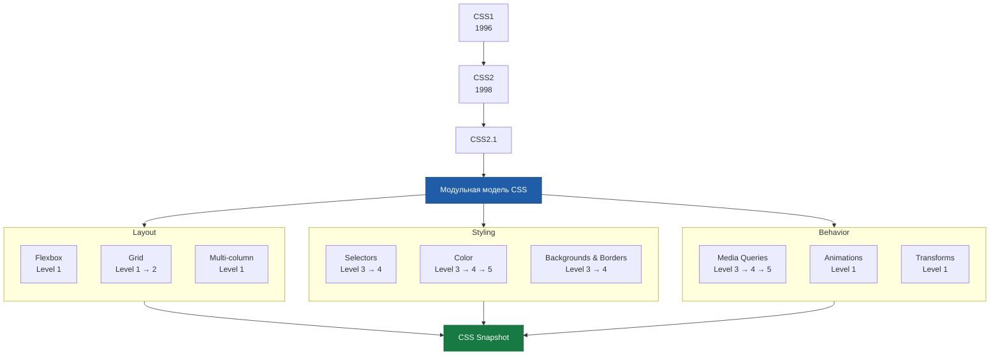
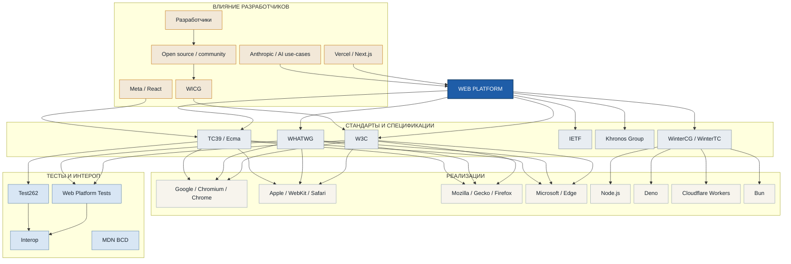
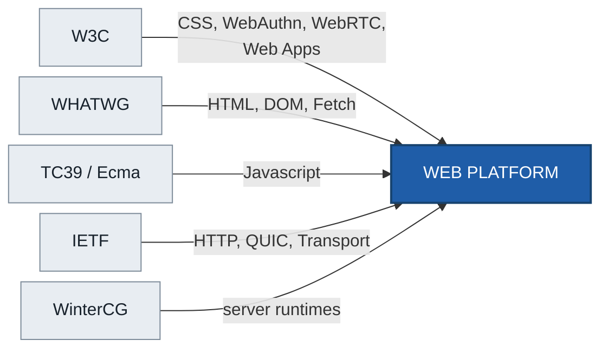
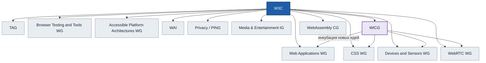

# Самое большое легаси,<br>с которым мы работаем

<template v-slot:subtitle>
Веб-платформа · Мария Кондаурова · BIOCAD
</template>

<template v-slot:image>

</template>

<!--
Всем привет! Меня зовут Мария Кондаурова, я из BIOCAD. Сегодня мы поговорим про самое большое легаси, с которым работает каждый в этом зале. Не про ваш монолит, не про проект, который вы боитесь трогать. Про веб-платформу. И к концу доклада я хочу, чтобы слово «легаси» перестало для вас звучать как ругательство.
-->

---
layout: two-column
title: Обо мне
sectionNumber: 0-1
docNumber: "HOLYJS AUTUMN 2026"
transition: fade
---

## Обо мне

<v-clicks>

- FrontLead в Департаменте Вычислительной Биологии в BIOCAD
- Член программного комитета HolyJS
- Соорганизовывала SPB Frontend
- Живу в Питере, крашу Warhammer и занимаюсь фехтованием

</v-clicks>

::right::

  

<!--
Про меня — коротко, чтобы вы понимали, откуда я смотрю на эту тему. Вычислительная биология в BIOCAD: продукты, которые живут годами и которым нельзя сказать «давайте перепишем».

[click] Ещё я в программном комитете HolyJS — то есть смотрю на доклады с двух сторон сцены.

[click] И раньше соорганизовывала SPB Frontend.

[click] А из неинженерного — Warhammer и фехтование. Оба про долгую работу над одним и тем же, так что для сегодняшней темы даже уместно.
-->

---
layout: section
sectionNumber: '0'
docNumber: "САМОЕ БОЛЬШОЕ ЛЕГАСИ"
---

# Пролог

## Продукт, который вырос

<template v-slot:descriptor>
Или как мировой MVP превратился в проект, который нельзя переписать
</template>

---
layout: default
sectionNumber: 0-2
docNumber: "HOLYJS AUTUMN 2026"
title: Как растут продукты
---

## Как растёт любой продукт

<v-clicks>

- Сначала — маленький **scope**: простая полезная штука
- Потом приходят **пользователи**
- За ними — **новые требования** и **бизнес**
- Потом — **новые команды**, костыли, обратная совместимость
- И вот вы работаете с огромным **legacy**, которое нельзя просто переписать

</v-clicks>

<!--
Начнём не с веба, а с того, что каждый из нас видел своими глазами.

[click] Сначала это две недели работы и один экран.

[click] Потом приходят пользователи — и первый же просит то, чего в scope не было.

[click] Дальше подключается бизнес, и сроки становятся важнее архитектуры.

[click] Потом приходят новые команды, и в коде появляется фраза «это трогать нельзя, сломается».

[click] А в какой-то момент вы обнаруживаете, что переписать это невозможно. Не потому что код плохой, а потому что им пользуются.

Знакомо? Так вот.
-->

---
layout: statement
sectionNumber: 0-3
docNumber: "HOLYJS AUTUMN 2026"
---

## Веб прошёл этот же путь — <br>только в масштабе всего мира

<v-click>

### Веб-платформа — самый большой живой **legacy-продукт** человечества

</v-click>

<!--
Веб прошёл ровно этот же путь. Только в масштабе всего мира.

[click] Веб-платформа — это самый большой живой legacy-продукт человечества. И «легаси» здесь не ругательство, а цена того, что продукт слишком долго был нужен людям. Далее мы посмотрим на историю одного продукта: как из лаконичного MVP он вырос в глобальную платформу и почему до сих пор не развалился.
-->

---
sectionNumber: 0-4
docNumber: "HOLYJS AUTUMN 2026"
---


<p v-click style="margin: 0 auto">Веб-платформа = Браузер + API + стандарты + тесты + комитеты</p>

<!--
И сразу договоримся о терминах.

[click] Смотрите на эту строчку не как на определение, а как на оглавление большого продукта. Браузер — это код. API — публичный контракт. Стандарты — документация. Тесты — CI. Комитеты — оргструктура. Всё как у любого зрелого продукта, только распределено по планете. И у каждого пункта дальше будет своя глава.
-->

---
layout: section
docNumber: "САМОЕ БОЛЬШОЕ ЛЕГАСИ"
sectionNumber: '1'
---

# Глава 1

## MVP, который оказался слишком успешным

<template v-slot:descriptor>
Или как веб начинался с простого гипертекста
</template>


---
sectionNumber: 1-1
docNumber: "HOLYJS AUTUMN 2026"
title: Масштаб за 80 лет
---

## На секунду — про масштаб

<div class="grid grid-cols-2 gap-6 items-center mt-4">


</div>

<v-click>

| Параметр            | ENIAC (1946)                              | iPhone 17 Pro (2025)            |
|:--------------------|:------------------------------------------|:--------------------------------|
| Операций в секунду  | ≈5 000 сложений/сек                       | ≥6 000 000 000 000 операций/сек |
| Память              | **20 слов**                               | **6–8 ГБ** ОЗУ                   |
| Потребление         | ≈174 кВт                                  | ~10 Вт                          |

</v-click>

<p v-click class="text-center">Но железо — это половина истории...</p>

<!--
Один флэшбек для масштаба. Вот первый компьютер — ENIAC, 1946 год. Комната, тридцать тонн, и под каждую новую задачу его перекоммутировали проводами. Руками, физически.

[click] А вот то, что лежит у вас в кармане. Восемьдесят лет разницы.

[click] И теперь цифры. ENIAC — пять тысяч сложений в секунду, телефон — шесть триллионов операций. Памяти у ENIAC — двадцать слов. Не килобайт, не гигабайт: двадцать чисел одновременно. И киловатты против ватт: под ENIAC строили отдельное питание, ваш телефон заряжается от повербанка.

[click] Но железо — это только половина истории. Вторая половина — как мы этим железом обмениваемся информацией.
-->

---
layout: statement
sectionNumber: 1-2
docNumber: "HOLYJS AUTUMN 2026"
---
## World Wide Web

<!--
1989 год, Задача, с которой всё началось, была скучной и внутренней и вы слышали её на уроках информатики про ученых, которым нужно было обмениваться информацией. Кратко и утрированно. 

И сразу оговорка. К 1989-му интернет существует уже двадцать лет: TCP/IP, DNS — всё это построено до веба и другими людьми.
-->

---
layout: image-right
sectionNumber: 1-3
docNumber: "HOLYJS AUTUMN 2026"
figNumber: 1-1
figLabel: TIM BERNERS-LEE — CREATOR OF THE WORLD WIDE WEB
---

# Тим Бернерс-Ли

## Создал первый браузер в **1990 году**

<template v-slot:image>

</template>

<!--
90-ый год — появился первый браузер. 
-->

---
docNumber: "HOLYJS AUTUMN 2026"
sectionNumber: 1-4
title: Первый в мире сайт
status: "1 document · 0 images"
---

<BrowserFrame
  url="http://info.cern.ch/hypertext/WWW/TheProject.html"
  tab="The World Wide Web project"
  year="1991"
  status="Done"
  class="h-full"
>
  
</BrowserFrame>

<!--
Вот он, первый сайт: info.cern.ch, 1991 год. Это одновременно первая страница, документация проекта и инструкция «как сделать себе такой же». Ни картинок, ни дизайна — текст и ссылки. И это не бедность, это — mvp.
-->


---
layout: statement
sectionNumber: 1-5
docNumber: "HOLYJS AUTUMN 2026"
---

## Это и был **MVP**: гипертекстовая система для обмена знаниями

<v-click>

### Удачный минимальный scope

</v-click>

<!--
Если описать это продуктовым языком — перед нами идеальный MVP. Гипертекстовая система для обмена знаниями: документы, связанные ссылками.

[click] Страницы открываются. Ссылки ведут на документ. А чтобы опубликовать своё, не нужно спрашивать разрешения ни у одной платформы. Три свойства, из которых потом выросло всё остальное.
-->

---
layout: image-right
sectionNumber: 1-6
docNumber: "HOLYJS AUTUMN 2026"
figNumber: 1-2
figLabel: EARLY WEB — TABLE-BASED LAYOUTS
---

## Эра «Невинного» веба

<v-clicks>

- Статичные HTML-страницы
- Документы, ссылки, немного картинок
- Табличная вёрстка

</v-clicks>

<template v-slot:image>

</template>

<!--
Первые годы веб был именно таким, каким его задумали.

[click] Страницы лежали файлами на диске: захотел поменять — открыл в редакторе, положил обратно.

[click] Картинки появились не сразу, и каждая была событием.

[click] А раскладку верстали таблицами — не из любви к таблицам, а потому что в языке для раскладки не было вообще ничего.
-->

---
sectionNumber: 1-7
docNumber: "HOLYJS AUTUMN 2026"
---


## ПК —> Веб стал доступен каждому

### TODO: поменять картинку на кадр Apple II ad - Homemaker (1981)

<!--
А потом компьютер переехал из лаборатории на кухню. Посмотрите, как это продавали: реклама обещает, что графики дома теперь построит даже домохозяйка. Веб получил не сотни исследователей, а всех сразу — и с этого момента требования к нему формируют не инженеры.
-->

---
layout: statement
sectionNumber: 1-8
docNumber: "HOLYJS AUTUMN 2026"
---

## Люди стали генерировать контент и самовыражаться

<!--
И люди немедленно занялись не тем, для чего это строили. Не обменом научными знаниями, а собой: домашние страницы, гостевые книги, счётчики посещений, гифки «under construction», Geocities.
-->

---
sectionNumber: 1-9
docNumber: "HOLYJS AUTUMN 2026"
title: Атмосфера раннего пользовательского веба
---

<SlidevVideo autoplay>
  <source src="./assets/mov/cameron1.mov"  />
</SlidevVideo>

<!--
Вот атмосфера того веба. Ярко, мигает, местами страшно — и абсолютно живое. Люди впервые получили площадку, на которой не нужно ничьё разрешение.
-->


---
layout: image-full
sectionNumber: 1-10
docNumber: "HOLYJS AUTUMN 2026"
---
<template v-slot:image>

</template>

# Сайт — как пиар компания фильма: Space Jam(1996)

<!--
Дальше веб замечает бизнес. 1996 год, Space Jam: сайт как часть пиар-кампании фильма.
-->

---
layout: image-full
sectionNumber: 1-11
docNumber: "HOLYJS AUTUMN 2026"
---

<template v-slot:image>

</template>

# Сайт — как заработок: The million dollars homepage (2005)

<!--
2005-й, The Million Dollar Homepage: миллион пикселей по доллару за пиксель — и человек действительно собрал миллион. Веб окончательно стал местом, где зарабатывают. А значит, у него появилось требование уровня «мой бизнес не должен упасть».
-->

---
layout: statement
sectionNumber: 1-12
docNumber: "HOLYJS AUTUMN 2026"
---

## Интернет взрослеет

### Самовыражение → сервис

<!--
И вот перелом. Самовыражение превращается в сервис: в браузер переезжают почта, магазины, банк, работа. Меняется не контент — меняются ожидания. От «смотрите, что я умею» к «это должно работать всегда, иначе я не оплачу счёт».
-->

---
layout: statement
sectionNumber: 1-13
docNumber: "HOLYJS AUTUMN 2026"
---

## Веб перестаёт быть просто страницами и становится средой для жизни

<v-click>

### Браузер уже не тянет «старым» способом

</v-click>

<!--
С этого момента страница перестаёт быть страницей: в ней живут, а не заходят почитать.

[click] И тут первый звоночек: старый, страничный способ этого не выдерживает. Каждое действие — полная перезагрузка, состояние живёт только на сервере. А потом в этот маленький MVP приходят все сразу: пользователи, авторы, бизнес, медиа, сервисы. И начинается то, из чего состоит вторая глава — рост требований.
-->

---
layout: section
sectionNumber: '2'
docNumber: "САМОЕ БОЛЬШОЕ ЛЕГАСИ"
---

# Глава 2

## Требования росли — веб отвечал

<template v-slot:descriptor>
Или как пользователи хотели X, а веб отвечал Y
</template>


---
layout: statement
sectionNumber: 2-1
docNumber: "HOLYJS AUTUMN 2026"
---

### "Фронтенд развивается скачкообразно"

<v-click>

#### Каждый скачок — это накопившееся давление **требований**

</v-click>

<!--
Есть известная страшилка: фронтенд развивается скачкообразно — рывками, а не плавно. Обычно его произносят с усталостью.

[click] Но продуктово скачок — это не «вышла новая технология». Это накопившееся давление требований, которое наконец прорвало. Дальше я разберу пять таких требований: пользователи хотят X — веб отвечает Y. И у каждого ответа есть цена.
-->

---
layout: image-full
sectionNumber: 2-1a
docNumber: "HOLYJS AUTUMN 2026"
title: Динамика скачков
---

<template v-slot:image>

</template>

<!--
Вот та же мысль картинкой: ровных участков почти нет, есть ступеньки. Пройдёмся по ступенькам по очереди.
-->


---
sectionNumber: 2-2
docNumber: "HOLYJS AUTUMN 2026"
---

## Захотели взаимодействовать, а не читать (2004)
<RequirementCard year="2004" demand="Взаимодействовать, а не читать"
  response="AJAX / XMLHttpRequest" effect="Состояние — вручную, спагетти-код" />

<div class="grid grid-cols-2 gap-6 mt-4 items-stretch">
  <div
    v-click
    class="rounded-2xl border border-red-200/60 bg-red-50/40 px-6 py-5"
  >
    <div class="text-sm uppercase tracking-widest text-red-500 font-bold mb-4">
      До 2004
    </div>

      - Каждое действие — новая страница
      - Обновить статус — рефреш

  </div>
  <div
    v-click
    class="rounded-2xl border border-teal-200/60 bg-teal-50/40 px-6 py-5"
  >
    <div class="text-sm uppercase tracking-widest text-teal-600 font-bold mb-4">
      Gmail + AJAX
    </div>

      - Частичное обновление страницы
      - Мгновенные ответы

  </div>
</div>

<!--
Требование первое, 2004 год: люди захотели не читать, а взаимодействовать.

[click] До этого любое действие означало новую страницу. Чтобы узнать, пришло ли письмо, вы жали F5.

[click] И тут выходит Gmail и показывает Ajax. При том теха была не новая — XMLHttpRequest существовал давно, — но именно Gmail показал, что так можно делать. Страница перестала перезагружаться целиком, и это ожидание уже никогда не откатилось назад.
-->

---
sectionNumber: 2-3
docNumber: "HOLYJS AUTUMN 2026"
---

## AJAX дал скорость,<br>но создал свои проблемы

<v-clicks>

- Управление состоянием вручную
- "Спагетти‑код" повсюду  **(привет, jquery!)**
- Каждый разработчик делает свой велосипед

</v-clicks>

<v-click>

### Нужна реиспользуемость

</v-click>

<!--
За скорость сразу пришёл счёт.

[click] Состояние теперь живёт на клиенте, и следить за ним приходится руками.

[click] Отсюда спагетти: обработчик дёргает DOM, DOM дёргает обработчик, и через полгода никто не знает, кто это перерисовал. Привет, jQuery.

[click] И каждый решал это по-своему: сколько проектов — столько архитектур.

[click] Но программист, как известно, человек ленивый.
-->


---
sectionNumber: 2-4
docNumber: "HOLYJS AUTUMN 2026"
---

## Захотели богатый UI и скорость разработки (2010)
<RequirementCard year="2010" demand="Богатый UI и скорость разработки"
  response="SPA: Angular, React, Vue" effect="Тяжёлый клиент, SEO ломается" />

<div class="grid grid-cols-2 gap-6 mt-4 items-stretch">
  <div
    v-click
    class="rounded-2xl border border-red-200/60 bg-red-50/40 px-6 py-5"
  >
    <div class="text-sm uppercase tracking-widest text-red-500 font-bold mb-4">
      Было (MPA)
    </div>

      - Каждый экран — отдельный HTML
      - Сервер рендерит всю страницу
      - Ограниченная интерактивность
      - Много кода

  </div>
  <div
    v-click
    class="rounded-2xl border border-teal-200/60 bg-teal-50/40 px-6 py-5"
  >
    <div class="text-sm uppercase tracking-widest text-teal-600 font-bold mb-4">
      Стало (SPA)
    </div>

      - Angular/React/Vue
      - Клиент — UI-машина
      - Сервер — только API

  </div>
</div>

<!--
Требование второе, около 2010 года: богатый интерфейс и скорость разработки.

[click] В MPA каждый экран — отдельный HTML, сервер рендерит всё целиком, и любая мелочь на клиенте стоит дорого.

[click] Ответ — SPA: сначала Angular, потом React и Vue. Клиент становится UI-машиной, сервер — только API. Фронтенд впервые получил собственную архитектуру и перестал быть вёрсткой поверх бэкенда.
-->

---
layout: default
sectionNumber: 2-5
docNumber: "HOLYJS AUTUMN 2026"
---

## Но телефоны не стояли на месте

<div class="grid grid-cols-2 gap-12 mt-10 items-start">

  <div
    v-click
    class="flex flex-col gap-1"
  >
    <h2 class="text-2xl font-bold text-rose-400">
      Кнопочные <span class="opacity-70">(2000–2007)</span>
    </h2>
    <div class="grid grid-cols-2 gap-1">
      
      
      
      
    </div>
  </div>

  <div
    v-click
    class="flex flex-col gap-1"
  >
    <h2 class="text-2xl font-bold text-cyan-300">
      Сенсорные <span class="opacity-70">(2007+)</span>
    </h2>
    <div class="grid grid-cols-2 gap-1">
      
      
      
      
    </div>
  </div>
</div>

<!--
Параллельно менялось то, с чего вообще смотрят на веб.

[click] До 2007-го мобильный интернет — это WAP на кнопочном телефоне. Смотреть там было почти нечего.

[click] Дальше сенсорные экраны, и за несколько лет привычный вход в веб становится другим. Заметьте: это требование пришло не от разработчиков и не от комитетов, а от рынка устройств.
-->

---
sectionNumber: 2-6
docNumber: "HOLYJS AUTUMN 2026"
---

## С мобильностью пришли новые вызовы

<v-clicks>

- Тяжёлый JS тормозит на слабых устройствах
- Touch UI вместо hover/click
- 3G/4G вместо оптоволокна
- Экраны от 320px до 4K

</v-clicks>

<!--
И мобильность немедленно ломает всё, что мы только что построили.

[click] Тот же JS, который бодро работал на десктопе, на дешёвом телефоне парсится и исполняется секунды.

[click] Hover, на котором держалась половина интерфейсов, на тач-экране просто не существует.

[click] Сеть перестаёт быть данностью. 3G в метро — это не медленный интернет, это интернет, который то есть, то нет.

[click] А ширина экрана превращается из числа в диапазон.
-->

---
sectionNumber: 2-7
docNumber: "HOLYJS AUTUMN 2026"
---

## Мир стал мобильным (2012)
<RequirementCard year="2012" demand="Мир стал мобильным"
  response="Mobile-first, адаптивность 320px–4K" effect="Хочется нативности" />

<div class="grid grid-cols-2 gap-6 mt-4 items-stretch">
  <div
    v-click
    class="rounded-2xl border border-red-200/60 bg-red-50/40 px-6 py-5"
  >
    <div class="text-sm uppercase tracking-widest text-red-500 font-bold mb-4">
      Десктоп-first (2010)
    </div>

      - Фиксированная ширина 1024px
      - Hover и курсор мыши
      - Быстрый интернет (DSL)
      - Мощные ПК

  </div>
  <div
    v-click
    class="rounded-2xl border border-teal-200/60 bg-teal-50/40 px-6 py-5"
  >
    <div class="text-sm uppercase tracking-widest text-teal-600 font-bold mb-4">
      Mobile-first (2012+)
    </div>

      - Адаптивность 320px–4K
      - Touch интерфейсы (Material UI)
      - Производительность (lazy load)
      - Сети 3G/4G

  </div>
</div>

<!--
Требование третье, 2012 год: мир стал мобильным.

[click] Десктоп-first — это проектирование от идеальных условий: тысяча двадцать четыре пикселя, мышь, быстрый провод.

[click] Mobile-first переворачивает порядок: сначала худший случай, потом улучшения. И это редкий случай, когда индустрия сама сменила методологию, не дожидаясь нового API от платформы.
-->

---
sectionNumber: 2-8
docNumber: "HOLYJS AUTUMN 2026"
---

## Mobile-first дал адаптивность, но хотелось нативности

<v-clicks>

- App Store модерация (недели)
- Обновления только через стор
- Офлайн недоступен
- Push только через натив

</v-clicks>

<!--
Адаптивность получили — и сразу захотелось того, что умеет натив: иконка на экране, офлайн, пуши.

[click] Только у нативного пути своя цена: релиз проходит модерацию неделями, и это ломает любую скорость доставки фич.

[click] Плюс обновление зависит от пользователя — он может годами сидеть на версии, которую вы выпустили когда-то давно.

[click] У веба ровно наоборот: обновление мгновенное, но без сети нет ничего.

[click] И пуши — только через натив. Так требование и сформулировалось: дайте нам возможности приложений, но без стора.
-->

---
sectionNumber: 2-9
docNumber: "HOLYJS AUTUMN 2026"
---

## Захотели возможности приложений (2015)
<RequirementCard year="2015" demand="То же, что умеют нативные приложения"
  response="PWA: Service Workers, offline, push" effect="Рендерные боли — опять" />

<div class="grid grid-cols-2 gap-6 mt-4 items-stretch">
  <div
    v-click
    class="rounded-2xl border border-red-200/60 bg-red-50/40 px-6 py-5"
  >
    <div class="text-sm uppercase tracking-widest text-red-500 font-bold mb-4">
      Обычный веб
    </div>

      - Только онлайн
      - Не устанавливается
      - Нет push
      - Зависит от сети

  </div>
  <div
    v-click
    class="rounded-2xl border border-teal-200/60 bg-teal-50/40 px-6 py-5"
  >
    <div class="text-sm uppercase tracking-widest text-teal-600 font-bold mb-4">
      PWA
    </div>

      - Offline-first
      - Установка без стора
      - Push уведомления
      - Кэш + Service Workers

  </div>
</div>

<v-click>

<p class="text-center pt-5">
Service Worker = прокси между сетью и кэшем
</p>

</v-click>

<!--
Требование четвёртое, 2015 год: хотим то же, что умеют нативные приложения.

[click] Обычный веб к этому моменту умеет только онлайн. Его нельзя установить, нельзя разбудить, он не переживает метро.

[click] Ответ — PWA: офлайн-first, установка без стора, пуши, кэш.

[click] И вот ключевая вещь. Service Worker — это прокси между вашей страницей и сетью, который вы пишете сами. Платформа впервые отдала разработчику право отвечать на сетевые запросы вместо сервера. И заодно право сломать себе весь кэш.
-->

---
sectionNumber: 2-10
docNumber: "HOLYJS AUTUMN 2026"
---

## ...но вылезли рендерные боли (опять)

<v-clicks>

- Тяжёлый JS на клиенте
- SEO страдает (SPA)
- TTFB (Time to First Byte) медленный
- Размытая ответственность между сервером и клиентом

</v-clicks>

<!--
И снова обратная сторона, по той же спирали.

[click] JS на клиенте становится тяжелее: библиотеки, роутер, стор — всё это едет к пользователю.

[click] SEO у SPA ломается: краулер видит пустой div.

[click] Первый байт приходит быстро, а первый смысл — нет.

[click] И ответственность размывается: никто не может сказать, где заканчивается сервер и начинается клиент.
-->

---
sectionNumber: 2-11
docNumber: "HOLYJS AUTUMN 2026"
---

## Нужны интерактив + скорость + SEO (2020)
<RequirementCard year="2020" demand="Интерактив + скорость + SEO сразу"
  response="React Server Components" effect="Границы сервер/клиент размыты" />

<div class="grid grid-cols-2 gap-6 mt-4 items-stretch">
  <div
    v-click
    class="rounded-2xl border border-red-200/60 bg-red-50/40 px-6 py-5"
  >
    <div class="text-sm uppercase tracking-widest text-red-500 font-bold mb-4">
      Классика
    </div>

      - Всё на клиенте (SPA)
      - Или всё на сервере (MPA)
      - Два кода
      - SEO или скорость

  </div>
  <div
    v-click
    class="rounded-2xl border border-teal-200/60 bg-teal-50/40 px-6 py-5"
  >
    <div class="text-sm uppercase tracking-widest text-teal-600 font-bold mb-4">
      RSC (React Server Components)
    </div>

      - Серверный рендер статичного
      - Клиентский только интерактив
      - Один код (async/await)
      - SEO + скорость + PWA

  </div>
</div>

<v-click>

<p class="mt-16 text-center">
Сервер рендерит → Streaming → Клиент "оживляет"
</p>

</v-click>

<!--
Требование пятое, 2020 год: хотим всё сразу — интерактив, скорость и SEO.

[click] До этого приходилось выбирать: или всё на клиенте, или всё на сервере. И часто это два кода и две команды.

[click] RSC пытается убрать сам выбор: статичное рендерит сервер, интерактивное — клиент, но код один.

[click] Формула короткая: сервер рендерит, стриминг доставляет, клиент оживляет. Рендер вернулся на сервер — туда, откуда уехал в 2004-м.
-->

---
layout: timeline
sectionNumber: 2-12
docNumber: "HOLYJS AUTUMN 2026"
title: ЭВОЛЮЦИЯ ВЕБА — ХРОНОЛОГИЯ
direction: horizontal
---

<div class="tl-entry">
  <div class="tl-entry-marker"><div class="tl-entry-dot"></div></div>
  <div class="tl-entry-body">
    <div class="tl-entry-date fm-label">1990</div>
    <div class="tl-entry-title">Статичный веб</div>
  </div>
</div>

<div class="tl-entry">
  <div class="tl-entry-marker"><div class="tl-entry-dot"></div></div>
  <div class="tl-entry-body">
    <div class="tl-entry-date fm-label">2004</div>
    <div class="tl-entry-title">Ajax</div>
    <div class="tl-entry-desc">Gmail заложил тренд веба как сервиса</div>
  </div>
</div>

<div class="tl-entry">
  <div class="tl-entry-marker"><div class="tl-entry-dot"></div></div>
  <div class="tl-entry-body">
    <div class="tl-entry-date fm-label">2010</div>
    <div class="tl-entry-title">SPA‑бум</div>
    <div class="tl-entry-desc">AngularJS (2010), React(2013), Vue(2014)</div>
  </div>
</div>

<div class="tl-entry">
  <div class="tl-entry-marker"><div class="tl-entry-dot"></div></div>
  <div class="tl-entry-body">
    <div class="tl-entry-date fm-label">2010</div>
    <div class="tl-entry-title">First-mobile</div>
    <div class="tl-entry-desc">Развитие смартфонов</div>
  </div>
</div>

<div class="tl-entry">
  <div class="tl-entry-marker"><div class="tl-entry-dot"></div></div>
  <div class="tl-entry-body">
    <div class="tl-entry-date fm-label">2015+</div>
    <div class="tl-entry-title">PWA</div>
    <div class="tl-entry-desc">Офлайн, установка, пуш‑уведомления</div>
  </div>
</div>

<div class="tl-entry">
  <div class="tl-entry-marker"><div class="tl-entry-dot"></div></div>
  <div class="tl-entry-body">
    <div class="tl-entry-date fm-label">2020-2023</div>
    <div class="tl-entry-title">Server Components</div>
    <div class="tl-entry-desc">Гибрид сервер/клиент</div>
  </div>
</div>

<!--
Соберём на одной линии. Двадцать лет: Ajax, SPA-бум, mobile-first, PWA, Server Components. Каждая точка здесь — не мода, а ответ на требование из предыдущих слайдов.
-->

---
layout: statement
sectionNumber: 2-13
docNumber: "HOLYJS AUTUMN 2026"
---

# Всего за 20 лет

<v-click>

### Темп колоссальный

</v-click>

<!--
И всё, что мы только что прошли, — это двадцать лет.

[click] Для платформы, которой пользуется вся планета, темп колоссальный.
-->

---
layout: statement
sectionNumber: 2-14
docNumber: "HOLYJS AUTUMN 2026"
---

## Но у каждого из этих скачков был один и тот же автор

<v-click>

### И это были не браузеры

</v-click>

<!--
Только смотрите, что здесь интереснее самого списка. У всех этих скачков один и тот же автор.

[click] И это были не браузеры.
-->

---
sectionNumber: 2-15
docNumber: "HOLYJS AUTUMN 2026"
title: Платформа догоняет библиотеки
---

## Платформа догоняет. Всегда.

| Мы выжимали из того, что было | Платформа догнала | Разрыв |
|:---|:---|:---|
| Вёрстка таблицами | Flexbox (2012), Grid (2017) | ~15 лет |
| `$('.item')` в jQuery | `querySelector` | ~7 лет |
| `$.ajax` | `fetch` | ~10 лет |
| moment.js | `Temporal` | ~10 лет |
| lodash | нативные методы массивов | ~10 лет |
| Свой lazy-load на скролле | `loading="lazy"` | ~10 лет |
| JS-хаки под ширину блока | `@container` (2023) | ~13 лет |

<!--
Вот доказательство. По строкам его читать не нужно — достаточно правой колонки.

Вёрстку таблицами придумали не от любви к таблицам, а потому что раскладки в языке не было: Flexbox приехал в 2012-м, Grid — в 2017-м. Разрыв — пятнадцать лет. jQuery-селекторы жили до `querySelector` семь лет, `$.ajax` до `fetch` — десять. А самая сильная строка здесь Temporal: десять лет, чтобы починить в языке работу со временем.

Общее у всех строк одно: сначала это сделали мы, потом — платформа.
-->

---
layout: statement
sectionNumber: 2-16
docNumber: "HOLYJS AUTUMN 2026"
---

## Разработчики всегда впереди платформы

<v-clicks>

### Мы выжимаем максимум из того, что есть сейчас — и делаем хак

### Платформа **легитимизирует** этот хак. Через десять лет.

</v-clicks>

<!--
Схема каждый раз одна и та же.

[click] Мы выжимаем максимум из того, что есть сегодня, и делаем хак.

[click] А платформа через десять лет легитимизирует этот хак и называет его стандартом. В пятой главе на этом же месте будет уже не смешно.
-->

---
layout: statement
sectionNumber: 2-16a
docNumber: "HOLYJS AUTUMN 2026"
---

## Сначала — откуда мы шли

<!--
И прежде чем идти дальше — короткая остановка на ностальгию. Три скриншота из ламповых нулевых, того самого рунета, в котором многие из нас и научились фронтенду. А сразу за ними — три примера из сегодняшнего дня. Смотреть надо не на технологии, а на разрыв между этими двумя половинами.
-->

---
sectionNumber: 2-17
docNumber: "HOLYJS AUTUMN 2026"
---


<!--
Старый ВКонтакте, профиль Дурова, СПбГУ '06. Смотрите, какой он прямолинейный: слева синие ссылки в столбик, справа буквально таблица — пол, день рождения, родной город, политические взгляды, любимая музыка, любимые фильмы. Никакой ленты, никаких состояний, никакого «загружается». Страница одна, и она либо есть, либо её нет. А внизу счётчик неиспользованных голосов — два с половиной миллиона.
-->

---
sectionNumber: 2-18
docNumber: "HOLYJS AUTUMN 2026"
---


<!--
Браузерные «Уличные гонки». Гараж, Mazda MX-3, восемьдесят восемь лошадиных сил, кнопка «Увеличить». И события текстом: «Станислав вызвал вас на гонку и выиграл» — с ссылкой «Вызвать в ответ». Вся игра — это форма и перезагрузка страницы. Затягивало при этом абсолютно.
-->

---
sectionNumber: 2-19
docNumber: "HOLYJS AUTUMN 2026"
---


<!--
И zaycev.net, новогодняя шапка 2011 года: «2011 — год Зайца». Каталог по алфавиту, потому что нормального поиска нет. Капча на плетёном фоне и ссылка «Не вижу символы». Слева навигация, в которой мирно соседствуют новинки mp3, торренты и форум. Вот так выглядел интерфейс, в котором мы все жили. И, что важно, он работал.
-->

---
sectionNumber: 2-20
docNumber: "HOLYJS AUTUMN 2026"
---

<div style="width: 100%; border-radius: 12px; overflow: hidden;">
  <video
    src="./assets/mov/samokat.mov"
    autoplay
    muted
    loop
    playsinline
    style="width: 100%; height: auto; display: block;"
  ></video>
</div>
<p class="text-center">3D музей в браузере &#40;React и Three.js) <a href="https://museum.samokat.ru">https://museum.samokat.ru</a></p>

<!--
А теперь тот же самый браузер, только двадцать лет спустя. 3D-музей Самоката: React и Three.js, сцена, по которой можно ходить. И это не демо для конференции, а продакшн-проект бренда.
-->

---
sectionNumber: 2-21
docNumber: "HOLYJS AUTUMN 2026"
---

<div style="width: 100%; border-radius: 12px; overflow: hidden;">
  <video
    src="./assets/mov/messanger.mov"
    autoplay
    muted
    loop
    playsinline
    style="width: 100%; height: auto; display: block;"
  ></video>
</div>
<p class="text-center">Многопользовательская игра в браузере (webGL) <a href="https://messenger.abeto.co">https://messenger.abeto.co</a></p>

<!--
Многопользовательская игра на WebGL. Сравните с «Уличными гонками»: там событие приходило перезагрузкой страницы, здесь — real-time, синхронизация состояний и чужие курсоры прямо на экране.
-->

---
sectionNumber: 2-22
docNumber: "HOLYJS AUTUMN 2026"
---


<div style="width: 100%; border-radius: 12px; overflow: hidden;">
  <video
    src="./assets/mov/doom.mov"
    autoplay
    muted
    loop
    playsinline
    style="width: 100%; height: auto; display: block;"
  ></video>
</div>
<p class="text-center">DOOM на CSS и JS <a href="https://cssdoom.wtf/">https://cssdoom.wtf/</a></p>

<!--
И вишенка: DOOM, отрисованный CSS и JS. Продуктовой ценности ноль, это чистое «потому что можем».

А теперь сложите вместе: таблица с любимыми фильмами и вот это. Один и тот же браузер, одна и та же тройка, двадцать лет разницы. Какой технологический разрыв.
-->


---
layout: two-column
sectionNumber: 2-23
docNumber: "HOLYJS AUTUMN 2026"
title: "Web API в действии"
---

<template v-slot:left>

### 150+ браузерных Web API с доступом к

<v-clicks>

- телефону (контакты, вибрация, bluetooth, уведомления)
- железу (GPU)
- AI (конец 2025-го)
- ..и много чему еще

</v-clicks>

</template>

<template v-slot:right>

<div style="width: 100%;">
  <video
    src="./assets/mov/mdn.mov"
    autoplay
    muted
    loop
    playsinline
    style="width: 100%; height: auto; display: block;"
  ></video>
</div>

</template>

<!--
А теперь то, что стоит за всеми этими примерами.

[click] Доступ к телефону как к устройству: контакты, вибрация, Bluetooth, уведомления.

[click] Доступ к железу: WebGPU — это вычисления на видеокарте прямо из JS.

[click] С конца 2025-го — доступ к моделям, и об этом будет отдельная глава.

[click] И это далеко не всё — справочник справа скроллится примерно бесконечно. Только вот следить за этим разработчику всё тяжелее: платформа растёт быстрее, чем мы успеваем за ней читать. Ни один человек в зале уже не знает всю платформу целиком — и это нормальное состояние зрелого продукта.
-->

---
layout: statement
sectionNumber: 2-24
docNumber: "HOLYJS AUTUMN 2026"
---

# Это уже полноценная платформа

<!--
Вывод простой: это уже не «странички». Это полноценная платформа — со своими возможностями, ограничениями и своей ценой.

Но вот что часто упускают. Когда продукт растёт, меняется не только его код. Каждое из этих требований расходилось волной по всей системе — далеко за пределы фронтенда.
-->

---
layout: section
sectionNumber: '3'
docNumber: "САМОЕ БОЛЬШОЕ ЛЕГАСИ"
---

# Глава 3

## Веб переписал не только фронтенд

<template v-slot:descriptor>
Или та же история глазами дизайна и бэкенда
</template>


---
layout: statement
sectionNumber: 3-1
docNumber: "HOLYJS AUTUMN 2026"
---

## Когда продукт растёт, меняется не только его код

<v-click>

### Меняются интерфейсы, инфраструктура, процессы — <br>и даже то, **кто считается пользователем**

</v-click>

<!--
Когда продукт растёт, меняется не только его код.

[click] Меняются интерфейсы, инфраструктура, процессы — и даже то, кто считается пользователем. Если вы когда-нибудь видели, как из-за одной фичи переписывают регламент в соседнем отделе, вы понимаете, о чём речь.
-->

---
layout: statement
sectionNumber: 3-2
docNumber: "HOLYJS AUTUMN 2026"
---

## Сейчас мы пройдём этот же путь ещё дважды

<v-clicks>

### Те же требования, те же годы — но не глазами фронтендера

#### Арка 1 — **дизайн**. Арка 2 — **бэкенд**.

</v-clicks>

<!--
И сейчас я сделаю странную вещь: мы пройдём те же двадцать лет ещё дважды.

[click] Те же требования, те же годы — но не глазами фронтендера.

[click] Арка первая — дизайн, арка вторая — бэкенд. Я возвращаюсь в те же годы специально: интересно не что случилось, а сколько профессий это переписало.
-->

---
layout: statement
sectionNumber: 3-3
docNumber: "HOLYJS AUTUMN 2026"
---

# Арка 1 — Дизайн

<v-click>

## От картинки к системе правил

</v-click>

<!--
Арка первая. Дизайн.

[click] Коротко её можно описать как путь от картинки к системе правил. А если честнее — это история про то, как дизайнер терял контроль над результатом.
-->

---
layout: two-column
sectionNumber: 3-4
docNumber: "HOLYJS AUTUMN 2026"
title: Дизайн = документ
---

<template v-slot:left>

## Шаг 1. Дизайн = документ

<v-clicks>

- Макет — **картинка фиксированной ширины**: 640 → 800 → 1024
- Типографика, таблицы, `<font>`, `<center>`
- «Отдали в вёрстку» → **pixel perfect**
- Дизайнер точно знает, как это будет выглядеть у пользователя

</v-clicks>

</template>

<template v-slot:right>

</template>

<!--
Сначала работа дизайнера выглядела так.

[click] Макет — картинка фиксированной ширины: сначала 640, потом 800, потом «делаем под 1024».

[click] Инструменты — типографика, таблицы, `<font>`, `<center>`.

[click] Макет отдавали в вёрстку, и слово дня — pixel perfect. Результат сверяли с картинкой, приложив линейку.

[click] И вот главное свойство этой эпохи: дизайнер точно знает, как это будет выглядеть у пользователя. Дальше вся арка — про то, как он это знание терял.
-->

---
layout: statement
sectionNumber: 3-5
docNumber: "HOLYJS AUTUMN 2026"
title: Табличная вёрстка не умерла
tone: legacy
status: "RENDERER: MICROSOFT WORD"
---

## Табличная вёрстка не умерла

<v-clicks>

### Она переехала в почту (и живее всех живых!)

#### Outlook с 2007-го рендерит письма движком **Microsoft Word** — поэтому email-вёрстка до сих пор на вложенных `<table>` и inline-стилях

<div class="flex items-center justify-center gap-6">
  <LegacySticker>Deprecated but supported</LegacySticker>
  <p class="m-0 text-left">слой, который нельзя выкинуть</p>
</div>

</v-clicks>

<!--
Маленькая остановка. Табличная вёрстка не умерла.

[click] Она переехала в почту 

[click] Outlook с 2007 года рендерит письма движком Microsoft Word — поэтому письма до сих пор верстают вложенными таблицами и inline-стилями. Кто верстал рассылки, тот знает, о чём я.

[click] слой, который нельзя выкинуть, потому что на нём кто-то живёт.
-->

---
sectionNumber: 3-6
docNumber: "HOLYJS AUTUMN 2026"
title: Дизайн начал рисовать состояния
---

## Шаг 2. Появилось поведение — и дизайн стал рисовать состояния

<div class="grid grid-cols-2 gap-8 mt-8 items-stretch">
  <div v-click class="rounded-2xl border border-red-200/60 bg-red-50/40 px-6 py-5">
    <div class="text-sm uppercase tracking-widest text-red-500 font-bold mb-4">
      Было
    </div>

      - Один макет = один экран
      - Страница либо есть, либо её нет

  </div>
  <div v-click class="rounded-2xl border border-teal-200/60 bg-teal-50/40 px-6 py-5">
    <div class="text-sm uppercase tracking-widest text-teal-600 font-bold mb-4">
      Стало (после AJAX)
    </div>

      - loading / empty / error / partial
      - Переходы и анимации
      - Оптимистичный UI

  </div>
</div>

<v-clicks>

<p class="text-center pt-6">Дизайнер впервые описывает не картинку, а <strong>поведение во времени</strong></p>

<p class="text-center">И тут же родилась боль, которая не решена до сих пор: <strong>«макет счастливого пути»</strong></p>

</v-clicks>

<!--
Дальше приходит AJAX — и у интерфейса впервые появляется поведение.

[click] Было просто: один макет — один экран, страница либо есть, либо её нет.

[click] Стало: загрузка, пустота, ошибка, частично пришедшие данные, переходы, оптимистичный UI. Каждое из этих слов — отдельный экран, который кто-то должен нарисовать.

[click] То есть дизайнер впервые описывает не картинку, а поведение во времени.

[click] И тут же рождается боль, которая не решена до сих пор: макет счастливого пути. Вспомните свой последний проект: empty state нарисован? А error state? А оба сразу?
-->

---
sectionNumber: 3-7
docNumber: "HOLYJS AUTUMN 2026"
title: Дизайн симулировал то, чего не было
---

## И параллельно дизайн симулировал то, чего в платформе не было

<v-clicks>

- Нативный `<select>` **нельзя было застилить** — и индустрия начала писать свои селекты
- Нет модального окна — свой оверлей, focus trap, блокировка скролла
- Нет тултипа — своя обёртка с позиционированием
- Нет кнопки нужной формы — `<div role="button">`
- А ещё дизайн симулировал **нативные интерфейсы ОС**: объёмные кнопки, кожа, полки, скевоморфизм

</v-clicks>

<v-click>

<p class="text-center pt-4">Дизайнер рисовал не то, что умеет веб. Он рисовал то, что умеет всё остальное.</p>

</v-click>

<!--
И параллельно дизайн занимался ещё одним делом: симулировал то, чего в платформе просто не было.

[click] Нативный `<select>` нельзя было застилить — и индустрия начала писать свои селекты. Каждый свой, и каждый со своей сломанной доступностью.

[click] Модального окна в платформе нет — значит свой оверлей, свой focus trap, своя блокировка скролла.

[click] Тултипа нет — своя обёртка с позиционированием, а потом ещё библиотека, чтобы она не выпадала за экран.

[click] Нужна кнопка нестандартной формы — `<div role="button">` и надежда, что про клавиатуру никто не забыл.

[click] А ещё дизайн симулировал сами интерфейсы операционных систем: объёмные кнопки, текстуры, кожа, полки для книг. Скевоморфизм.

[click] Итог: дизайнер рисовал не то, что умеет веб. Он рисовал то, что умеет всё остальное вокруг.
-->

---
layout: statement
sectionNumber: 3-8
docNumber: "HOLYJS AUTUMN 2026"
---

## Платформа догнала

<v-clicks>

#### `<dialog>` — **2022**. `popover` — **2023**. `appearance: base-select` — **2025**.

### Двадцать лет индустрия писала свои селекты, потому что платформа не давала стилизовать нативный

</v-clicks>

<!--
И платформа догнала.

[click] `<dialog>` — 2022-й. `popover` — 2023-й. `appearance: base-select`, чтобы наконец стилизовать нативный селект, — 2025-й.

[click] Двадцать лет индустрия писала свои селекты, потому что платформа не давала застилить свой. Та же схема, что во второй главе: сначала костыль, через двадцать лет — стандарт.
-->

---
layout: two-column
sectionNumber: 3-9
docNumber: "HOLYJS AUTUMN 2026"
title: Mobile-first — макет перестал быть картинкой
---

<template v-slot:left>

## Шаг 3. Макет перестал быть картинкой

<v-clicks>

- **2010**, Ethan Marcotte, A List Apart — «Responsive Web Design»
- Число экранов больше **не конечно**
- Комбинаторный взрыв: состояния × экраны × плотности × ориентации
- Нарисовать все макеты стало **физически невозможно**

</v-clicks>

</template>

<template v-slot:right>

<v-click>

### 5 состояний × 4 брейкпоинта × 2 темы

### = 40 макетов на один экран

</v-click>

<v-click>

<p class="pt-6">Это <strong>перелом арки</strong>. До этой точки дизайн мог нарисовать результат. После — уже нет.</p>

</v-click>

</template>

<!--
Шаг третий, и он ломает всю профессию.

[click] 2010 год, Ethan Marcotte публикует в A List Apart статью «Responsive Web Design».

[click] И число экранов перестаёт быть конечным. Не «стало больше» — а именно перестаёт быть числом.

[click] Дальше включается комбинаторика: состояния умножаются на экраны, на плотности, на ориентации.

[click] Нарисовать все макеты становится физически невозможно.

[click] Посчитайте сами: пять состояний, четыре брейкпоинта, две темы — сорок макетов. Не на приложение, а на один экран.

[click] Это перелом арки. До этой точки дизайн мог нарисовать результат. После — уже нет.
-->

---
sectionNumber: 3-10
docNumber: "HOLYJS AUTUMN 2026"
title: Ответ индустрии — дизайн-системы
---

## Шаг 4. Ответ индустрии: дизайн перестал быть картинками

<v-clicks>

- **2011** — Bootstrap: готовая сетка и компоненты
- **2013** — Atomic Design (Brad Frost): интерфейс как набор атомов
- **2014** — Material Design: дизайн как **спецификация с правилами**
- **2016** — Figma: макет как общий редактируемый исходник
- **Design tokens** — дизайн-решения становятся данными

</v-clicks>

<v-click>

<p class="text-center pt-4">Дизайн стал кодом. И у него появились <strong>версии, релизы и обратная совместимость</strong></p>

</v-click>

<v-click>

<p class="text-center opacity-70">Дизайн-системы выросли не из моды. Они выросли из арифметики .</p>

</v-click>

<!--
И индустрия ответила — причём ответила системно.

[click] 2011 — Bootstrap: готовая сетка и компоненты. Посыл простой: не рисуйте, берите.

[click] 2013 — Atomic Design Брэда Фроста: интерфейс как набор атомов, а не набор страниц.

[click] 2014 — Material Design. Это уже не макет, а спецификация с правилами: дизайн впервые выглядит как документ стандарта.

[click] 2016 — Figma: макет перестаёт быть файлом на чьём-то ноутбуке и становится общим исходником.

[click] Дальше design tokens: цвет и отступ превращаются в данные, которые можно собрать в CI.

[click] Дизайн стал кодом — и получил вместе с этим версии, релизы и обратную совместимость. Кто менял токен в живой дизайн-системе, знает, что это ровно такой же breaking change.

[click] И заметьте: дизайн-системы выросли не из моды. Они выросли из арифметики с предыдущего слайда.
-->

---
layout: statement
sectionNumber: 3-11
docNumber: "HOLYJS AUTUMN 2026"
---

## И даже дизайн-токены уехали в комитет

<v-click>

### W3C **Design Tokens Community Group** — чтобы токены работали одинаково в Figma, в вебе и в мобилке

</v-click>

<!--
И ещё одна деталь, которая понадобится нам через десять минут.

[click] У дизайн-токенов есть своя группа в W3C, чтобы токен одинаково понимали Figma, веб и мобилка. То есть как только что-то в вебе становится важным для всех, вокруг этого немедленно появляется комитет. Дизайн прошёл ровно тот же путь, что HTML и CSS.
-->

---
sectionNumber: 3-12
docNumber: "HOLYJS AUTUMN 2026"
---

## Тот же процесс — но в языке оформления

<v-click>


```mermaid
flowchart TD
    A["CSS1<br/>1996"] --> B["CSS2<br/>1998"]
    B --> C["CSS2.1"]

    C --> D["Модульная модель CSS"]

    D --> S1

    subgraph S1["Layout"]
        direction TB
        I["Flexbox<br/>Level 1"]
        J["Grid<br/>Level 1 → 2"]
        K["Multi-column<br/>Level 1"]
    end

    D --> S2

    subgraph S2["Styling"]
        direction TB
        E["Selectors<br/>Level 3 → 4"]
        F["Color<br/>Level 3 → 4 → 5"]
        G["Backgrounds & Borders<br/>Level 3 → 4"]
    end

    D --> S3

    subgraph S3["Behavior"]
        direction TB
        H["Media Queries<br/>Level 3 → 4 → 5"]
        L["Animations<br/>Level 1"]
        M["Transforms<br/>Level 1"]
    end

    S1 --> N["CSS Snapshot"]
    S2 --> N
    S3 --> N

    style D fill:#1f5da8,stroke:#17436f,color:#fff
    style N fill:#177a42,stroke:#115c32,color:#fff
```

</v-click>

<v-click>

<p class="text-center text-sm opacity-70">Layout / Styling / Behavior — это буквально те три вещи, которые дизайнер перестал держать в одной картинке</p>

</v-click>

<!--
И здесь очень к месту история CSS.

[click] От монолитных CSS1 и CSS2 язык ушёл к модульной модели: каждый модуль живёт своими уровнями и своей скоростью, а общее состояние на момент времени фиксирует CSS Snapshot.

[click] Но интереснее форма схемы. Layout, Styling, Behavior — это буквально те три вещи, которые дизайнер перестал держать в одной картинке. Язык оформления разросся теми же слоями, что и работа дизайнера. И никто это специально не согласовывал.
-->

---
sectionNumber: 3-13
docNumber: "HOLYJS AUTUMN 2026"
title: Решение отдали пользователю
---

## Шаг 5. Дизайн больше не решает, как это выглядит

<v-clicks>

- `prefers-color-scheme` — тёмная тема это **не макет**, а согласие с настройкой ОС
- `prefers-reduced-motion` — анимацию может отменить пользователь
- `prefers-contrast`, `forced-colors` — цвета может переопределить система
- Accessibility: экранный ридер строит **свой** интерфейс из вашей разметки

</v-clicks>

<v-click>

<p class="text-center pt-4">Дизайн описывает <strong>намерение</strong>. Решение принимают пользователь и устройство.</p>

</v-click>

<!--
И финал арки. Сегодня дизайн вообще не решает, как это выглядит.

[click] `prefers-color-scheme`: тёмная тема — это не макет, а согласие с настройкой системы.

[click] `prefers-reduced-motion`: вашу анимацию пользователь может просто отменить.

[click] `prefers-contrast` и `forced-colors`: цвета может переопределить ОС, и это законно.

[click] А экранный ридер строит из вашей разметки свой собственный интерфейс — линейный, без вашей сетки и без вашей типографики.

[click] Дизайн описывает намерение. Решение принимают пользователь и устройство.
-->

---
layout: statement
sectionNumber: 3-14
docNumber: "HOLYJS AUTUMN 2026"
---

## Дизайнер перестал рисовать результат — <br>и начал описывать правила

<v-click>

### И это было не решение дизайнеров. Это давление веба.

</v-click>

<!--
Итог арки: дизайнер перестал рисовать результат и начал описывать правила.

[click] И это было не решение дизайнеров. Это давление веба.
-->

---
layout: statement
sectionNumber: 3-15
docNumber: "HOLYJS AUTUMN 2026"
---

# Арка 2 — Бэкенд

<v-click>

## От файлового сервера до edge

</v-click>

<!--
Арка вторая. Бэкенд.

[click] От файлового сервера до edge. Спойлер: он тоже потерял контроль над интерфейсом, просто позже и болезненнее.
-->

---
sectionNumber: 3-16
docNumber: "HOLYJS AUTUMN 2026"
title: Сервер отдаёт файл
---

## Шаг 1. Сервер отдаёт файл → сервер собирает страницу

<v-clicks>

- **1991** — httpd отдаёт файл с диска. И всё.
- **1993** — CGI: первая динамика, процесс на каждый запрос
- **1995+** — PHP, Perl, JSP: шаблоны на сервере, состояние в сессии
- HTML — это **результат работы бэкенда**

</v-clicks>

<v-click>

<p class="text-center pt-6">В этой точке бэкенд владеет интерфейсом целиком</p>

</v-click>

<!--
Начало у бэкенда даже скромнее, чем у дизайна.

[click] 1991-й: httpd отдаёт файл с диска. Это весь бэкенд, целиком.

[click] 1993-й: CGI — первая динамика, отдельный процесс на каждый запрос. Дорого, зато страница наконец зависит от данных.

[click] С 1995-го: PHP, Perl, JSP — шаблоны на сервере, состояние в сессии.

[click] И главное: HTML — это результат работы бэкенда.

[click] То есть в этой точке бэкенд владеет интерфейсом целиком. Дизайн, кстати, он тоже видел последним.
-->

---
sectionNumber: 3-17
docNumber: "HOLYJS AUTUMN 2026"
title: Сервер начал отдавать данные
---

## Шаг 2. Сервер начал отдавать данные, а не страницы

<v-clicks>

- **1999** — XMLHttpRequest. Написан Microsoft **для веб-версии Outlook**
- **2000** — REST, диссертация Роя Филдинга
- **2005** — появляется само слово «AJAX»

</v-clicks>

<v-click>

<p class="text-center pt-8">Рендеринг уехал на клиент. Сессия → <strong>токен</strong>.</p>

</v-click>

<!--
Дальше повторяется история из второй главы, но с другой стороны.

[click] 1999-й: Microsoft пишет XMLHttpRequest — чтобы работала веб-версия Outlook.

[click] 2000-й: Рой Филдинг защищает диссертацию, из которой индустрия вычитает REST.

[click] 2005-й: появляется само слово «AJAX» — уже как название явления, а не технологии.

[click] И вот итог шага: рендеринг уезжает на клиент, а сессия превращается в токен. Сервер больше не собирает страницу — он отдаёт данные.
-->

---
layout: statement
sectionNumber: 3-17a
docNumber: "HOLYJS AUTUMN 2026"
title: Побочные эффекты AJAX
---

## Корпоративная почта случайно родила весь современный фронтенд

<v-click>

### А заодно **CORS** — защиту, которая нужна только потому, что фронтенд уехал на другой origin

</v-click>

<!--
И два побочных эффекта этого сдвига, которые с нами до сих пор. Первый: XMLHttpRequest написали не визионеры веба, а команда, которой нужно было, чтобы Outlook работал в браузере.

[click] Второй: CORS. Целый механизм безопасности существует только потому, что фронтенд стал отдельным приложением на другом origin. Каждый, кто ловил preflight в пятницу вечером, может благодарить именно этот сдвиг.
-->

---
sectionNumber: 3-18
docNumber: "HOLYJS AUTUMN 2026"
title: Один бэкенд — много клиентов
---

## Шаг 3. Один бэкенд — много клиентов

<v-clicks>

- Веб + iOS + Android + партнёрское API — из одного бэкенда
- **2015** — Facebook открывает GraphQL, придуманный под мобильную ленту
- **BFF**: у каждого клиента свой backend-for-frontend
- Версионирование API, потому что старое приложение у пользователя **не обновится**

</v-clicks>

<v-click>

<p class="pt-4">Это буквально <strong>«не ломай веб»</strong>, только на уровне вашего API. Бэкенд получил ту же проблему обратной совместимости, что и браузеры.</p>

</v-click>

<v-click>

<p class="text-center">Форму бэкенда теперь диктует клиент</p>

</v-click>

<!--
Клиентов становится много — и это переписывает бэкенд.

[click] Веб, iOS, Android, партнёрское API — и всё из одного бэкенда.

[click] 2015-й: GraphQL, придуманный под мобильную ленту. То есть под требование клиента.

[click] BFF — потому что один универсальный API не выдержал.

[click] Версионирование — потому что старое приложение на телефоне не обновится никогда.

[click] А это уже «не ломай веб», только на уровне вашего API.

[click] Форму бэкенда теперь диктует клиент.
-->

---
sectionNumber: 3-19
docNumber: "HOLYJS AUTUMN 2026"
title: Мобильность как бэкенд-требование
---

## Шаг 4. Мобильность — это тоже бэкенд-требование

<v-clicks>

- Вес ответа стал **продуктовой метрикой**
- `srcset` / `<picture>`: картинки по размерам, WebP, AVIF
- CDN превращается из оптимизации в обязательный слой
- **HTTP/2** (2015) и **HTTP/3** — работа IETF
- Brotli вместо gzip
- Performance budgets прямо в CI

</v-clicks>

<v-click>

<p class="text-center pt-4">«Мир стал мобильным» — это был change request и для бэкенда тоже</p>

</v-click>

<!--
«Мир стал мобильным» — это был change request и для бэкенда тоже.

[click] Вес ответа впервые становится продуктовой метрикой, а не темой для спора на ретро.

[click] Картинки приходится отдавать по размерам: `srcset`, `<picture>`, WebP, AVIF.

[click] CDN превращается из оптимизации в обязательный слой.

[click] HTTP/2 в 2015-м, потом HTTP/3 — и это работа IETF.

[click] Brotli вместо gzip — экономия там, где раньше и так казалось хорошо.

[click] А performance budget переезжает прямо в CI: медленно — значит не собралось.

[click] Ни одного из этих пунктов нет в задаче «сделайте мобильную вёрстку». Но без них она не работает.
-->

---
sectionNumber: 3-20
docNumber: "HOLYJS AUTUMN 2026"
title: Сервер вернулся
---

## Шаг 5. Сервер вернулся — но не в датацентр

<v-clicks>

- SSR и стриминг: рендер **снова на сервере**
- Edge и serverless: сервер в сотнях точек рядом с пользователем
- Гибридный рендеринг: часть страницы с сервера, часть с клиента

</v-clicks>

<v-click>

<p class="text-center pt-8">Круг замкнулся: рендер ушёл к клиенту и вернулся назад.<br>Только за это время веб-платформа <strong>переписала обе стороны</strong>.</p>

</v-click>

<!--
Шаг пятый: сервер вернулся. Но не в датацентр.

[click] SSR и стриминг — рендер снова на сервере.

[click] Edge и serverless — сервер оказывается в сотнях точек рядом с пользователем.

[click] Гибридный рендеринг — часть страницы с сервера, часть с клиента, и граница проходит внутри одного экрана.

[click] Круг замкнулся: рендер ушёл к клиенту и вернулся назад. Только за это время платформа успела переписать обе стороны.
-->

---
layout: two-column
sectionNumber: 3-21
docNumber: "HOLYJS AUTUMN 2026"
title: Веб навязал бэкенду свой API
---

<template v-slot:left>

## Веб не просто изменил бэкенд.<br>Он навязал ему свой API.

<v-clicks>

- В Node.js из коробки: `fetch`, `Request`, `Response`, `Headers`, `URL`, `AbortController`, Web Streams
- Это API, спроектированные **для браузера** комитетом WHATWG
- Deno, Bun, Cloudflare Workers построены на них **изначально**
- Есть даже комитет, который договаривается, какие браузерные API обязан иметь серверный рантайм — **WinterCG / WinterTC**

</v-clicks>

</template>

<template v-slot:right>

```js
// Node.js 18+, Deno, Bun,
// Cloudflare Workers — один и тот же код

const res = await fetch(url)
const data = await res.json()

export default {
  // Request — из спеки WHATWG Fetch
  async fetch(request) {
    // Response — оттуда же
    return new Response('hello', {
      headers: {
        'content-type': 'text/plain',
      },
    })
  },
}
```

</template>

<!--
И вот самое интересное за главу. Веб не просто изменил бэкенд — он навязал ему свой API.

[click] Посмотрите на код справа: `fetch`, `Request`, `Response`, `Headers`, Web Streams — в Node это теперь из коробки.

[click] Это API, спроектированные для браузера комитетом WHATWG. Никто не проектировал их для сервера.

[click] Deno, Bun и Cloudflare Workers построены на них изначально — то есть новый сервер рождается уже совместимым с браузером.

[click] И есть отдельный комитет, который договаривается, какие браузерные API обязан иметь серверный рантайм: WinterCG, теперь WinterTC. Получается, бэкенд-разработчик на Node пишет код по спецификации, написанной для браузера. Платформа дотянулась туда, где браузера нет вообще.
-->

---
layout: statement
sectionNumber: 3-22
docNumber: "HOLYJS AUTUMN 2026"
---

## Бэкенд перестал владеть интерфейсом — <br>и начал обслуживать платформу

<v-click>

### Со своей обратной совместимостью, своими комитетами и своим legacy

</v-click>

<!--
Итог арки: бэкенд перестал владеть интерфейсом и начал обслуживать платформу.

[click] Со своей обратной совместимостью, своими комитетами и своим legacy.
-->

---
layout: statement
sectionNumber: 3-23
docNumber: "HOLYJS AUTUMN 2026"
---

## Одно требование к вебу — <br>и его переписывают три отрасли

<v-click>

### Legacy веба — это legacy всей индустрии

</v-click>

<!--
И общий итог главы. Одно требование к вебу — и его переписывают три профессии.

[click] Значит legacy веба — это legacy всей индустрии, а не только фронтенда. И заметьте: ни дизайн-системы, ни `fetch` в Node никто не планировал централизованно. Так кто вообще всё это согласует?
-->

---
layout: section
sectionNumber: '4'
docNumber: "САМОЕ БОЛЬШОЕ ЛЕГАСИ"
---

# Глава 4

## У мирового продукта нет одного владельца

<template v-slot:descriptor>
Или зоопарк комитетов как закономерность масштаба
</template>


---
layout: statement
sectionNumber: 4-1
docNumber: "HOLYJS AUTUMN 2026"
title: Global architecture review
status: "MERGE: PERMISSION DENIED"
---

## В обычном продукте вы собираете architecture review

<v-click>

<WarningDialog title="GLOBAL ARCHITECTURE REVIEW" tone="platform" icon="⚙" ok="Merge" :ok-disabled="true" cancel="Обсуждать ещё 10 лет" class="text-left">
  Participants: Chrome, Safari, Firefox, W3C, WHATWG, TC39, IETF, разработчики, пользователи<br>
  Affected users: <strong>billions</strong> · Rollback: <strong>unavailable</strong>
</WarningDialog>

</v-click>

<v-click>

### Ни у кого нет права нажать **Merge**

</v-click>

<!--
В обычном продукте большое изменение выглядит так: собрали architecture review, поспорили, кто-то главный нажал Merge.

[click] А теперь представьте, что ваш architecture review проводят одновременно Chrome, Safari, Firefox, W3C, WHATWG, TC39, IETF, тысячи разработчиков и миллиарды пользователей. Affected users — миллиарды. Rollback — недоступен.

[click] И ни у кого нет права нажать Merge. Всё, что дальше будет выглядеть как зоопарк, — не хаос, а закономерность масштаба: когда продукт огромный, ownership неизбежно дробится.
-->

---
layout: chart-full
sectionNumber: 4-2
docNumber: "HOLYJS AUTUMN 2026"
title: КАРТА ВЛИЯНИЯ
figNumber: 4-1
figLabel: КТО КОНТРИБЬЮТИТ В WEB PLATFORM
transition: slide-left
---
<template v-slot:chart>


```mermaid
%%{init: {'flowchart': {'curve': 'basis', 'nodeSpacing': 10, 'rankSpacing': 45}}}%%

flowchart TD

  WEB["WEB PLATFORM"]

  subgraph STDS["СТАНДАРТЫ И СПЕЦИФИКАЦИИ"]
    W3C["W3C"]
    WHATWG["WHATWG"]
    TC39["TC39 / Ecma"]
    IETF["IETF"]
    KHR["Khronos Group"]
    WINTER["WinterCG / WinterTC"]
  end

  subgraph IMPL["РЕАЛИЗАЦИИ"]
    CHROME["Google / Chromium / Chrome"]
    WEBKIT["Apple / WebKit / Safari"]
    MOZ["Mozilla / Gecko / Firefox"]
    EDGE["Microsoft / Edge"]
    NODE["Node.js"]
    DENO["Deno"]
    CF["Cloudflare Workers"]
    BUN["Bun"]
  end

  subgraph TESTS["ТЕСТЫ И ИНТЕРОП"]
    WPT["Web Platform Tests"]
    TEST262["Test262"]
    INTEROP["Interop"]
    MDNBCD["MDN BCD"]
  end

  subgraph ECO["ВЛИЯНИЕ РАЗРАБОТЧИКОВ"]
    WICG["WICG"]
    VERCEL["Vercel / Next.js"]
    META["Meta / React"]
    OSS["Open source / community"]
    DEVS["Разработчики"]
    ANTH["Anthropic / AI use-cases"]
  end

  WEB --> W3C
  WEB --> WHATWG
  WEB --> TC39
  WEB --> IETF
  WEB --> KHR
  WEB --> WINTER

  W3C --> CHROME
  W3C --> WEBKIT
  W3C --> MOZ
  W3C --> EDGE

  WHATWG --> CHROME
  WHATWG --> WEBKIT
  WHATWG --> MOZ
  WHATWG --> EDGE

  TC39 --> CHROME
  TC39 --> WEBKIT
  TC39 --> MOZ
  TC39 --> EDGE

  W3C --> WPT
  WHATWG --> WPT
  TC39 --> TEST262
  WPT --> INTEROP
  TEST262 --> INTEROP

  WICG --> W3C
  DEVS --> OSS
  OSS --> WICG
  META --> TC39
  VERCEL --> WEB
  ANTH --> WEB
  WINTER --> NODE
  WINTER --> DENO
  WINTER --> CF
  WINTER --> BUN

  classDef main fill:#1f5da8,stroke:#17436f,color:#fff,stroke-width:2px;
  classDef standards fill:#e8edf2,stroke:#7d8b99,color:#17212b;
  classDef impl fill:#f7f4ed,stroke:#98a8b6,color:#17212b;
  classDef tests fill:#d8e6f4,stroke:#5d84ad,color:#17212b;
  classDef eco fill:#f2e8d8,stroke:#c57712,color:#17212b;

  class WEB main;
  class W3C,WHATWG,TC39,IETF,KHR,WINTER standards;
  class CHROME,WEBKIT,MOZ,EDGE,NODE,DENO,CF,BUN impl;
  class WPT,TEST262,INTEROP,MDNBCD tests;
  class WICG,VERCEL,META,OSS,DEVS,ANTH eco;
```

</template>

<template v-slot:source>
ОБЗОР: стандарты, реализации, тесты и экосистема на одной карте. 
</template>

<!--
Вот общая карта, и я не жду, что вы её прочитаете. Важна структура: кто пишет стандарты, кто их реализует, кто проверяет, что реализовали одинаково, и кто давит снизу. Дальше разберём по слоям.
-->

---
layout: chart-full
sectionNumber: 4-3
docNumber: "HOLYJS AUTUMN 2026"
title: СЛОЙ 1 — СТАНДАРТЫ
figNumber: 4-2
figLabel: ОСНОВНЫЕ ПЛОЩАДКИ СТАНДАРТИЗАЦИИ
transition: slide-left
---

<template v-slot:chart>


```mermaid
%%{init: {'flowchart': {'curve': 'basis', 'nodeSpacing': 10, 'rankSpacing': 10}}}%%
flowchart LR

  W3C["W3C"] -->|CSS, WebAuthn, WebRTC,\nWeb Apps| WEB["WEB PLATFORM"]
  WHATWG["WHATWG"] -->|HTML, DOM, Fetch| WEB
  TC39["TC39 / Ecma"] -->|Javascript| WEB
  IETF["IETF"] -->|HTTP, QUIC, Transport| WEB
  WINTER["WinterCG"] -->|server runtimes| WEB

  classDef web fill:#1f5da8,stroke:#17436f,color:#fff,stroke-width:2px;
  classDef org fill:#e8edf2,stroke:#7d8b99,color:#17212b;

  class WEB web;
  class W3C,WHATWG,TC39,IETF,WINTER org;
```

</template>

<template v-slot:source>
WHATWG ведёт HTML Living Standard; TC39 отвечает за JavaScript; W3C и IETF покрывают значительную часть веб-платформы и сетевого стека. 
</template>

<!--
Слой стандартов. Простой вопрос: кто владеет HTML? Ответ — WHATWG. JavaScript — TC39 при Ecma. CSS и большая часть платформенных API — W3C. Сеть, HTTP и QUIC — IETF, а это вообще другие люди и другая культура. Серверные рантаймы — WinterCG. Единого владельца в этой картинке просто нет.
-->

---
layout: chart-full
sectionNumber: 4-4
docNumber: "HOLYJS AUTUMN 2026"
title: СЛОЙ 2 — W3C И ИНКУБАЦИЯ
figNumber: 4-3
figLabel: ВНУТРЕННЯЯ СТРУКТУРА W3C
transition: slide-left
---

<template v-slot:chart>


```mermaid
%%{init: {'flowchart': {'curve': 'basis', 'nodeSpacing': 15, 'rankSpacing': 15}}}%%

flowchart TD

  W3C["W3C"]

  TAG["TAG"]
  WEBAPPS["Web Applications WG"]
  CSSWG["CSS WG"]
  BTT["Browser Testing and Tools WG"]
  DAS["Devices and Sensors WG"]
  WEBRTCWG["WebRTC WG"]
  APA["Accessible Platform Architectures WG"]
  WAI["WAI"]
  PATWG["Privacy / PING"]
  MEIG["Media & Entertainment IG"]
  WICG["WICG"]
  WASMCG["WebAssembly CG"]

  W3C --> TAG
  W3C --> WEBAPPS
  W3C --> CSSWG
  W3C --> BTT
  W3C --> DAS
  W3C --> WEBRTCWG
  W3C --> APA
  W3C --> WAI
  W3C --> PATWG
  W3C --> MEIG
  W3C --> WICG
  W3C --> WASMCG

  WICG -->|инкубация новых идей| WEBAPPS
  WICG --> CSSWG
  WICG --> DAS
  WICG --> WEBRTCWG

  classDef core fill:#1f5da8,stroke:#17436f,color:#fff,stroke-width:2px;
  classDef group fill:#e8edf2,stroke:#7d8b99,color:#17212b;
  classDef incubator fill:#ece5f5,stroke:#7055a8,color:#17212b,stroke-width:2px;

  class W3C core;
  class TAG,WEBAPPS,CSSWG,BTT,DAS,WEBRTCWG,APA,WAI,PATWG,MEIG,WASMCG group;
  class WICG incubator;
```

</template>

<template v-slot:source>
WICG — инкубатор новых веб-идей; внутри W3C множество рабочих и community groups с разной ответственностью. 
</template>

<!--
Теперь заглянем внутрь одного только W3C — и это ещё не все группы. Отдельно отмечу WICG: инкубатор, куда идея попадает раньше, чем в рабочую группу. Именно поэтому у новых API так часто нет статуса стандарта, но есть реализация в Chrome.
-->

---
transition: slide-left
sectionNumber: 4-5
docNumber: "HOLYJS AUTUMN 2026"
---


<!--
Примерно так это выглядит изнутри, когда пытаешься понять, где именно решается твой вопрос.
-->


---
layout: two-column
sectionNumber: 4-6
docNumber: "HOLYJS AUTUMN 2026"
title: Кухня стандартизации
transition: fade
---

<template v-slot:left>

# Если кратко

<v-clicks>

- очень много комитетов и рабочих групп
- в том числе поставщики браузеров
- не всегда прозрачные обязанности
- внутренняя "кухня" и политика

</v-clicks>

</template>

<template v-slot:right>

</template>

<!--
Если совсем кратко про эту кухню.

[click] Комитетов и рабочих групп очень много, и они пересекаются.

[click] В них сидят те же вендоры браузеров, которые между собой конкурируют.

[click] Зоны ответственности не всегда прозрачны: бывает непонятно, где вообще обсуждать твою проблему.

[click] И есть внутренняя политика. Немного Game of Thrones, только про стандарты.
-->

---
layout: statement
sectionNumber: 4-7
docNumber: "HOLYJS AUTUMN 2026"
---

# Спецификации

<!--
Теперь про спецификации — то есть про документацию этого продукта.
-->

---
layout: statement
sectionNumber: 4-8
docNumber: "HOLYJS AUTUMN 2026"
---

Кто из вас читал спецификации по JS/HTML/CSS?

<v-click>

### ...и не сбежал через минуту?

</v-click>

<!--
Вопрос в зал, честно: кто читал спеки по JS, HTML или CSS?

[click] А теперь тот же вопрос, но с уточнением: кто не сбежал через минуту? Вот примерно об этом дальше.
-->

---
layout: two-column
sectionNumber: 4-9
docNumber: "HOLYJS AUTUMN 2026"
title: История HTML как стандарта
transition: fade
---

<template v-slot:left>

### Краткая история спеки

<v-clicks>

- **1989–1991** — HTML рождается в CERN вместе с Web.
- **1994–1999** — W3C формализует HTML как набор версий и рекомендаций.
- **2004** — **реализация опередила стандарт** и появился комитет WHATWG — как реакция браузерных вендоров.
- **2012** — у индустрии **две версии** HTML: W3C и WHATWG.
- **2019** — W3C и WHATWG договариваются о единой версии HTML и DOM, HTML как **living standard**.

</v-clicks>

</template>

<template v-slot:right>

</template>

<!--
Проследим на HTML — там вся драма видна лучше всего.

[click] 1989–1991: HTML рождается в CERN вместе с вебом, без всякого комитета.

[click] 1994–1999: W3C формализует его как версии и рекомендации.

[click] 2004: реализация опережает стандарт, и вендоры создают WHATWG — фактически в обход процесса.

[click] 2012: у индустрии две версии HTML одновременно. Вопрос «где правда» становится политическим.

[click] 2019: договорились. Одна версия HTML и DOM, и это living standard — документ без версий, который меняется постоянно.
-->

---
sectionNumber: 4-10
docNumber: "HOLYJS AUTUMN 2026"
---


<!--
Вот как выглядит спека. Это не введение, это середина обычного раздела.
-->


---
sectionNumber: 4-11
docNumber: "HOLYJS AUTUMN 2026"
---


<!--
Скроллим дальше. И это всё ещё HTML.
-->


---
sectionNumber: 4-12
docNumber: "HOLYJS AUTUMN 2026"
---


<!--
И ещё дальше. Живой документ, который обновляется чаще, чем README в вашем проекте.
-->


---
sectionNumber: 4-13
docNumber: "HOLYJS AUTUMN 2026"
---

## HTML Living Standard (Last Updated 11 May 2026) (TODO: обновить дату)


<v-clicks>

- **Эту спецификацию следует читать так же, как и все другие спецификации.**
- Сначала — **от корки до корки**, несколько раз.
- Потом — в **обратном** направлении, как минимум один раз.
- Затем — выбирая случайные разделы в оглавлении и переходя по всем перекрёстным ссылкам.

</v-clicks>

<!--
Актуальный HTML Living Standard — обновлён в мае 2026-го, то есть буквально позавчера.

[click] По полосе скролла объём понятен лучше, чем по любой цифре.

[click] И в самой спеке есть инструкция, как её читать. Читайте её так же, как все другие спецификации.

[click] Сначала — от корки до корки, несколько раз.

[click] Потом — в обратном направлении, хотя бы один раз.

[click] А затем — выбирая случайные разделы и переходя по всем перекрёстным ссылкам. Это ирония авторов, но масштаб она передаёт точно.
-->

---
layout: statement
sectionNumber: 4-14
docNumber: "HOLYJS AUTUMN 2026"
---

## CSS: модульная модель = философия **микрорелизов**

<v-click>

### Каждый модуль — свои уровни, состояние фиксирует CSS Snapshot

</v-click>

<!--
Про CSS мы подробно говорили в предыдущей главе, поэтому здесь только вывод.

[click] Модульная модель — это философия микрорелизов: каждый модуль едет со своей скоростью, а состояние на момент времени фиксирует CSS Snapshot. Никакого «CSS 4» не будет, и это осознанное решение.
-->

---
layout: two-column
sectionNumber: 4-15
docNumber: "HOLYJS AUTUMN 2026"
title: TC39 и proposal-driven JavaScript
---

<template v-slot:left>  

### Javascript

<v-clicks>

- **ECMAScript 6** — последняя большая версия (2015)
- Новые фичи теперь проходят через **proposal stages**
- Cовременный JavaScript —  **непрерывный поток улучшений** c ежегодными мини-релизами
- Почти **10 лет** понадобилось чтобы "починить время" в вебе

</v-clicks>
</template>

<template v-slot:right>
  
</template>

<!--
JavaScript пришёл к тому же, но своим путём.

[click] ES6 в 2015-м — последняя большая версия. Больших версий больше просто нет.

[click] Каждая фича теперь идёт через proposal stages, от нулевой стадии до четвёртой.

[click] На выходе — непрерывный поток улучшений и ежегодные мини-релизы.

[click] И вот цена этого процесса: почти десять лет, чтобы починить в языке работу со временем. Десять лет на даты.
-->

---
layout: statement
sectionNumber: 4-16
docNumber: "HOLYJS AUTUMN 2026"
---
Все спецификации пришли к философии микрорелизов

<!--
Вывод по слою стандартов: все три спецификации независимо пришли к одной философии — микрорелизы вместо больших версий. Потому что большая версия требует, чтобы все обновились одновременно, а в вебе это невозможно.
-->

---
layout: statement
sectionNumber: 4-17
docNumber: "HOLYJS AUTUMN 2026"
tone: legacy
status: "INTEROPERABILITY: FAILED"
---

Браузерные войны

<!--
Но чтобы прийти к этому, веб прошёл через браузерные войны.
-->

---
layout: two-column
sectionNumber: 4-18
docNumber: "HOLYJS AUTUMN 2026"
tone: legacy
status: "INTEROPERABILITY: FAILED"
---
<template v-slot:left>

## Браузерные войны

### Анархия и отсутствие стандартов между браузерами

</template>

<template v-slot:right>

</template>

<!--
Анархия и отсутствие общих правил: каждый вендор тянул одеяло на себя, добавлял свои теги и свои API. «Best viewed in Internet Explorer» было нормальной надписью на сайте — кто-то в этом зале это ещё видел своими глазами.
-->

---
layout: image-top
sectionNumber: 4-19
docNumber: "HOLYJS AUTUMN 2026"
tone: legacy
status: "FEATURE NOT AVAILABLE"
---

<template v-slot:image>

</template>

<v-clicks>

- Узнаешь из статьи/доклада про новую крутую фичу
- Пробуешь внедрить — не работает
- Плачешь в подушку / пишешь полифилл / загоняешь юзеров в один браузер
- ...Хорошо если года через 3 станет доступно везде

</v-clicks>

<!--
И у этих войн была очень конкретная цена. Вот эта последовательность знакома каждому.

[click] Узнаёшь из статьи или доклада про крутую новую фичу.

[click] Пробуешь внедрить — не работает. В одном браузере есть, в другом нет.

[click] Дальше три варианта: плакать, писать полифилл или тихо загонять пользователей в один браузер.

[click] И хорошо, если года через три это станет доступно везде. Три года — это нормальный срок ожидания, к которому мы просто привыкли.
-->

---
layout: statement
sectionNumber: 4-20
docNumber: "HOLYJS AUTUMN 2026"
---

## Поэтому мы не ждали

<v-click>

### Работа программиста — это борьба со сложностью. А борются со сложностью **дроблением**.

</v-click>

<!--
Так вот — поэтому мы и не ждали.

[click] Работа программиста — это борьба со сложностью, и способ у неё один: дробление. Модули, компоненты, области видимости, границы. Это базовый инструмент профессии. А теперь посмотрим, что было с этим инструментом в вебе.
-->

---
sectionNumber: 4-21
docNumber: "HOLYJS AUTUMN 2026"
title: JS без модулей
---

## JavaScript: модулей не было 20 лет

<v-clicks>

- **1995** — язык появился. Модулей нет. Всё в глобальной области.
- IIFE, пространства имён, `window.MyApp = {}`
- **2009** — CommonJS и AMD/RequireJS. Модули придумало **сообщество**, не платформа.
- **2011+** — Browserify, webpack, Rollup
- **2015** — ES-модули в стандарте. **2017–2018** — наконец в браузерах.

</v-clicks>

<v-click>

<p class="text-center pt-4">Бандлеры существуют <strong>только</strong> потому, что модули опоздали на двадцать лет</p>

</v-click>

<!--
JavaScript.

[click] 1995-й: язык появился, модулей нет вообще. Всё живёт в глобальной области.

[click] Мы обходились IIFE, самодельными неймспейсами и `window.MyApp = {}`. Это был не стиль, это была единственная опция.

[click] 2009-й: CommonJS и AMD с RequireJS. Модули придумало сообщество, а не платформа.

[click] Дальше Browserify, webpack, Rollup: целая индустрия инструментов вокруг отсутствующей фичи языка.

[click] 2015-й: ES-модули попадают в стандарт. До браузеров без флагов доезжают к 2017–2018 году.

[click] Двадцать лет. И отсюда вывод: бандлеры существуют только потому, что модули опоздали на двадцать лет.
-->

---
sectionNumber: 4-22
docNumber: "HOLYJS AUTUMN 2026"
title: CSS без области видимости
---

## CSS: области видимости нет до сих пор

<v-clicks>

- Один глобальный неймспейс на весь документ
- Каскад, специфичность, `!important` — и `.button` из чужого файла
- **2009** — BEM: инкапсуляция **через соглашение об именах**
- **2015** — CSS Modules. **2016** — styled-components. **2017** — Tailwind.
- **2023** — `@scope` в Chrome. Всё ещё не везде.

</v-clicks>

<v-click>

<p class="text-center pt-4">BEM — это не методология. Это <strong>протез</strong> отсутствующей в языке инкапсуляции.</p>

</v-click>

<!--
С CSS ещё интереснее: там области видимости нет до сих пор.

[click] Один глобальный неймспейс на весь документ. Представьте язык, в котором все переменные глобальные, и это by design.

[click] Каскад, специфичность, `!important` — и `.button`, приехавший из чужого файла в чужой команде.

[click] 2009-й: BEM. Инкапсуляция через соглашение об именах — то есть силой воли, а не языком.

[click] Дальше CSS Modules, styled-components, Tailwind: три очень разных инструмента, решающих ровно одну задачу.

[click] `@scope` появился в Chrome только в 2023-м, и до сих пор не везде.

[click] Отсюда моя формулировка: BEM — это не методология. Это протез отсутствующей в языке инкапсуляции. Пятнадцать лет мы решали именами переменных то, что в любом другом языке решает область видимости.
-->

---
sectionNumber: 4-23
docNumber: "HOLYJS AUTUMN 2026"
title: HTML без компонентов
---

## HTML: компонентов не было

<v-clicks>

- Разметку нельзя переиспользовать. Копипаста или шаблонизатор на сервере.
- **2011** — идея Web Components
- **2013** — выходит React. Ждать перестали.
- **2016–2018** — Custom Elements и Shadow DOM доезжают до браузеров
- Инкапсуляция приехала, но стилизовать сквозь границу больно до сих пор

</v-clicks>

<v-click>

<p class="text-center pt-4">Фреймворки победили не потому, что были лучше стандарта.<br>Они приехали <strong>на пять лет раньше</strong>.</p>

</v-click>

<!--
HTML, та же схема.

[click] Разметку нельзя переиспользовать: либо копипаста, либо шаблонизатор на сервере.

[click] 2011-й: появляется идея Web Components.

[click] 2013-й: выходит React — и ждать перестали.

[click] 2016–2018: Custom Elements и Shadow DOM доезжают до браузеров.

[click] Инкапсуляция приехала, но стилизовать сквозь границу больно до сих пор.

[click] И вот честный вывод. Фреймворки победили не потому, что они лучше стандарта. Они приехал на пять лет раньше.
-->

---
layout: statement
sectionNumber: 4-24
docNumber: "HOLYJS AUTUMN 2026"
---

## Всё, что мы называем современным фронтендом —

<v-clicks>

# это протезы отсутствующей в платформе модульности

#### Webpack, Babel, BEM, CSS-in-JS, компонентные фреймворки — это не изобретения. Это компенсации.

</v-clicks>

<!--
Соберём три предыдущих слайда в одну фразу.

[click] Всё, что мы называем современным фронтендом, — это протезы отсутствующей в платформе модульности.

[click] Webpack, Babel, BEM, CSS-in-JS, компонентные фреймворки — это не изобретения. Это компенсации.
-->

---
layout: statement
sectionNumber: 4-25
docNumber: "HOLYJS AUTUMN 2026"
---

## А почему модульность опоздала?

<v-clicks>

### Потому что договориться о ней должны были **все сразу**

#### Модули в языке — это не фича. Это решение, которое ломает всё, что написано до него.

</v-clicks>

<!--
И теперь главный вопрос: почему модульность опоздала? Не потому, что о ней не думали — CommonJS появился через четырнадцать лет после языка.

[click] Потому что договориться о ней должны были все сразу.

[click] Модули в языке — это не фича, которую выкатывают патчем. Это решение, которое ломает всё, что написано до него. А у веба, как мы только что выяснили, нет владельца, который мог бы нажать Merge.
-->

---
layout: statement
sectionNumber: 4-26
docNumber: "HOLYJS AUTUMN 2026"
---

# Прошло **32** года

<!--
Прошло тридцать два года. И кое-что всё-таки изменилось.
-->

---
layout: two-column
sectionNumber: 4-27
docNumber: "HOLYJS AUTUMN 2026"
---

<template v-slot:left>

# Interop

#### Google, Mozilla, Microsoft, Apple, Bocoup и Igalia — объединились для борьбы с проблемами несовместимости браузеров и стандартизации

<v-click>

</v-click>

</template>

<template v-slot:right>

</template>

<!--
Появился Interop. Google, Mozilla, Microsoft, Apple, Bocoup и Igalia сели за один стол — те самые конкуренты, которые двадцать лет воевали друг с другом.

[click] Каждый год они публикуют общий список приоритетов и измеряют по нему прогресс — вот он на графике. То есть у платформы впервые появилось что-то похожее на общий бэклог. Но почему тогда всё равно так медленно и осторожно? Почему нельзя было просто договориться и переписать?
-->

---
layout: section
sectionNumber: '5'
docNumber: "САМОЕ БОЛЬШОЕ ЛЕГАСИ"
---

# Глава 5

## Цена успеха — legacy

<template v-slot:descriptor>
Или почему нельзя просто взять и переписать веб
</template>


---
layout: statement
sectionNumber: 5-1
docNumber: "HOLYJS AUTUMN 2026"
---

# но почему так сложно?

<!--
Итак, главный вопрос этой главы: почему так сложно?
-->

---
layout: image-full
sectionNumber: 5-2
docNumber: "HOLYJS AUTUMN 2026"
tone: legacy
status: "REMOVAL STATUS: IMPOSSIBLE"
---

<template v-slot:image>


</template>

<!--
Потому что старый веб нельзя просто удалить — на нём всё ещё кто-то живёт. Нельзя переписать браузер, нельзя переписать спецификацию: любое изменение должно не сломать миллиарды уже существующих страниц, авторов которых давно не найти. Спросить разрешения не у кого.
-->

---
layout: statement
sectionNumber: 5-3
docNumber: "HOLYJS AUTUMN 2026"
tone: legacy
---

## Хотите увидеть, как выглядит legacy, которое нельзя удалить?

<v-click>

### Оно прямо сейчас уезжает с каждым вашим запросом

</v-click>

<!--
Хотите увидеть, как выглядит legacy, которое нельзя удалить?

[click] Оно прямо сейчас уезжает с каждым вашим запросом. Можно открыть DevTools и проверить.
-->

---
sectionNumber: 5-4
docNumber: "HOLYJS AUTUMN 2026"
title: Археология User-Agent
tone: legacy
status: "COMPATIBILITY MODE ENABLED"
---

## User-Agent: тридцать лет наслоений

```text
1993  NCSA_Mosaic/2.0
1994  Mozilla/1.0                                    Netscape: кодовое имя «Mosaic killer»
1996  Mozilla/2.0 (compatible; MSIE 3.0; Windows 95) IE притворяется Netscape,
                                                     чтобы ему отдавали фреймы
2004  Mozilla/5.0 (...) Gecko/20100101               Firefox: дата в строке — фальшивая
                                                     и намертво замороженная
2003  Mozilla/5.0 (...) AppleWebKit/85.7
      (KHTML, like Gecko) Safari/85.5                Safari притворяется Gecko
2008  Mozilla/5.0 (...) AppleWebKit/525.13
      (KHTML, like Gecko) Chrome/0.2 Safari/525.13   Chrome притворяется всеми сразу
```

<!--
User-Agent — тридцать лет наслоений в одной строке. Пробежимся сверху вниз.

Mosaic пишет, что он Mosaic. Netscape называет себя Mozilla — от кодового имени «Mosaic killer», и серверы начинают по этому слову решать, отдавать ли фреймы. Дальше все притворяются друг другом: IE — Netscape, Safari — Gecko, а Chrome в 2008-м дописывает себя ко всем сразу и оставляет в конце Safari. У Firefox в строке фальшивая дата, замороженная навсегда.

Каждая строчка здесь — ложь, добавленная, чтобы не сломался чей-то серверный `if`.
-->

---
layout: statement
sectionNumber: 5-5
docNumber: "HOLYJS AUTUMN 2026"
tone: legacy
status: "FROZEN SINCE 2013"
---

## А вот что ваш Chrome отправляет сегодня

```text
Mozilla/5.0 (Windows NT 10.0; Win64; x64) AppleWebKit/537.36
(KHTML, like Gecko) Chrome/141.0.0.0 Safari/537.36
```

<v-clicks>

#### Он представляется как **Mozilla**, как **AppleWebKit**, как **KHTML**, как **Gecko** и как **Safari**

### Ни одно из этих утверждений не является правдой

#### А `537.36` — это не версия. Это константа, **замороженная с 2013 года**, потому что на неё где-то что-то смотрит.

</v-clicks>

<!--
А вот что отправляет ваш Chrome сегодня — прямо сейчас, с этого ноутбука.

[click] Он представляется как Mozilla, как AppleWebKit, как KHTML, как Gecko и как Safari.

[click] Ни одно из этих утверждений не является правдой.

[click] А `537.36` — это не версия. Это константа, замороженная с 2013 года, потому что где-то что-то на неё смотрит. Кто именно смотрит — никто не знает, и именно поэтому её не трогают.
-->

---
sectionNumber: 5-6
docNumber: "HOLYJS AUTUMN 2026"
title: UA починить не смогли
tone: legacy
status: "UA REDUCTION 2022-2023"
---

## Починить UA-строку не смогли. Её заморозили.

<v-clicks>

- **User-Agent Reduction** в Chrome, 2022–2023
- Минорная версия теперь всегда `0.0.0`
- Версия ОС и модель устройства — огрублены
- Детали переехали в отдельный механизм — Client Hints

</v-clicks>

<v-click>

<p class="text-center pt-6">Менять её оказалось <strong>опаснее</strong>, чем оставить как есть</p>

</v-click>

<!--
Финал этой истории такой: строку не починили. Её заморозили.

[click] User-Agent Reduction в Chrome, 2022–2023.

[click] Минорная версия теперь всегда `0.0.0`.

[click] Версия ОС и модель устройства — огрублены.

[click] А детали переехали в отдельный механизм, Client Hints, который надо запрашивать явно.

[click] То есть менять её оказалось опаснее, чем оставить как есть. Это, кстати, ровно то решение, которое каждый из нас когда-нибудь принимал про какой-нибудь модуль в своём проекте.
-->

---
sectionNumber: 5-7
docNumber: "HOLYJS AUTUMN 2026"
title: Браузеры возят патчи под сайты
tone: legacy
status: "SITE-SPECIFIC PATCHES LOADED"
---

## Браузеры возят с собой патчи под конкретные сайты

<v-clicks>

- **Opera** — файл `browser.js`: список исправлений под отдельные сайты, обновлялся вместе с браузером
- **Firefox** — webcompat interventions: подмена UA и патчи для сайтов, которые иначе не открываются
- **WebKit** — файл `Quirks.cpp` с обходными путями, где прямо перечислены домены

</v-clicks>

<v-click>

<p class="text-center pt-4">Это не костыли отдельных команд. Это <strong>штатный механизм</strong> веб-платформы.</p>

</v-click>

<!--
Дальше то, о чём редко говорят вслух: браузеры возят с собой патчи под конкретные сайты.

[click] У Opera это был файл `browser.js` — список исправлений под отдельные сайты, который обновлялся вместе с браузером.

[click] У Firefox это webcompat interventions: подмена UA и патчи для сайтов, которые иначе просто не откроются.

[click] У WebKit есть `Quirks.cpp`, где обходные пути перечислены прямо по доменам. Код открытый, можно пойти и посмотреть, кто там есть.

[click] И это не костыли отдельных команд, а штатный механизм платформы. Потому что браузер обязан открыть сайт, написанный пятнадцать лет назад под конкурента, — иначе пользователь решит, что сломался браузер. Виноват всегда тот, кто новее.
-->

---
sectionNumber: 5-8
docNumber: "HOLYJS AUTUMN 2026"
title: Legacy, записанное в стандарт
tone: legacy
status: "COMPATIBILITY EXCEPTION"
---

## И самое красивое: legacy, записанное **в стандарт**

<v-clicks>

- `document.all` — единственный объект в JavaScript, который **врёт про свой `typeof`**
- Он фальсив по спецификации. В ECMAScript для этого есть отдельный внутренний слот.
- Зачем? Чтобы код детекта Internet Explorer, написанный в **1999 году**, уходил в правильную ветку.
- `<marquee>` не удалён — он **специфицирован** в разделе устаревших возможностей
- Quirks mode: доктайп до сих пор переключает режим рендеринга

</v-clicks>

<v-click>

<div class="flex items-center justify-center gap-6 pt-4">
  <LegacySticker>Do not delete</LegacySticker>
  <p class="m-0">Устаревание в вебе не удаляют. Его <strong>документируют и поддерживают вечно</strong>.</p>
</div>

</v-click>

<!--
И самое красивое: legacy, записанное в стандарт.

[click] `document.all` — единственный объект в JavaScript, который врёт про свой `typeof`.

[click] Он фальсив по спецификации, и в ECMAScript для этого есть отдельный внутренний слот. Это не баг движка — это требование документа.

[click] Зачем? Чтобы код детекта Internet Explorer, написанный в 1999 году, уходил в правильную ветку. Спецификация языка защищает `if` из прошлого века.

[click] `<marquee>` не удалён — он специфицирован в разделе устаревших возможностей.

[click] А quirks mode до сих пор жив: доктайп переключает режим рендеринга.

[click] Отсюда правило: устаревание в вебе не удаляют. Его документируют и поддерживают вечно.
-->

---
layout: statement
sectionNumber: 5-9
docNumber: "HOLYJS AUTUMN 2026"
title: Space Jam всё ещё открывается
tone: legacy
status: "HTTP 200 · 1996"
---

## А ещё Space Jam 1996 года всё ещё открывается

<v-clicks>

<BrowserFrame
  url="https://www.spacejam.com/1996/"
  tab="Space Jam"
  year="1996"
  status="Done — без единой правки"
  tone="legacy"
>
  
</BrowserFrame>

#### Тот же HTML, тот же дизайн — работает в сегодняшнем Chrome. Страница, свёрстанная тридцать лет назад под браузер, которого больше нет.

### Ни одна другая платформа в мире так не умеет. В этом одновременно её сила и её приговор.

</v-clicks>

<!--
И помните Space Jam из первой главы?

[click] Он всё ещё открывается. Без единой правки за тридцать лет.

[click] Тот же HTML, тот же дизайн — работает в сегодняшнем Chrome. Страница, свёрстанная под браузер, которого больше нет.

[click] Ни одна другая платформа в мире так не умеет. Попробуйте запустить на своём телефоне приложение тридцатилетней давности. И в этом одновременно сила веба и его приговор.
-->

---
layout: statement
sectionNumber: 5-10
docNumber: "HOLYJS AUTUMN 2026"
---

# Для чего создавался веб?

<!--
Чтобы понять, откуда такое упорство, вспомним, для чего вообще создавался веб.
-->

---
layout: image-full
sectionNumber: 5-11
docNumber: "HOLYJS AUTUMN 2026"
---

<template v-slot:image>


</template>

<!--
Как открытая библиотека знаний, доступная всем. А у библиотеки есть обязательство, которого нет у обычного продукта: книга, которую поставили на полку тридцать лет назад, должна открываться и сегодня. Никто не придёт и не скажет, что её версия больше не поддерживается.
-->

---
layout: statement
sectionNumber: 5-12
docNumber: "HOLYJS AUTUMN 2026"
tone: legacy
---

## Legacy — это не про то, что команда плохо работала

<v-click>

### Чаще это про то, что продукт слишком долго был нужен людям

</v-click>

<!--
И вот здесь главная мысль доклада.

[click] Legacy — это не признак того, что команда плохо работала. Чаще это признак того, что продукт слишком долго был нужен людям. Веб не может позволить себе сломать обратную совместимость именно потому, что он слишком успешен. Успех и есть причина.
-->

---
sectionNumber: 5-13
docNumber: "HOLYJS AUTUMN 2026"
tone: legacy
---

### Принципы развития веб-платформы

<p class="opacity-60">по сути — non-functional requirements зрелого продукта</p>

<v-clicks>

- **Не ломай веб.**
- **Интероперабельность** — должно работать везде и одинаково.
- **Расширяй**, а не заменяй.
- **Безопасность по умолчанию.**
- **Доступность по умолчанию.**
- Патентная политика без роялти.

</v-clicks>

<v-click>

<p class="text-center pt-4">Именно поэтому всё так медленно и осторожно — <strong>цена ошибки слишком велика</strong></p>

</v-click>

<!--
Отсюда и принципы. Если перевести их на рабочий язык — это non-functional requirements продукта планетарного масштаба.

[click] Не ломай веб. Это первое правило, и оно сильнее любой красоты API.

[click] Интероперабельность: должно работать везде и одинаково.

[click] Расширяй, а не заменяй — поэтому старое никуда не девается.

[click] Безопасность по умолчанию.

[click] Доступность по умолчанию.

[click] И патентная политика без роялти: за реализацию стандарта никто не должен платить.

[click] Именно поэтому всё так медленно и осторожно. Цена ошибки слишком велика, а rollback недоступен.
-->

---
layout: statement
sectionNumber: 5-14
docNumber: "HOLYJS AUTUMN 2026"
---

## У этих принципов есть цена

<v-click>

### И платим её мы

</v-click>

<!--
Но у этих принципов есть цена.

[click] И платим её мы.
-->

---
sectionNumber: 5-15
docNumber: "HOLYJS AUTUMN 2026"
title: На голой тройке писать нельзя
---

## Мы не можем писать на голой тройке

<v-clicks>

- Нет типов
- Нет области видимости в стилях
- Компоненты приехали на пять лет позже React
- Модули опоздали на двадцать лет
- Реактивность, роутинг, формы — собирайте сами

</v-clicks>

<v-click>

### Developer experience веб-платформы — плохой. Это надо просто произнести вслух.

</v-click>

<!--
Смотрите, из чего состоит этот счёт.

[click] Нет типов — поэтому в проектах TypeScript, а не потому что мы любим сборку.

[click] Нет области видимости в стилях.

[click] Компоненты приехали на пять лет позже React.

[click] Модули опоздали на двадцать лет.

[click] Реактивность, роутинг, формы — собирайте сами из того, что есть.

[click] Developer experience веб-платформы — плохой. Это надо просто произнести вслух, потому что обычно мы это стыдливо называем «спецификой».
-->

---
layout: statement
sectionNumber: 5-16
docNumber: "HOLYJS AUTUMN 2026"
---

## Мы приезжаем на Порше к даче с трактором

<v-click>

### Тулинг оброс мощностью. Дорога под ним не менялась.

</v-click>

<!--
Моя любимая метафора для этого состояния: мы приезжаем на Порше к даче с трактором.

[click] Тулинг оброс мощностью: сборка, типы, линтеры, дев-серверы с хот-релоадом. А дорога под ним не менялась — там всё те же HTML, CSS и JS.
-->

---
layout: statement
sectionNumber: 5-17
docNumber: "HOLYJS AUTUMN 2026"
---

## Всё, что хайпует — это сахар вокруг тройки

<v-clicks>

#### JSX компилируется в вызовы функций, которые дёргают DOM

#### Tailwind компилируется в классы. TypeScript — стирается. Svelte и Vue SFC — в тот же JS.

### Ни один фреймворк не заменил платформу. Все они её **обвязка**.

</v-clicks>

<!--
И если посмотреть честно, всё, что хайпует, — это сахар вокруг той же тройки.

[click] JSX компилируется в вызовы функций, которые дёргают DOM.

[click] Tailwind компилируется в классы, TypeScript стирается, Svelte и Vue SFC собираются в тот же JS.

[click] Ни один фреймворк не заменил платформу — все они её обвязка. И это не оскорбление: они необходимы именно потому, что сама платформа не даёт достаточного уровня абстракции.
-->

---
sectionNumber: 5-18
docNumber: "HOLYJS AUTUMN 2026"
title: Это не чья-то вина
---

## Но это не чья-то вина

<v-clicks>

- Каждый раз выбор был не «удобно или неудобно»
- Выбор был: **сделать удобно** или **не сломать миллиард страниц**
- Платформа каждый раз выбирала второе
- А ещё договориться должны были все вендоры сразу — и ни у кого нет права нажать Merge

</v-clicks>

<v-click>

### Плохой DX — это счёт за обратную совместимость. И он выставлен нам.

</v-click>

<!--
И здесь важное: это не чья-то вина. Ни комитетов, ни вендоров.

[click] Каждый раз выбор был не между «удобно» и «неудобно».

[click] Выбор был между «сделать удобно» и «не сломать миллиард страниц».

[click] Платформа каждый раз выбирала второе. И, если честно, выбирала правильно.

[click] Плюс договориться должны были все вендоры сразу — а права нажать Merge нет ни у кого.

[click] Плохой DX — это счёт за обратную совместимость. И он выставлен нам.
-->

---
layout: statement
sectionNumber: 5-19
docNumber: "HOLYJS AUTUMN 2026"
---

## Некогда ждать милости от природы

<v-click>

### Живём как живём

</v-click>

<!--
Некогда ждать милости от природы.

[click] Живём как живём. И, между прочим, из этого «как живём» получилось всё, что мы смотрели во второй главе.
-->

---
layout: section
sectionNumber: '6'
docNumber: "САМОЕ БОЛЬШОЕ ЛЕГАСИ"
---

# Глава 6

## Новый пользователь: агент

<template v-slot:descriptor>

~~Заменит ли нас ИИ~~ · или новый change request для legacy-продукта

</template>


---
layout: statement
sectionNumber: 6-1
docNumber: "HOLYJS AUTUMN 2026"
title: New user detected
tone: agent
status: "NEW USER CLASS DETECTED"
---

## В глобальный продукт пришёл новый пользователь

<v-click>

<AgentPrompt
  user="AGENT"
  :permissions="['Read page semantics', 'Call declared actions', 'Render structured UI']"
  allow="Allow"
  deny="Deny"
  class="text-left"
/>

</v-click>

<v-click>

### Не человек с браузером — а **агент**

</v-click>

<!--
В этот огромный legacy-продукт приходит новый пользователь.

[click] И у него другие запросы: прочитать семантику страницы, вызвать объявленное действие, отрендерить структурный UI. И форма знакомая — это диалог разрешений, ровно как когда-то у геолокации и камеры.

[click] Это не человек с браузером. Это агент. И дальше всё начинается заново: новые API, новые споры о том, кто это стандартизирует, новые битвы за ownership. Посмотрим на три свежих примера.
-->

---
layout: statement
sectionNumber: 6-2
docNumber: "HOLYJS AUTUMN 2026"
tone: agent
---

## web MCP

### (не путать с MCP)

<!--
Первое — WebMCP. И сразу оговорка: это не тот MCP, к которому вы привыкли в редакторах.
-->

---
layout: two-column
sectionNumber: 6-3
docNumber: "HOLYJS AUTUMN 2026"
title: WebMCP
tone: agent
---

### WebMCP (не путать просто с MCP)

<template v-slot:left>

#### без WebMCP

<v-clicks>

- Робот/агент идет на сайт
- парсит его
- протыкивает все кнопки и добивается результата "стучась в каждую дверь"
-
- ... хорошо если еще верстка семантическая

</v-clicks>

</template>

<template v-slot:right>

#### WebMCP

<v-clicks>

- Мы описываем декларативно/императивно агенту как пользоваться сайтом
- Убираем хрупкую автоматизацию кликов
- AI — как новый "потребитель" веб-интерфейсов
- экономия токенов (профит)

</v-clicks>

</template>

<!--
Разница вот в чём.

[click] Без WebMCP агент приходит на сайт как слепой пользователь: парсит разметку, угадывает, где здесь кнопка, и протыкивает всё подряд, стучась в каждую дверь, пока не добьётся результата. И хорошо, если вёрстка семантическая — а мы с вами знаем, какая она бывает.

[click] С WebMCP мы сами описываем агенту, как пользоваться сайтом: какие есть действия и что они делают. Хрупкая автоматизация кликов уходит.

[click] То есть AI становится новым потребителем веб-интерфейсов — наравне с браузером.

[click] И побочный, но приятный эффект: экономия токенов, потому что агенту не нужно тащить в контекст всю страницу.
-->

---
layout: statement
sectionNumber: 6-4
docNumber: "HOLYJS AUTUMN 2026"
tone: agent
---

## A2UI

<!--
Второе — A2UI. Идея звучит странно, пока не увидишь: интерфейс описывается не кодом, а данными.
-->

---
layout: image-full
sectionNumber: 6-5
docNumber: "HOLYJS AUTUMN 2026"
tone: agent
---

<template v-slot:image>

</template>

<!--
Вот схема. Агент отдаёт структуру, данные и действия, а клиент рендерит это своими компонентами — своей дизайн-системой, своими правилами доступности.
-->

---
layout: two-column
title: A2UI как JSON-интерфейс
sectionNumber: 6-6
docNumber: "HOLYJS AUTUMN 2026"
transition: fade
tone: agent
---

<template v-slot:left>

### Идея

- A2UI описывает UI **через JSON**, а не через JavaScript-код.
- Агент отдаёт структуру, данные и действия, а клиент рендерит это своими компонентами.
- Между агентом и клиентом передаётся **данные**, а не код.

</template>

<template v-slot:right>

```json
{
  "surfaceId": "booking",
  "components": [
    {
      "id": "title",
      "component": "Text",
      "text": "Найдите билеты мечты",
      "variant": "h1"
    },
    {
      "id": "datetime",
      "component": "DateTimeInput",
      "value": {
        "path": "/booking/date"
      },
      "enableDate": true
    },
    {
      "id": "submit-btn",
      "component": "Button",
      "variant": "primary",
      "action": {
        "event": {
          "name": "Искать"
        }
      }
    }
  ]
}
```

</template>

<!--
А вот как это выглядит на практике: JSON, в котором описаны заголовок, поле даты и кнопка со своим действием. Между агентом и клиентом передаются данные, а не код. И это принципиально: код пришлось бы исполнять, данные достаточно отрендерить.
-->

---
layout: statement
sectionNumber: 6-7
docNumber: "HOLYJS AUTUMN 2026"
tone: agent
---

JSON — как описание интерфейса

<!--
То есть JSON становится описанием интерфейса. И если это кажется вам знакомым — да, мы это уже проходили: серверная вёрстка, BFF, схемы форм. Только теперь на другой стороне сидит модель.
-->

---
sectionNumber: 6-8
docNumber: "HOLYJS AUTUMN 2026"
---

<div style="display: flex; flex-direction: row; align-items: center; justify-content: center">
<div style="flex-grow: 1; width: 40%">

<a href="https://youtu.be/2btBC99seK4?si=jtrum7BTqGnK_E-K">Запись</a>
</div>

<div style="flex-grow: 1; width: 40%">

<a href="https://holyjs.ru/archive/2026%20Spring/talks/20009814-ai-driven-ui-how-the-ui-will-look-like-in-the-age-of-agents/" target="_blank" rel="noreferrer">Доклад</a>
</div>
</div>

<!--
Если тема зацепила — про неё у меня есть отдельный доклад: запись с MSK Vue и выступление на HolyJS про AI-driven UI. Ссылки на слайде, можно сфотографировать.
-->

---
layout: statement
sectionNumber: 6-9
docNumber: "HOLYJS AUTUMN 2026"
tone: agent
---

# Prompt API

<v-clicks>

- предложен Google весной
- возможность вызвать модель прямо на сайте при помощи js
- быстродействие, одно "окно входа"
- ...
- можно использовать **только** Gemini Nano

</v-clicks>

<!--
Третье — Prompt API.

[click] Предложен Google весной.

[click] Идея: вызвать модель прямо на сайте из JavaScript.

[click] Плюсы очевидные: быстро и одно «окно входа» вместо своего бэкенда с ключами.

[click] Но есть нюанс.

[click] Использовать можно только Gemini Nano. То есть API веб-платформы, привязанное к модели одного вендора.
-->

---
layout: statement
sectionNumber: 6-10
docNumber: "HOLYJS AUTUMN 2026"
tone: agent
status: "CONCERN: INTEROPERABILITY"
---

## position: **negative**

<v-click>

# concerns: **interoperability**

</v-click>

<!--
И вот здесь круг замыкается. По этому API официальная позиция — negative.

[click] А основной concern — interoperability. Та самая интероперабельность из принципов предыдущей главы. Это не новая проблема: это старая legacy-боль веба, просто проявившаяся в новом API.
-->

---
layout: image-full
sectionNumber: 6-11
docNumber: "HOLYJS AUTUMN 2026"
tone: agent
status: "VENDOR CONFLICT"
---
<template v-slot:image>

</template>

<!--
Поэтому здесь снова расхождение вендоров: Chrome проталкивает, Firefox сопротивляется. Браузерные войны на новом витке — только на кону теперь не теги, а доступ к моделям.
-->

---
sectionNumber: 6-12
docNumber: "HOLYJS AUTUMN 2026"
tone: agent
---

### Совсем кратко

<v-clicks>

- **WebMCP** — сайт становится удобным для AI-агента
- **A2UI** — интерфейс можно генерировать динамически под задачу на основе json
- **Prompt API** — возможность вызова модели из браузера/js

</v-clicks>

<!--
Соберём три технологии вместе.

[click] WebMCP — сайт становится удобным для агента.

[click] A2UI — интерфейс собирается под задачу из JSON.

[click] Prompt API — модель вызывается прямо из браузера. И ни одна из трёх пока не стандарт: всё это происходит прямо сейчас, у нас на глазах.
-->

---
layout: statement
sectionNumber: 6-13
docNumber: "HOLYJS AUTUMN 2026"
tone: agent
---

### Мы не хотели семантически верстать и писать документацию для кожаных мешков<v-click>, но хотим это делать для агентов </v-click>

<!--
И маленькая ирония напоследок. Тридцать лет мы не хотели семантически верстать и писать документацию для живых людей.

[click] А для агентов, кажется, готовы.
-->

---
layout: statement
sectionNumber: 6-14
docNumber: "HOLYJS AUTUMN 2026"
tone: agent
---

## А может, новый веб — это они?

<v-clicks>

#### Агенту не нужен наш developer experience. Не нужны фреймворки и сборка.

#### Ему нужна семантика и описание действий — ровно то, что мы тридцать лет не писали.

</v-clicks>

<!--
И на этой иронии — неожиданная мысль. А может, новый веб — это они?

[click] Агенту не нужен наш developer experience: ни фреймворков, ни сборки, ни дев-сервера.

[click] Ему нужна семантика и описание действий — ровно то, что мы тридцать лет не писали. То есть вся эта глава — очередной change request к тому же самому legacy-продукту. Просто теперь пользователь не человек.
-->

---
layout: statement
sectionNumber: 6-15
docNumber: "HOLYJS AUTUMN 2026"
---

## Мы не знаем, каким будет следующий веб

<v-click>

### Но мы точно знаем, что старый никуда не денется

</v-click>

<!--
Мы не знаем, каким будет следующий веб.

[click] Но одно знаем точно: старый никуда не денется. Он останется под новым — как остались таблицы в письмах и `document.all` в спецификации.
-->

---
sectionNumber: 6-16
docNumber: "HOLYJS AUTUMN 2026"
---

### Выводы

<v-clicks>

- веб — самый большой живой **legacy-продукт** в мире
- он рос как любой продукт: сначала просто, потом срочно, потом сложно, потом легаси — только в масштабе всей планеты
- рост требований изменил не только фронт, но и **дизайн**, и **бэкенд**
- ownership дробится, потому что продукт огромный — **комитеты это следствие, а не причина**
- разработчики всегда впереди платформы: всё, что мы называем фронтендом — **протезы** отсутствующей модульности
- плохой DX — это **счёт за обратную совместимость**, и он выставлен нам
- устаревание в вебе не удаляют — его документируют и поддерживают вечно
- и всё же система живёт **36+ лет** и развивается — legacy как цена успеха

</v-clicks>

<!--
Соберём всё в одну картину.

[click] Веб — самый большой живой legacy-продукт в мире.

[click] Он рос как любой продукт, только в масштабе планеты.

[click] Рост требований переписал не только фронт, но и дизайн, и бэкенд.

[click] Ownership дробится потому, что продукт огромный: комитеты — следствие, а не причина.

[click] Разработчики всегда впереди платформы, и почти весь наш инструментарий — протезы отсутствующей модульности.

[click] Плохой DX — это счёт за обратную совместимость, и он выставлен нам.

[click] Устаревание в вебе не удаляют: его документируют и поддерживают вечно.

[click] И при всём этом система живёт тридцать шесть лет и продолжает развиваться. Legacy здесь не приговор, а цена успеха.
-->

---
layout: statement
sectionNumber: 6-17
docNumber: "HOLYJS AUTUMN 2026"
---

## Послесловие

<v-click>

### Обычный продукт делает одна компания. Веб — весь мир. Разница только в масштабе.

</v-click>

<!--
И последнее, что я хочу оставить.

[click] Обычный продукт делает одна компания, веб — весь мир, и разница между ними только в масштабе. А значит, когда вы в следующий раз скажете про свой проект «это легаси», попробуйте услышать в этом не приговор, а то, что им слишком долго пользуются.
-->

---
layout: end
sectionNumber: 7
docNumber: "HOLYJS AUTUMN 2026"
classification: HOLYJS AUTUMN 2026
unit: HQ, DEPT OF THE PRESENTATION

---

<template v-slot:title>Спасибо</template>
<template v-slot:contact>
</template>

<!--
Спасибо! Вопросы, контакты и материалы — по QR-коду. Буду рада пообщаться.
-->
