# Самое большое легаси,<br>с которым мы работаем

<template v-slot:subtitle>
Веб-платформа · Мария Кондаурова · BIOCAD
</template>

<template v-slot:image>

</template>

---
layout: two-column
title: Обо мне
sectionNumber: 0-1
docNumber: "HOLYJS AUTUMN 2026"
transition: fade
---

## Обо мне

<v-clicks>

- FrontLead в Департаменте Вычислительной Биологии в BIOCAD
- Член программного комитета HolyJS
- Соорганизовывала SPB Frontend
- Живу в Питере, крашу Warhammer и занимаюсь фехтованием

</v-clicks>

::right::

  

---
layout: section
sectionNumber: '0'
docNumber: "САМОЕ БОЛЬШОЕ ЛЕГАСИ"
---

# Пролог

## Продукт, который вырос

<template v-slot:descriptor>
Или как мировой MVP превратился в проект, который нельзя переписать
</template>

---
layout: default
sectionNumber: 0-2
docNumber: "HOLYJS AUTUMN 2026"
title: Как растут продукты
---

## Как растёт любой продукт

<v-clicks>

- Сначала — маленький **scope**: простая полезная штука
- Потом приходят **пользователи**
- За ними — **новые требования** и **бизнес**
- Потом — **новые команды**, костыли, обратная совместимость
- И вот вы работаете с огромным **legacy**, которое нельзя просто переписать

</v-clicks>

<!--
🚧 ЗАГЛУШКА (мысль слайда):
Хук доклада. Нужна знакомая инженерная картина роста продукта в компании — чтобы зал
кивал. Возможен визуал: MVP-коробочка, которая обрастает слоями/командами/стрелками.
Задача — за 30 секунд подготовить зал к развороту на следующем слайде.
-->

---
layout: statement
sectionNumber: 0-3
docNumber: "HOLYJS AUTUMN 2026"
---

## Веб прошёл этот же путь — <br>только в масштабе всего мира

<v-click>

### Веб-платформа — самый большой живой **legacy-продукт** человечества

</v-click>

<!--
🚧 ЗАГЛУШКА (мысль слайда):
Разворот тезиса. Legacy здесь — не ругательство, а цена успеха и масштаба.
Это внутренний компас всего доклада. Можно усилить визуалом: планета / глобус как продукт.
-->

---
sectionNumber: 0-4
docNumber: "HOLYJS AUTUMN 2026"
---

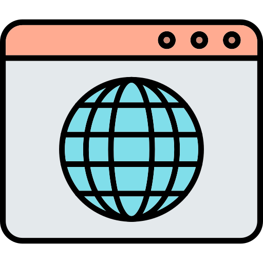

<p v-click style="margin: 0 auto">Веб-платформа = Браузер + API + стандарты + тесты + комитеты</p>

<!--
[REFRAME] Определение подаём как ОГЛАВЛЕНИЕ большого продукта: код, инфраструктура,
процессы, оргструктура — всё как у зрелого продукта, только распределено по планете.
-->

---
layout: section
docNumber: "САМОЕ БОЛЬШОЕ ЛЕГАСИ"
sectionNumber: '1'
---

# Глава 1

## MVP, который оказался слишком успешным

<template v-slot:descriptor>
Или как веб начинался с простого гипертекста
</template>

---
sectionNumber: 1-1
docNumber: "HOLYJS AUTUMN 2026"
title: Масштаб за 80 лет
---

## На секунду — про масштаб

<div class="grid grid-cols-2 gap-6 items-center mt-4">

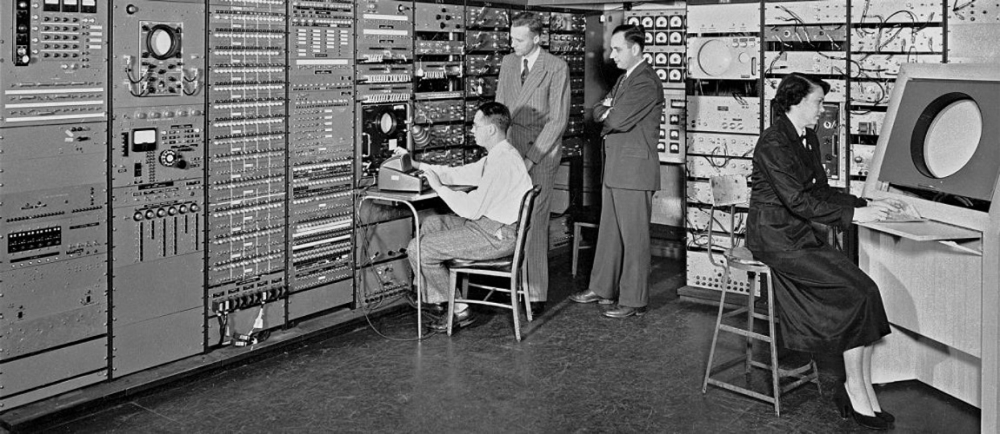


</div>

| Параметр            | ENIAC (1946)                              | iPhone 17 Pro (2025)            |
|:--------------------|:------------------------------------------|:--------------------------------|
| Операций в секунду  | ≈5 000 сложений/сек                       | ≥6 000 000 000 000 операций/сек |
| Память              | **20 слов**                               | **6–8 ГБ** ОЗУ                   |
| Потребление         | ≈174 кВт                                  | ~10 Вт                          |

<p v-click class="text-center">За 80 лет — разница на порядки. Но железо — это половина истории.</p>

<!--
[CUT→1 слайд] Слияние старых 1-2 / 1-4 / 1-5 / 1-6 в один флэшбек.
Это быстрая ремарка про масштаб, а не отдельная мини-глава. Держать бодро, ~30–40 сек.
Вторая половина истории — как мы этим железом обмениваемся информацией → WWW.
-->

---
layout: statement
sectionNumber: 1-2
docNumber: "HOLYJS AUTUMN 2026"
---
## World Wide Web

---
layout: image-right
sectionNumber: 1-3
docNumber: "HOLYJS AUTUMN 2026"
figNumber: 1-1
figLabel: TIM BERNERS-LEE — CREATOR OF THE WORLD WIDE WEB
---

# Тим Бернерс-Ли

## Создал первый браузер в **1990 году**

<template v-slot:image>

</template>

---
docNumber: "HOLYJS AUTUMN 2026"
sectionNumber: 1-4
---

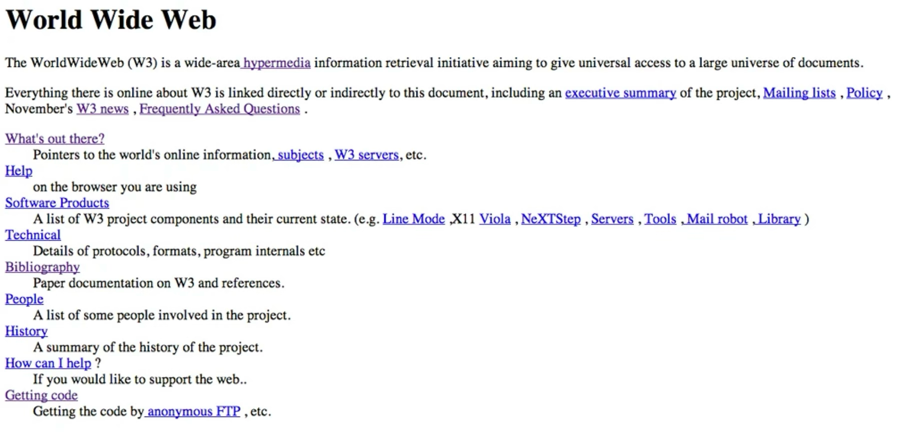

## Первый в мире сайт

---
layout: statement
sectionNumber: 1-5
docNumber: "HOLYJS AUTUMN 2026"
---

## Это и был **MVP**: гипертекстовая система для обмена знаниями

<v-click>

### Удачный минимальный scope: открыть можно почти везде, ссылка ведёт на документ, автору не нужно разрешение платформы

</v-click>

<!--
[REFRAME] Раньше был просто «изначальная идея веба». Теперь явно называем это MVP —
чтобы связать с продуктовой рамкой. К минимализму вернёмся в главе про принципы.
-->

---
layout: image-right
sectionNumber: 1-6
docNumber: "HOLYJS AUTUMN 2026"
figNumber: 1-2
figLabel: EARLY WEB — TABLE-BASED LAYOUTS
---

## Эра «Невинного» веба

<v-clicks>

- Статичные HTML-страницы
- Документы, ссылки, немного картинок
- Табличная вёрстка

</v-clicks>

<template v-slot:image>
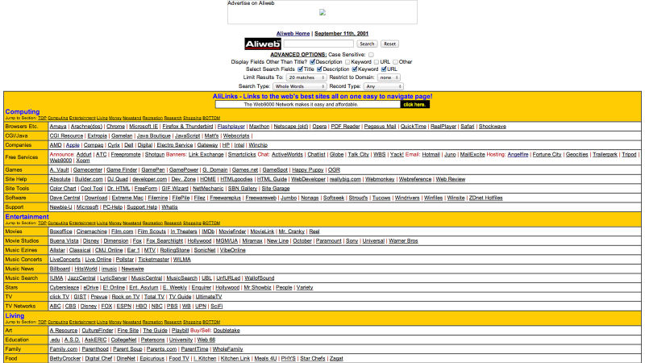
</template>

---
sectionNumber: 1-7
docNumber: "HOLYJS AUTUMN 2026"
---


## ПК —> Веб стал доступен каждому

---
layout: statement
sectionNumber: 1-8
docNumber: "HOLYJS AUTUMN 2026"
---

## Люди стали генерировать контент и самовыражаться

---
sectionNumber: 1-9
docNumber: "HOLYJS AUTUMN 2026"
title: Атмосфера раннего пользовательского веба
---

<SlidevVideo autoplay>
  <source src="./assets/mov/cameron1.mov"  />
</SlidevVideo>

---
layout: image-full
sectionNumber: 1-10
docNumber: "HOLYJS AUTUMN 2026"
---
<template v-slot:image>
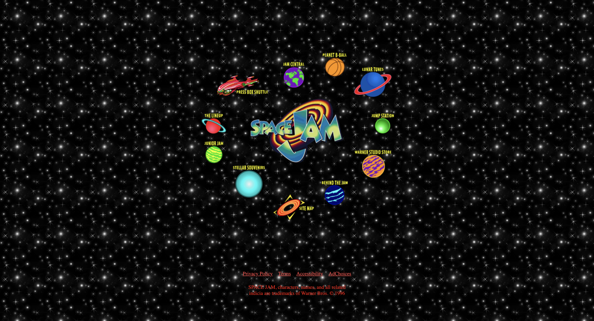
</template>

# Сайт — как пиар компания фильма: Space Jam(1996)

---
layout: image-full
sectionNumber: 1-11
docNumber: "HOLYJS AUTUMN 2026"
---

<template v-slot:image>
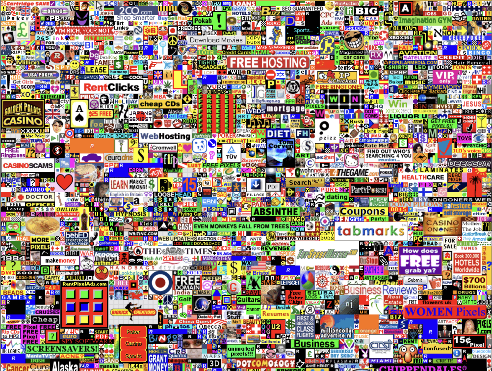
</template>

# Сайт — как заработок: The million dollars homepage (2005)

---
layout: statement
sectionNumber: 1-12
docNumber: "HOLYJS AUTUMN 2026"
---

## Интернет взрослеет

### Самовыражение → сервис

---
layout: statement
sectionNumber: 1-13
docNumber: "HOLYJS AUTUMN 2026"
---

## Веб перестаёт быть просто страницами и становится средой для жизни

<v-click>

### Браузер уже не тянет «старым» способом

</v-click>

<!--
[Переход в Акт 2] А потом в этот маленький MVP пришли все сразу: пользователи, авторы,
бизнес, медиа, сервисы. И начался рост требований.
-->

---
layout: section
sectionNumber: '2'
docNumber: "САМОЕ БОЛЬШОЕ ЛЕГАСИ"
---

# Глава 2

## Требования росли — веб отвечал

<template v-slot:descriptor>
Или как пользователи хотели X, а веб отвечал Y
</template>

---
layout: statement
sectionNumber: 2-1
docNumber: "HOLYJS AUTUMN 2026"
---

### "Фронтенд развивается скачкообразно"

<v-click>

#### Каждый скачок — это накопившееся давление **требований**

</v-click>

---
layout: image-full
sectionNumber: 2-1a
docNumber: "HOLYJS AUTUMN 2026"
title: Динамика скачков
---

<template v-slot:image>

</template>

<!--
Слайд-график динамики — визуальная опора для рассказа про скачки. Не разбирать по осям,
использовать как фон под мысль «рывками, а не плавно».
-->


---
sectionNumber: 2-2
docNumber: "HOLYJS AUTUMN 2026"
---

## Захотели взаимодействовать, а не читать
### Скачок 1: Статичный HTML → Динамический веб

<div class="grid grid-cols-2 gap-8 mt-10 items-stretch">
  <div
    v-click
    class="rounded-2xl border border-red-200/60 bg-red-50/40 px-6 py-5"
  >
    <div class="text-sm uppercase tracking-widest text-red-500 font-bold mb-4">
      До 2004
    </div>

      - Каждое действие — новая страница
      - Обновить статус — рефреш

  </div>
  <div
    v-click
    class="rounded-2xl border border-teal-200/60 bg-teal-50/40 px-6 py-5"
  >
    <div class="text-sm uppercase tracking-widest text-teal-600 font-bold mb-4">
      Gmail + AJAX
    </div>

      - Частичное обновление страницы
      - Мгновенные ответы

  </div>
</div>

---
sectionNumber: 2-3
docNumber: "HOLYJS AUTUMN 2026"
---

## AJAX дал скорость,<br>но создал свои проблемы

<v-clicks>

- Управление состоянием вручную
- "Спагетти‑код" повсюду  **(привет, jquery!)**
- Каждый разработчик делает свой велосипед

</v-clicks>

<v-click>

### Нужна реиспользуемость

</v-click>


---
sectionNumber: 2-4
docNumber: "HOLYJS AUTUMN 2026"
---

## Захотели богатый UI и скорость разработки
### Скачок 2: Страницы → SPA и фреймворки

<div class="grid grid-cols-2 gap-8 mt-10 items-stretch">
  <div
    v-click
    class="rounded-2xl border border-red-200/60 bg-red-50/40 px-6 py-5"
  >
    <div class="text-sm uppercase tracking-widest text-red-500 font-bold mb-4">
      Было (MPA)
    </div>

      - Каждый экран — отдельный HTML
      - Сервер рендерит всю страницу
      - Ограниченная интерактивность
      - Много кода

  </div>
  <div
    v-click
    class="rounded-2xl border border-teal-200/60 bg-teal-50/40 px-6 py-5"
  >
    <div class="text-sm uppercase tracking-widest text-teal-600 font-bold mb-4">
      Стало (SPA)
    </div>

      - Angular/React/Vue
      - Клиент — UI-машина
      - Сервер — только API

  </div>
</div>

---
layout: default
sectionNumber: 2-5
docNumber: "HOLYJS AUTUMN 2026"
---

## Но телефоны не стояли на месте

<div class="grid grid-cols-2 gap-12 mt-10 items-start">

  <div
    v-click
    class="flex flex-col gap-1"
  >
    <h2 class="text-2xl font-bold text-rose-400">
      Кнопочные <span class="opacity-70">(2000–2007)</span>
    </h2>
    <div class="grid grid-cols-2 gap-1">
      
      
      
      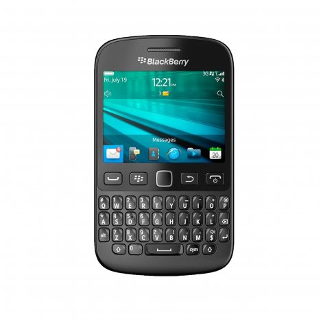
    </div>
  </div>

  <div
    v-click
    class="flex flex-col gap-1"
  >
    <h2 class="text-2xl font-bold text-cyan-300">
      Сенсорные <span class="opacity-70">(2007+)</span>
    </h2>
    <div class="grid grid-cols-2 gap-1">
      
      
      
      
    </div>
  </div>
</div>

---
sectionNumber: 2-6
docNumber: "HOLYJS AUTUMN 2026"
---

## С мобильностью пришли новые вызовы

<v-clicks>

- Тяжёлый JS тормозит на слабых устройствах
- Touch UI вместо hover/click
- 3G/4G вместо оптоволокна
- Экраны от 320px до 4K

</v-clicks>

---
sectionNumber: 2-7
docNumber: "HOLYJS AUTUMN 2026"
---

## Мир стал мобильным
### Скачок 3: Десктоп → Mobile-first

<div class="grid grid-cols-2 gap-8 mt-10 items-stretch">
  <div
    v-click
    class="rounded-2xl border border-red-200/60 bg-red-50/40 px-6 py-5"
  >
    <div class="text-sm uppercase tracking-widest text-red-500 font-bold mb-4">
      Десктоп-first (2010)
    </div>

      - Фиксированная ширина 1024px
      - Hover и курсор мыши
      - Быстрый интернет (DSL)
      - Мощные ПК

  </div>
  <div
    v-click
    class="rounded-2xl border border-teal-200/60 bg-teal-50/40 px-6 py-5"
  >
    <div class="text-sm uppercase tracking-widest text-teal-600 font-bold mb-4">
      Mobile-first (2012+)
    </div>

      - Адаптивность 320px–4K
      - Touch интерфейсы (Material UI)
      - Производительность (lazy load)
      - Сети 3G/4G

  </div>
</div>

---
sectionNumber: 2-8
docNumber: "HOLYJS AUTUMN 2026"
---

## Mobile-first дал адаптивность, но хотелось нативности

<v-clicks>

- App Store модерация (недели)
- Обновления только через стор
- Офлайн недоступен
- Push только через натив

</v-clicks>

---
sectionNumber: 2-9
docNumber: "HOLYJS AUTUMN 2026"
---

## Захотели возможности приложений
### Скачок 4: Веб → PWA

<div class="grid grid-cols-2 gap-8 mt-10 items-stretch">
  <div
    v-click
    class="rounded-2xl border border-red-200/60 bg-red-50/40 px-6 py-5"
  >
    <div class="text-sm uppercase tracking-widest text-red-500 font-bold mb-4">
      Обычный веб
    </div>

      - Только онлайн
      - Не устанавливается
      - Нет push
      - Зависит от сети

  </div>
  <div
    v-click
    class="rounded-2xl border border-teal-200/60 bg-teal-50/40 px-6 py-5"
  >
    <div class="text-sm uppercase tracking-widest text-teal-600 font-bold mb-4">
      PWA
    </div>

      - Offline-first
      - Установка без стора
      - Push уведомления
      - Кэш + Service Workers

  </div>
</div>

<v-click>

<p class="text-center pt-5">
Service Worker = прокси между сетью и кэшем
</p>

</v-click>

---
sectionNumber: 2-10
docNumber: "HOLYJS AUTUMN 2026"
---

## ...но вылезли рендерные боли (опять)

<v-clicks>

- Тяжёлый JS на клиенте
- SEO страдает (SPA)
- TTFB (Time to First Byte) медленный
- Размытая ответственность между сервером и клиентом

</v-clicks>

---
sectionNumber: 2-11
docNumber: "HOLYJS AUTUMN 2026"
---

## Нужны интерактив + скорость + SEO
### Скачок 5: Клиент/Сервер → Server Components

<div class="grid grid-cols-2 gap-8 mt-10 items-stretch">
  <div
    v-click
    class="rounded-2xl border border-red-200/60 bg-red-50/40 px-6 py-5"
  >
    <div class="text-sm uppercase tracking-widest text-red-500 font-bold mb-4">
      Классика
    </div>

      - Всё на клиенте (SPA)
      - Или всё на сервере (MPA)
      - Два кода
      - SEO или скорость

  </div>
  <div
    v-click
    class="rounded-2xl border border-teal-200/60 bg-teal-50/40 px-6 py-5"
  >
    <div class="text-sm uppercase tracking-widest text-teal-600 font-bold mb-4">
      RSC (React Server Components)
    </div>

      - Серверный рендер статичного
      - Клиентский только интерактив
      - Один код (async/await)
      - SEO + скорость + PWA

  </div>
</div>

<v-click>

<p class="mt-16 text-center">
Сервер рендерит → Streaming → Клиент "оживляет"
</p>

</v-click>

---
layout: timeline
sectionNumber: 2-12
docNumber: "HOLYJS AUTUMN 2026"
title: ЭВОЛЮЦИЯ ВЕБА — ХРОНОЛОГИЯ
direction: horizontal
---

<div class="tl-entry">
  <div class="tl-entry-marker"><div class="tl-entry-dot"></div></div>
  <div class="tl-entry-body">
    <div class="tl-entry-date fm-label">1990</div>
    <div class="tl-entry-title">Статичный веб</div>
  </div>
</div>

<div class="tl-entry">
  <div class="tl-entry-marker"><div class="tl-entry-dot"></div></div>
  <div class="tl-entry-body">
    <div class="tl-entry-date fm-label">2004</div>
    <div class="tl-entry-title">Ajax</div>
    <div class="tl-entry-desc">Gmail заложил тренд веба как сервиса</div>
  </div>
</div>

<div class="tl-entry">
  <div class="tl-entry-marker"><div class="tl-entry-dot"></div></div>
  <div class="tl-entry-body">
    <div class="tl-entry-date fm-label">2010</div>
    <div class="tl-entry-title">SPA‑бум</div>
    <div class="tl-entry-desc">AngularJS (2010), React(2013), Vue(2014)</div>
  </div>
</div>

<div class="tl-entry">
  <div class="tl-entry-marker"><div class="tl-entry-dot"></div></div>
  <div class="tl-entry-body">
    <div class="tl-entry-date fm-label">2010</div>
    <div class="tl-entry-title">First-mobile</div>
    <div class="tl-entry-desc">Развитие смартфонов</div>
  </div>
</div>

<div class="tl-entry">
  <div class="tl-entry-marker"><div class="tl-entry-dot"></div></div>
  <div class="tl-entry-body">
    <div class="tl-entry-date fm-label">2015+</div>
    <div class="tl-entry-title">PWA</div>
    <div class="tl-entry-desc">Офлайн, установка, пуш‑уведомления</div>
  </div>
</div>

<div class="tl-entry">
  <div class="tl-entry-marker"><div class="tl-entry-dot"></div></div>
  <div class="tl-entry-body">
    <div class="tl-entry-date fm-label">2020-2023</div>
    <div class="tl-entry-title">Server Components</div>
    <div class="tl-entry-desc">Гибрид сервер/клиент</div>
  </div>
</div>

---
layout: statement
sectionNumber: 2-13
docNumber: "HOLYJS AUTUMN 2026"
---

# Всего за 20 лет

<v-click>

### Темп колоссальный

</v-click>

<!--
Короткий выдох после таймлайна. Одна фраза — и сразу разворот на следующем слайде.
-->

---
layout: statement
sectionNumber: 2-14
docNumber: "HOLYJS AUTUMN 2026"
---

## Но у каждого из этих скачков был один и тот же автор

<v-click>

### И это были не браузеры

</v-click>

<!--
🚧 РАЗВОРОТ. Предыдущий слайд говорит «всего за 20 лет» — то есть быстро. Этот
переворачивает: каждый раз новую возможность придумывали не в комитете, а разработчики,
которые выжимали максимум из того, что было под рукой. Платформа приходила потом.
-->

---
sectionNumber: 2-15
docNumber: "HOLYJS AUTUMN 2026"
title: Платформа догоняет библиотеки
---

## Платформа догоняет. Всегда.

| Мы выжимали из того, что было | Платформа догнала | Разрыв |
|:---|:---|:---|
| Вёрстка таблицами | Flexbox (2012), Grid (2017) | ~15 лет |
| `$('.item')` в jQuery | `querySelector` | ~7 лет |
| `$.ajax` | `fetch` | ~10 лет |
| moment.js | `Temporal` | ~10 лет |
| lodash | нативные методы массивов | ~10 лет |
| Свой lazy-load на скролле | `loading="lazy"` | ~10 лет |
| JS-хаки под ширину блока | `@container` (2023) | ~13 лет |

<!--
🚧 ЭТО СЛАЙД-ДОКАЗАТЕЛЬСТВО, не читать вслух построчно. Выбрать 2–3 строки и назвать
цифру разрыва — цифра работает сильнее списка.
Сильнейшая строка — Temporal: «десять лет, чтобы починить время».
Про дизайнерские контролы (select, dialog, popover) НЕ говорить — они в Главе 3.
-->

---
layout: statement
sectionNumber: 2-16
docNumber: "HOLYJS AUTUMN 2026"
---

## Разработчики всегда впереди платформы

<v-clicks>

### Мы выжимаем максимум из того, что есть сейчас — и делаем хак

### Платформа **легитимизирует** этот хак. Через десять лет.

</v-clicks>

<!--
Ключевая мысль главы 2 в новой формулировке: эволюция веба — это не подарки от комитетов.
Это узаконивание народного творчества, всегда с запозданием. Держать без обиды — обида
будет в Главе 5, здесь только констатация.
-->

---
layout: statement
sectionNumber: 2-16a
docNumber: "HOLYJS AUTUMN 2026"
---

## Посмотрим, к чему это привело

<!--
Лид-ин к галерее примеров. Одна фраза, дальше только картинки и видео.
-->

---
sectionNumber: 2-17
docNumber: "HOLYJS AUTUMN 2026"
---

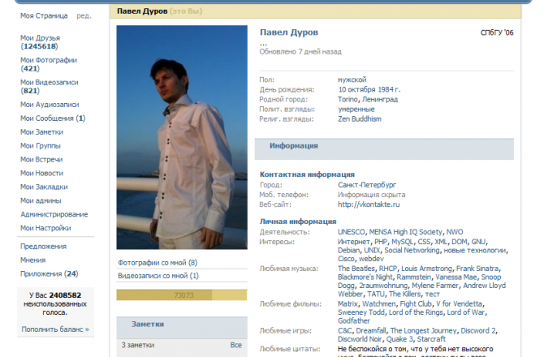

---
sectionNumber: 2-18
docNumber: "HOLYJS AUTUMN 2026"
---

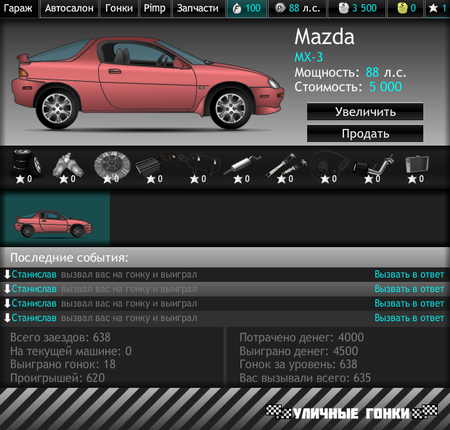

---
sectionNumber: 2-19
docNumber: "HOLYJS AUTUMN 2026"
---

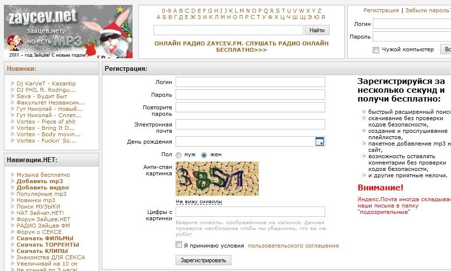

---
sectionNumber: 2-20
docNumber: "HOLYJS AUTUMN 2026"
---

<div style="width: 100%; border-radius: 12px; overflow: hidden;">
  <video
    src="./assets/mov/samokat.mov"
    autoplay
    muted
    loop
    playsinline
    controls={false}
    style="width: 100%; height: auto; display: block;"
  ></video>
</div>
<p class="text-center">3D музей в браузере &#40;React и Three.js) <a href="https://museum.samokat.ru">https://museum.samokat.ru</a></p>

---
sectionNumber: 2-21
docNumber: "HOLYJS AUTUMN 2026"
---

<div style="width: 100%; border-radius: 12px; overflow: hidden;">
  <video
    src="./assets/mov/messanger.mov"
    autoplay
    muted
    loop
    playsinline
    controls={false}
    style="width: 100%; height: auto; display: block;"
  ></video>
</div>
<p class="text-center">Многопользовательская игра в браузере (webGL) <a href="https://messenger.abeto.co">https://messenger.abeto.co</a></p>

---
sectionNumber: 2-22
docNumber: "HOLYJS AUTUMN 2026"
---


<div style="width: 100%; border-radius: 12px; overflow: hidden;">
  <video
    src="./assets/mov/doom.mov"
    autoplay
    muted
    loop
    playsinline
    controls={false}
    style="width: 100%; height: auto; display: block;"
  ></video>
</div>
<p class="text-center">DOOM на CSS и JS <a href="https://cssdoom.wtf/">https://cssdoom.wtf/</a></p>


---
layout: two-column
sectionNumber: 2-23
docNumber: "HOLYJS AUTUMN 2026"
title: "Web API в действии"
---

<template v-slot:left>

### 150+ браузерных Web API с доступом к

<v-clicks>

- телефону (контакты, вибрация, bluetooth, уведомления)
- железу (GPU)
- AI (конец 2025-го)
- ..и много чему еще

</v-clicks>

</template>

<template v-slot:right>

<div style="width: 100%;">
  <video
    src="./assets/mov/mdn.mov"
    autoplay
    muted
    loop
    playsinline
    controls={false}
    style="width: 100%; height: auto; display: block;"
  ></video>
</div>

</template>

---
layout: statement
sectionNumber: 2-24
docNumber: "HOLYJS AUTUMN 2026"
---

# Это уже полноценная платформа

<!--
[Переход в Акт 3] Но когда продукт растёт, меняется не только его код. Каждое из этих
требований расходилось волной по всей системе — не только по фронтенду.
-->

---
layout: section
sectionNumber: '3'
docNumber: "САМОЕ БОЛЬШОЕ ЛЕГАСИ"
---

# Глава 3

## Веб переписал не только фронтенд

<template v-slot:descriptor>
Или та же история глазами дизайна и бэкенда
</template>

---
layout: statement
sectionNumber: 3-1
docNumber: "HOLYJS AUTUMN 2026"
---

## Когда продукт растёт, меняется не только его код

<v-click>

### Меняются интерфейсы, инфраструктура, процессы — <br>и даже то, **кто считается пользователем**

</v-click>

<!--
🚧 ЗАГЛУШКА (мысль слайда):
Открытие новой главы. Заявляем приём: дальше каждую волну требований смотрим в трёх
измерениях сразу — ФРОНТ / ДИЗАЙН / БЭКЕНД. Тезис: legacy веба = legacy всей индустрии.
-->

---
layout: statement
sectionNumber: 3-2
docNumber: "HOLYJS AUTUMN 2026"
---

## Сейчас мы пройдём этот же путь ещё дважды

<v-clicks>

### Те же требования, те же годы — но не глазами фронтендера

#### Арка 1 — **дизайн**. Арка 2 — **бэкенд**.

</v-clicks>

<!--
🚧 ЗАЩИТА ОТ «ЭТО ЖЕ БЫЛО»:
Обязательно проговорить приём вслух, иначе зал решит, что мы повторяем Главу 2.
Формулировка: «Я специально возвращаюсь в те же годы. Потому что интересно не ЧТО
случилось, а СКОЛЬКО профессий это переписало.»
-->

---
layout: statement
sectionNumber: 3-3
docNumber: "HOLYJS AUTUMN 2026"
---

# Арка 1 — Дизайн

<v-click>

## От картинки к системе правил

</v-click>

---
layout: two-column
sectionNumber: 3-4
docNumber: "HOLYJS AUTUMN 2026"
title: Дизайн = документ
---

<template v-slot:left>

## Шаг 1. Дизайн = документ

<v-clicks>

- Макет — **картинка фиксированной ширины**: 640 → 800 → 1024
- Типографика, таблицы, `<font>`, `<center>`
- «Отдали в вёрстку» → **pixel perfect**
- Дизайнер точно знает, как это будет выглядеть у пользователя

</v-clicks>

</template>

<template v-slot:right>

</template>

<!--
Опорная мысль: в этой точке дизайн ЗНАЕТ результат. Всё остальное в арке — история
того, как он это знание терял. Картинка та же, что в Главе 1 — это осознанный повтор,
но теперь мы смотрим на неё как на рабочий процесс дизайнера, а не как на «ранний веб».
-->

---
layout: statement
sectionNumber: 3-5
docNumber: "HOLYJS AUTUMN 2026"
---

## Табличная вёрстка не умерла

<v-clicks>

### Она переехала в почту

#### Outlook с 2007-го рендерит письма движком **Microsoft Word** — поэтому email-вёрстка до сих пор на вложенных `<table>` и inline-стилях

### Это первый legacy-артефакт в докладе: слой, который нельзя выкинуть, потому что на нём кто-то живёт

</v-clicks>

<!--
🚧 ПЕРВЫЙ LEGACY-АРТЕФАКТ ДОКЛАДА — и он нужен именно здесь, а не в Главе 5.
Мысль: вот как выглядит слой, который нельзя выкинуть, потому что на нём кто-то живёт.
Зал (особенно те, кто верстал письма) отреагирует стоном узнавания.
🚧 НУЖЕН АССЕТ: скриншот кода реального email-шаблона (вложенные table, inline-стили).
-->

---
sectionNumber: 3-6
docNumber: "HOLYJS AUTUMN 2026"
title: Дизайн начал рисовать состояния
---

## Шаг 2. Появилось поведение — и дизайн стал рисовать состояния

<div class="grid grid-cols-2 gap-8 mt-8 items-stretch">
  <div v-click class="rounded-2xl border border-red-200/60 bg-red-50/40 px-6 py-5">
    <div class="text-sm uppercase tracking-widest text-red-500 font-bold mb-4">
      Было
    </div>

      - Один макет = один экран
      - Страница либо есть, либо её нет

  </div>
  <div v-click class="rounded-2xl border border-teal-200/60 bg-teal-50/40 px-6 py-5">
    <div class="text-sm uppercase tracking-widest text-teal-600 font-bold mb-4">
      Стало (после AJAX)
    </div>

      - loading / empty / error / partial
      - Переходы и анимации
      - Оптимистичный UI

  </div>
</div>

<v-clicks>

<p class="text-center pt-6">Дизайнер впервые описывает не картинку, а <strong>поведение во времени</strong></p>

<p class="text-center">И тут же родилась боль, которая не решена до сих пор: <strong>«макет счастливого пути»</strong></p>

</v-clicks>

<!--
Здесь живёт шутка про «макет счастливого пути» — боль, которая не решена до сих пор.
Можно спросить зал: у кого в проекте есть дизайн empty state? А error state? А обоих?
-->

---
sectionNumber: 3-7
docNumber: "HOLYJS AUTUMN 2026"
title: Дизайн симулировал то, чего не было
---

## И параллельно дизайн симулировал то, чего в платформе не было

<v-clicks>

- Нативный `<select>` **нельзя было застилить** — и индустрия начала писать свои селекты
- Нет модального окна — свой оверлей, focus trap, блокировка скролла
- Нет тултипа — своя обёртка с позиционированием
- Нет кнопки нужной формы — `<div role="button">`
- А ещё дизайн симулировал **нативные интерфейсы ОС**: объёмные кнопки, кожа, полки, скевоморфизм

</v-clicks>

<v-click>

<p class="text-center pt-4">Дизайнер рисовал не то, что умеет веб. Он рисовал то, что умеет всё остальное.</p>

</v-click>

<!--
🚧 Тезис из твоего списка: «желание симулировать нативщину и древние элементы интерфейсов».
Важный акцент: симуляция — это не каприз дизайнера. Это следствие того, что у платформы
не было нужных примитивов. И расплачивался за это фронтендер.
-->

---
layout: statement
sectionNumber: 3-8
docNumber: "HOLYJS AUTUMN 2026"
---

## Платформа догнала

<v-clicks>

#### `<dialog>` — **2022**. `popover` — **2023**. `appearance: base-select` — **2025**.

### Двадцать лет индустрия писала свои селекты, потому что платформа не давала стилизовать нативный

</v-clicks>

<!--
Панчлайн. Цифры произносить медленно — они и есть шутка.
Связка с Главой 2 («платформа догоняет всегда»), но здесь конкретно про контролы,
то есть про дизайн. В Главе 5 это вернётся как «счёт, который прислали нам».
-->

---
layout: two-column
sectionNumber: 3-9
docNumber: "HOLYJS AUTUMN 2026"
title: Mobile-first — макет перестал быть картинкой
---

<template v-slot:left>

## Шаг 3. Макет перестал быть картинкой

<v-clicks>

- **2010**, Ethan Marcotte, A List Apart — «Responsive Web Design»
- Число экранов больше **не конечно**
- Комбинаторный взрыв: состояния × экраны × плотности × ориентации
- Нарисовать все макеты стало **физически невозможно**

</v-clicks>

</template>

<template v-slot:right>

<v-click>

### 5 состояний × 4 брейкпоинта × 2 темы

### = 40 макетов на один экран

</v-click>

<v-click>

<p class="pt-6">Это <strong>перелом арки</strong>. До этой точки дизайн мог нарисовать результат. После — уже нет.</p>

</v-click>

</template>

<!--
Это перелом арки. До этого слайда дизайн мог нарисовать результат. После — нет.
Именно отсюда растут дизайн-системы: не из моды, а из арифметики.
-->

---
sectionNumber: 3-10
docNumber: "HOLYJS AUTUMN 2026"
title: Ответ индустрии — дизайн-системы
---

## Шаг 4. Ответ индустрии: дизайн перестал быть картинками

<v-clicks>

- **2011** — Bootstrap: готовая сетка и компоненты
- **2013** — Atomic Design (Brad Frost): интерфейс как набор атомов
- **2014** — Material Design: дизайн как **спецификация с правилами**
- **2016** — Figma: макет как общий редактируемый исходник
- **Design tokens** — дизайн-решения становятся данными

</v-clicks>

<v-click>

<p class="text-center pt-4">Дизайн стал кодом. И у него появились <strong>версии, релизы и обратная совместимость</strong></p>

</v-click>

<v-click>

<p class="text-center opacity-70">Дизайн-системы выросли не из моды. Они выросли из арифметики с предыдущего слайда.</p>

</v-click>

<!--
Ключевая связка: Material Design — это уже не макет, а спецификация. То есть дизайн
пришёл к тому же формату, что и веб-стандарты. Дальше — что и к тем же комитетам.
-->

---
layout: statement
sectionNumber: 3-11
docNumber: "HOLYJS AUTUMN 2026"
---

## И даже дизайн-токены уехали в комитет

<v-click>

### W3C **Design Tokens Community Group** — чтобы токены работали одинаково в Figma, в вебе и в мобилке

</v-click>

<!--
🚧 ПОДГОТОВКА ГЛАВЫ 4. Не разворачивать, 20 секунд. Мысль: как только что-то в вебе
становится важным для всех — вокруг этого немедленно появляется комитет. Дизайн прошёл
ровно тот же путь, что HTML и CSS. В Главе 4 зал это уже узнает.
-->

---
sectionNumber: 3-12
docNumber: "HOLYJS AUTUMN 2026"
---

## Тот же процесс — но в языке оформления

<v-click>

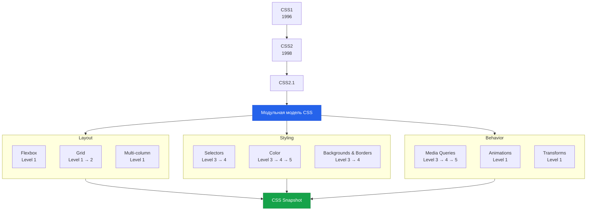
```mermaid
flowchart TD
    A["CSS1<br/>1996"] --> B["CSS2<br/>1998"]
    B --> C["CSS2.1"]

    C --> D["Модульная модель CSS"]

    D --> S1

    subgraph S1["Layout"]
        direction TB
        I["Flexbox<br/>Level 1"]
        J["Grid<br/>Level 1 → 2"]
        K["Multi-column<br/>Level 1"]
    end

    D --> S2

    subgraph S2["Styling"]
        direction TB
        E["Selectors<br/>Level 3 → 4"]
        F["Color<br/>Level 3 → 4 → 5"]
        G["Backgrounds & Borders<br/>Level 3 → 4"]
    end

    D --> S3

    subgraph S3["Behavior"]
        direction TB
        H["Media Queries<br/>Level 3 → 4 → 5"]
        L["Animations<br/>Level 1"]
        M["Transforms<br/>Level 1"]
    end

    S1 --> N["CSS Snapshot"]
    S2 --> N
    S3 --> N

    style D fill:#2563eb,stroke:#1d4ed8,color:#fff
    style N fill:#16a34a,stroke:#15803d,color:#fff
```

</v-click>

<v-click>

<p class="text-center text-sm opacity-70">Layout / Styling / Behavior — это буквально те три вещи, которые дизайнер перестал держать в одной картинке</p>

</v-click>

<!--
[MOVE] Диаграмма переехала из старой главы про комитеты. Здесь она — не про стандарт,
а доказательство арки: CSS разросся ровно теми же слоями, что и работа дизайнера.
Layout / Styling / Behavior — это буквально три вещи, которые дизайн перестал держать
в одной картинке. Не углубляться в модули, показать форму.
-->

---
sectionNumber: 3-13
docNumber: "HOLYJS AUTUMN 2026"
title: Решение отдали пользователю
---

## Шаг 5. Дизайн больше не решает, как это выглядит

<v-clicks>

- `prefers-color-scheme` — тёмная тема это **не макет**, а согласие с настройкой ОС
- `prefers-reduced-motion` — анимацию может отменить пользователь
- `prefers-contrast`, `forced-colors` — цвета может переопределить система
- Accessibility: экранный ридер строит **свой** интерфейс из вашей разметки

</v-clicks>

<v-click>

<p class="text-center pt-4">Дизайн описывает <strong>намерение</strong>. Решение принимают пользователь и устройство.</p>

</v-click>

---
layout: statement
sectionNumber: 3-14
docNumber: "HOLYJS AUTUMN 2026"
---

## Дизайнер перестал рисовать результат — <br>и начал описывать правила

<v-click>

### И это было не решение дизайнеров. Это давление веба.

</v-click>

<!--
Микровывод арки 1. Пауза. Это первое из двух доказательств главного тезиса главы.
-->

---
layout: statement
sectionNumber: 3-15
docNumber: "HOLYJS AUTUMN 2026"
---

# Арка 2 — Бэкенд

<v-click>

## От файлового сервера до edge

</v-click>

---
sectionNumber: 3-16
docNumber: "HOLYJS AUTUMN 2026"
title: Сервер отдаёт файл
---

## Шаг 1. Сервер отдаёт файл → сервер собирает страницу

<v-clicks>

- **1991** — httpd отдаёт файл с диска. И всё.
- **1993** — CGI: первая динамика, процесс на каждый запрос
- **1995+** — PHP, Perl, JSP: шаблоны на сервере, состояние в сессии
- HTML — это **результат работы бэкенда**

</v-clicks>

<v-click>

<p class="text-center pt-6">В этой точке бэкенд владеет интерфейсом целиком</p>

</v-click>

---
sectionNumber: 3-17
docNumber: "HOLYJS AUTUMN 2026"
title: Сервер начал отдавать данные
---

## Шаг 2. Сервер начал отдавать данные, а не страницы

<v-clicks>

- **1999** — XMLHttpRequest. Написан Microsoft **для веб-версии Outlook**
- **2000** — REST, диссертация Роя Филдинга
- **2005** — появляется само слово «AJAX»
- Рендеринг уехал на клиент. Сессия → **токен**.

</v-clicks>

<v-click>

<p class="pt-6">А ещё родился <strong>CORS</strong> — целый механизм безопасности, который существует только потому, что фронтенд стал отдельным приложением на другом origin</p>

</v-click>

<v-click>

<p class="text-center opacity-70">Корпоративный продукт для корпоративной почты случайно родил весь современный фронтенд</p>

</v-click>

<!--
Хорошая деталь для зала: движок всего современного фронтенда Microsoft написала
в 1999-м, чтобы почта работала в браузере. Корпоративный продукт случайно родил AJAX.
-->

---
sectionNumber: 3-18
docNumber: "HOLYJS AUTUMN 2026"
title: Один бэкенд — много клиентов
---

## Шаг 3. Один бэкенд — много клиентов

<v-clicks>

- Веб + iOS + Android + партнёрское API — из одного бэкенда
- **2015** — Facebook открывает GraphQL, придуманный под мобильную ленту
- **BFF**: у каждого клиента свой backend-for-frontend
- Версионирование API, потому что старое приложение у пользователя **не обновится**

</v-clicks>

<v-click>

<p class="pt-4">Это буквально <strong>«не ломай веб»</strong>, только на уровне вашего API. Бэкенд получил ту же проблему обратной совместимости, что и браузеры.</p>

</v-click>

<v-click>

<p class="text-center">Форму бэкенда теперь диктует клиент</p>

</v-click>

<!--
Про версионирование сказать отдельно: это буквально «не ломай веб», но на уровне API.
Бэкенд получил ту же проблему обратной совместимости, что и браузеры. Готовит Главу 5.
-->

---
sectionNumber: 3-19
docNumber: "HOLYJS AUTUMN 2026"
title: Мобильность как бэкенд-требование
---

## Шаг 4. Мобильность — это тоже бэкенд-требование

<v-clicks>

- Вес ответа стал **продуктовой метрикой**
- `srcset` / `<picture>`: картинки по размерам, WebP, AVIF
- CDN превращается из оптимизации в обязательный слой
- **HTTP/2** (2015) и **HTTP/3** — работа IETF
- Brotli вместо gzip
- Performance budgets прямо в CI

</v-clicks>

<v-click>

<p class="text-center pt-4">«Мир стал мобильным» — это был change request и для бэкенда тоже</p>

</v-click>

<!--
Упоминание IETF здесь не случайно — это второй заход на мысль «вокруг всего важного
появляется комитет». В Главе 4 IETF уже будет знакомым именем.
-->

---
sectionNumber: 3-20
docNumber: "HOLYJS AUTUMN 2026"
title: Сервер вернулся
---

## Шаг 5. Сервер вернулся — но не в датацентр

<v-clicks>

- SSR и стриминг: рендер **снова на сервере**
- Edge и serverless: сервер в сотнях точек рядом с пользователем
- Гибридный рендеринг: часть страницы с сервера, часть с клиента

</v-clicks>

<v-click>

<p class="text-center pt-8">Круг замкнулся: рендер ушёл к клиенту и вернулся назад.<br>Только за это время веб-платформа <strong>переписала обе стороны</strong>.</p>

</v-click>

---
layout: two-column
sectionNumber: 3-21
docNumber: "HOLYJS AUTUMN 2026"
title: Веб навязал бэкенду свой API
---

<template v-slot:left>

## Веб не просто изменил бэкенд.<br>Он навязал ему свой API.

<v-clicks>

- В Node.js из коробки: `fetch`, `Request`, `Response`, `Headers`, `URL`, `AbortController`, Web Streams
- Это API, спроектированные **для браузера** комитетом WHATWG
- Deno, Bun, Cloudflare Workers построены на них **изначально**
- Есть даже комитет, который договаривается, какие браузерные API обязан иметь серверный рантайм — **WinterCG / WinterTC**

</v-clicks>

</template>

<template v-slot:right>

```js
// Node.js 18+, Deno, Bun,
// Cloudflare Workers — один и тот же код

const res = await fetch(url)
const data = await res.json()

export default {
  // Request — из спеки WHATWG Fetch
  async fetch(request) {
    // Response — оттуда же
    return new Response('hello', {
      headers: {
        'content-type': 'text/plain',
      },
    })
  },
}
```

</template>

<!--
🎯 ПИК ГЛАВЫ. Самое сильное доказательство тезиса за весь доклад.
Формулировка вслух: «Бэкенд-разработчик на Node сегодня пишет код по спецификации,
которую WHATWG написала для браузера. Веб-платформа дотянулась даже туда, где нет
никакого браузера.» WinterCG уже есть на карте влияния в Главе 4 — это заряженная связка.
🚧 ПРОВЕРИТЬ: точный статус WinterCG → Ecma TC55 на момент доклада.
-->

---
layout: statement
sectionNumber: 3-22
docNumber: "HOLYJS AUTUMN 2026"
---

## Бэкенд перестал владеть интерфейсом — <br>и начал обслуживать платформу

<v-click>

### Со своей обратной совместимостью, своими комитетами и своим legacy

</v-click>

<!--
Микровывод арки 2. Симметричен микровыводу арки 1 — это важно для ритма.
-->

---
layout: statement
sectionNumber: 3-23
docNumber: "HOLYJS AUTUMN 2026"
---

## Одно требование к вебу — <br>и его переписывают три профессии

<v-click>

### Legacy веба — это legacy всей индустрии

</v-click>

<!--
Микровывод главы. Мостик в Главу 4: у всех этих изменений не было одного архитектора.
Ни дизайн-системы, ни fetch в Node никто не планировал централизованно.
Так кто же вообще всё это согласует?
-->

---
layout: section
sectionNumber: '4'
docNumber: "САМОЕ БОЛЬШОЕ ЛЕГАСИ"
---

# Глава 4

## У мирового продукта нет одного владельца

<template v-slot:descriptor>
Или зоопарк комитетов как закономерность масштаба
</template>

---
layout: statement
sectionNumber: 4-1
docNumber: "HOLYJS AUTUMN 2026"
---

## В обычном продукте вы собираете architecture review

<v-click>

### В вебе его проводят Chrome, Safari, Firefox, W3C, WHATWG, TC39, IETF, разработчики и пользователи — и ни у кого нет права нажать **Merge**

</v-click>

<!--
🚧 ЗАГЛУШКА (мысль слайда): рамка главы. «Зоопарк комитетов» — не хаос ради мема, а
закономерность: когда продукт огромный, ownership неизбежно дробится.
-->

---
layout: chart-full
sectionNumber: 4-2
docNumber: "HOLYJS AUTUMN 2026"
title: КАРТА ВЛИЯНИЯ
figNumber: 4-1
figLabel: КТО КОНТРИБЬЮТИТ В WEB PLATFORM
transition: slide-left
---
<template v-slot:chart>

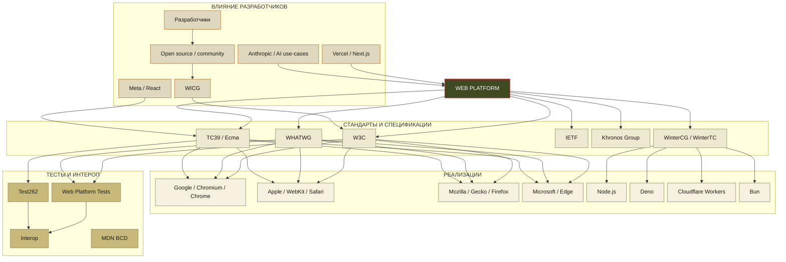
```mermaid
%%{init: {'flowchart': {'curve': 'basis', 'nodeSpacing': 10, 'rankSpacing': 45}}}%%

flowchart TD

  WEB["WEB PLATFORM"]

  subgraph STDS["СТАНДАРТЫ И СПЕЦИФИКАЦИИ"]
    W3C["W3C"]
    WHATWG["WHATWG"]
    TC39["TC39 / Ecma"]
    IETF["IETF"]
    KHR["Khronos Group"]
    WINTER["WinterCG / WinterTC"]
  end

  subgraph IMPL["РЕАЛИЗАЦИИ"]
    CHROME["Google / Chromium / Chrome"]
    WEBKIT["Apple / WebKit / Safari"]
    MOZ["Mozilla / Gecko / Firefox"]
    EDGE["Microsoft / Edge"]
    NODE["Node.js"]
    DENO["Deno"]
    CF["Cloudflare Workers"]
    BUN["Bun"]
  end

  subgraph TESTS["ТЕСТЫ И ИНТЕРОП"]
    WPT["Web Platform Tests"]
    TEST262["Test262"]
    INTEROP["Interop"]
    MDNBCD["MDN BCD"]
  end

  subgraph ECO["ВЛИЯНИЕ РАЗРАБОТЧИКОВ"]
    WICG["WICG"]
    VERCEL["Vercel / Next.js"]
    META["Meta / React"]
    OSS["Open source / community"]
    DEVS["Разработчики"]
    ANTH["Anthropic / AI use-cases"]
  end

  WEB --> W3C
  WEB --> WHATWG
  WEB --> TC39
  WEB --> IETF
  WEB --> KHR
  WEB --> WINTER

  W3C --> CHROME
  W3C --> WEBKIT
  W3C --> MOZ
  W3C --> EDGE

  WHATWG --> CHROME
  WHATWG --> WEBKIT
  WHATWG --> MOZ
  WHATWG --> EDGE

  TC39 --> CHROME
  TC39 --> WEBKIT
  TC39 --> MOZ
  TC39 --> EDGE

  W3C --> WPT
  WHATWG --> WPT
  TC39 --> TEST262
  WPT --> INTEROP
  TEST262 --> INTEROP

  WICG --> W3C
  DEVS --> OSS
  OSS --> WICG
  META --> TC39
  VERCEL --> WEB
  ANTH --> WEB
  WINTER --> NODE
  WINTER --> DENO
  WINTER --> CF
  WINTER --> BUN

  classDef main fill:#3d4a22,stroke:#bf2020,color:#fff,stroke-width:2px;
  classDef standards fill:#ede8d0,stroke:#8a7a50,color:#1a1a14;
  classDef impl fill:#f5f0e0,stroke:#7a7a45,color:#1a1a14;
  classDef tests fill:#c8b87a,stroke:#8a7a50,color:#1a1a14;
  classDef eco fill:#e0d8be,stroke:#b05e10,color:#1a1a14;

  class WEB main;
  class W3C,WHATWG,TC39,IETF,KHR,WINTER standards;
  class CHROME,WEBKIT,MOZ,EDGE,NODE,DENO,CF,BUN impl;
  class WPT,TEST262,INTEROP,MDNBCD tests;
  class WICG,VERCEL,META,OSS,DEVS,ANTH eco;
```

</template>

<template v-slot:source>
ОБЗОР: стандарты, реализации, тесты и экосистема на одной карте. 
</template>

---
layout: chart-full
sectionNumber: 4-3
docNumber: "HOLYJS AUTUMN 2026"
title: СЛОЙ 1 — СТАНДАРТЫ
figNumber: 4-2
figLabel: ОСНОВНЫЕ ПЛОЩАДКИ СТАНДАРТИЗАЦИИ
transition: slide-left
---

<template v-slot:chart>

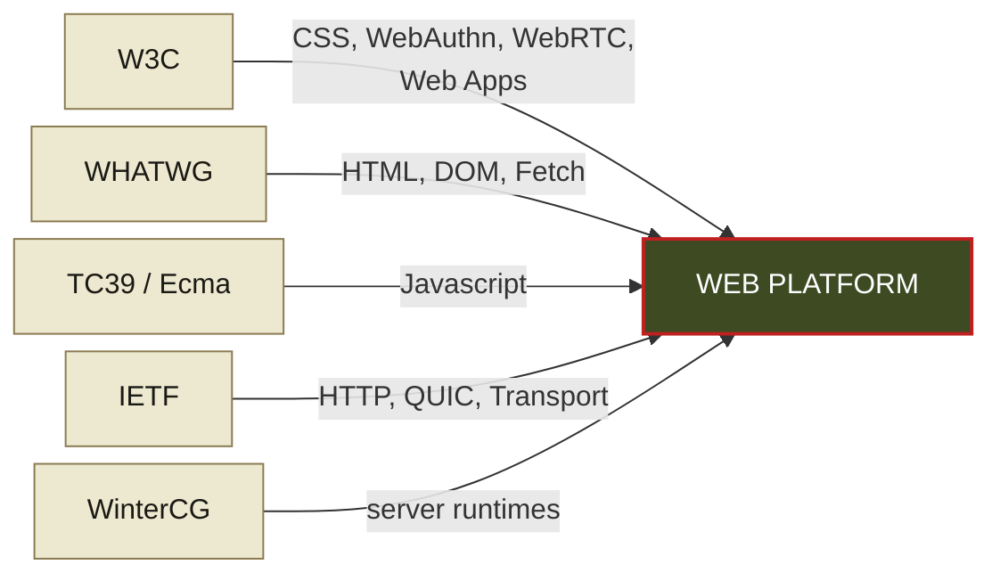
```mermaid
%%{init: {'flowchart': {'curve': 'basis', 'nodeSpacing': 10, 'rankSpacing': 10}}}%%
flowchart LR

  W3C["W3C"] -->|CSS, WebAuthn, WebRTC,\nWeb Apps| WEB["WEB PLATFORM"]
  WHATWG["WHATWG"] -->|HTML, DOM, Fetch| WEB
  TC39["TC39 / Ecma"] -->|Javascript| WEB
  IETF["IETF"] -->|HTTP, QUIC, Transport| WEB
  WINTER["WinterCG"] -->|server runtimes| WEB

  classDef web fill:#3d4a22,stroke:#bf2020,color:#fff,stroke-width:2px;
  classDef org fill:#ede8d0,stroke:#8a7a50,color:#1a1a14;

  class WEB web;
  class W3C,WHATWG,TC39,IETF,WINTER org;
```

</template>

<template v-slot:source>
WHATWG ведёт HTML Living Standard; TC39 отвечает за JavaScript; W3C и IETF покрывают значительную часть веб-платформы и сетевого стека. 
</template>

---
layout: chart-full
sectionNumber: 4-4
docNumber: "HOLYJS AUTUMN 2026"
title: СЛОЙ 2 — W3C И ИНКУБАЦИЯ
figNumber: 4-3
figLabel: ВНУТРЕННЯЯ СТРУКТУРА W3C
transition: slide-left
---

<template v-slot:chart>

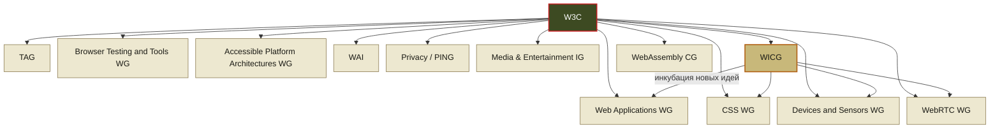
```mermaid
%%{init: {'flowchart': {'curve': 'basis', 'nodeSpacing': 15, 'rankSpacing': 15}}}%%

flowchart TD

  W3C["W3C"]

  TAG["TAG"]
  WEBAPPS["Web Applications WG"]
  CSSWG["CSS WG"]
  BTT["Browser Testing and Tools WG"]
  DAS["Devices and Sensors WG"]
  WEBRTCWG["WebRTC WG"]
  APA["Accessible Platform Architectures WG"]
  WAI["WAI"]
  PATWG["Privacy / PING"]
  MEIG["Media & Entertainment IG"]
  WICG["WICG"]
  WASMCG["WebAssembly CG"]

  W3C --> TAG
  W3C --> WEBAPPS
  W3C --> CSSWG
  W3C --> BTT
  W3C --> DAS
  W3C --> WEBRTCWG
  W3C --> APA
  W3C --> WAI
  W3C --> PATWG
  W3C --> MEIG
  W3C --> WICG
  W3C --> WASMCG

  WICG -->|инкубация новых идей| WEBAPPS
  WICG --> CSSWG
  WICG --> DAS
  WICG --> WEBRTCWG

  classDef core fill:#3d4a22,stroke:#bf2020,color:#fff,stroke-width:2px;
  classDef group fill:#ede8d0,stroke:#8a7a50,color:#1a1a14;
  classDef incubator fill:#c8b87a,stroke:#b05e10,color:#1a1a14,stroke-width:2px;

  class W3C core;
  class TAG,WEBAPPS,CSSWG,BTT,DAS,WEBRTCWG,APA,WAI,PATWG,MEIG,WASMCG group;
  class WICG incubator;
```

</template>

<template v-slot:source>
WICG — инкубатор новых веб-идей; внутри W3C множество рабочих и community groups с разной ответственностью. 
</template>

---
transition: slide-left
sectionNumber: 4-5
docNumber: "HOLYJS AUTUMN 2026"
---

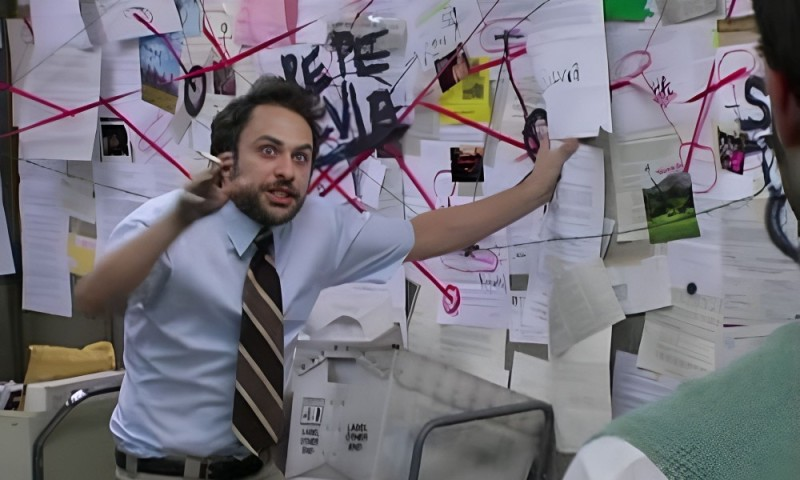

---
layout: two-column
sectionNumber: 4-6
docNumber: "HOLYJS AUTUMN 2026"
title: Кухня стандартизации
transition: fade
---

<template v-slot:left>

# Если кратко

<v-clicks>

- очень много комитетов и рабочих групп
- в том числе поставщики браузеров
- не всегда прозрачные обязанности
- внутренняя "кухня" и политика

</v-clicks>

</template>

<template v-slot:right>
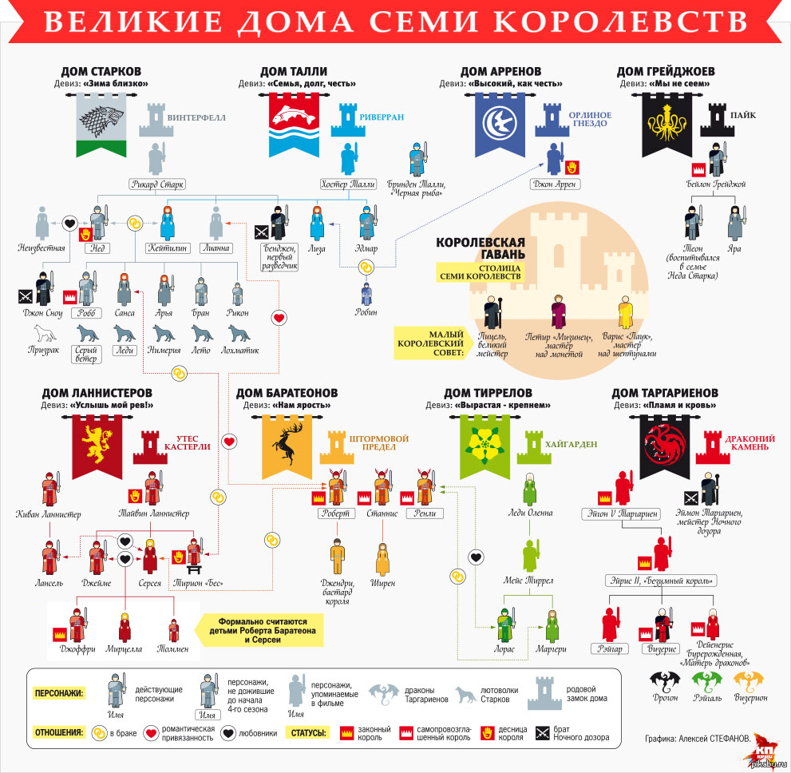
</template>

---
layout: statement
sectionNumber: 4-7
docNumber: "HOLYJS AUTUMN 2026"
---

# Спецификации

---
layout: statement
sectionNumber: 4-8
docNumber: "HOLYJS AUTUMN 2026"
---

Кто из вас читал спецификации по JS/HTML/CSS?

<v-click>

### ...и не сбежал через минуту?

</v-click>

---
layout: two-column
sectionNumber: 4-9
docNumber: "HOLYJS AUTUMN 2026"
title: История HTML как стандарта
transition: fade
---

<template v-slot:left>

### Краткая история спеки

<v-clicks>

- **1989–1991** — HTML рождается в CERN вместе с Web.
- **1994–1999** — W3C формализует HTML как набор версий и рекомендаций.
- **2004** — **реализация опередила стандарт** и появился комитет WHATWG — как реакция браузерных вендоров.
- **2012** — у индустрии **две версии** HTML: W3C и WHATWG.
- **2019** — W3C и WHATWG договариваются о единой версии HTML и DOM, HTML как **living standard**.

</v-clicks>

</template>

<template v-slot:right>

</template>

---
sectionNumber: 4-10
docNumber: "HOLYJS AUTUMN 2026"
---

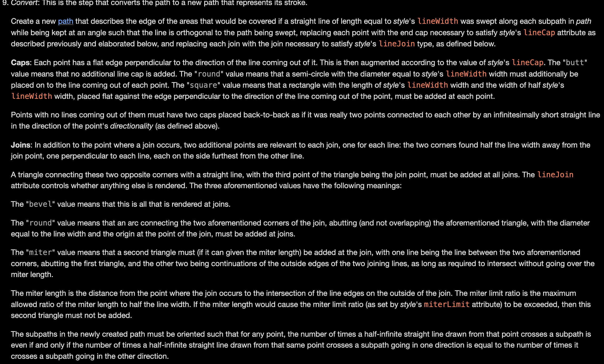

---
sectionNumber: 4-11
docNumber: "HOLYJS AUTUMN 2026"
---


---
sectionNumber: 4-12
docNumber: "HOLYJS AUTUMN 2026"
---


---
sectionNumber: 4-13
docNumber: "HOLYJS AUTUMN 2026"
---

## HTML Living Standard (Last Updated 11 May 2026)


<v-clicks>

- **Эту спецификацию следует читать так же, как и все другие спецификации.**
- Сначала — **от корки до корки**, несколько раз.
- Потом — в **обратном** направлении, как минимум один раз.
- Затем — выбирая случайные разделы в оглавлении и переходя по всем перекрёстным ссылкам.

</v-clicks>

---
layout: statement
sectionNumber: 4-14
docNumber: "HOLYJS AUTUMN 2026"
---

## CSS: модульная модель = философия **микрорелизов**

<v-click>

### Каждый модуль — свои уровни, состояние фиксирует CSS Snapshot

</v-click>

<!--
[REFRAME] Диаграмма-раскол CSS переехала в Главу 3. Здесь остаётся только вывод про
микрорелизы, чтобы связать CSS/HTML/JS одной философией на следующем слайде.
-->

---
layout: two-column
sectionNumber: 4-15
docNumber: "HOLYJS AUTUMN 2026"
title: TC39 и proposal-driven JavaScript
---

<template v-slot:left>  

### Javascript

<v-clicks>

- **ECMAScript 6** — последняя большая версия (2015)
- Новые фичи теперь проходят через **proposal stages**
- Cовременный JavaScript —  **непрерывный поток улучшений** c ежегодными мини-релизами
- Почти **10 лет** понадобилось чтобы "починить время" в вебе

</v-clicks>
</template>

<template v-slot:right>
  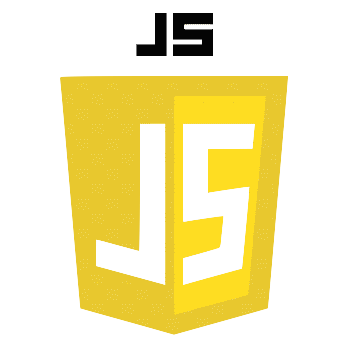
</template>

---
layout: statement
sectionNumber: 4-16
docNumber: "HOLYJS AUTUMN 2026"
---
Все спецификации пришли к философии микрорелизов

---
layout: statement
sectionNumber: 4-17
docNumber: "HOLYJS AUTUMN 2026"
---

Браузерные войны

---
layout: two-column
sectionNumber: 4-18
docNumber: "HOLYJS AUTUMN 2026"
---
<template v-slot:left>

## Браузерные войны

### Анархия и отсутствие стандартов между браузерами

</template>

<template v-slot:right>

</template>

---
layout: image-top
sectionNumber: 4-19
docNumber: "HOLYJS AUTUMN 2026"
---

<template v-slot:image>
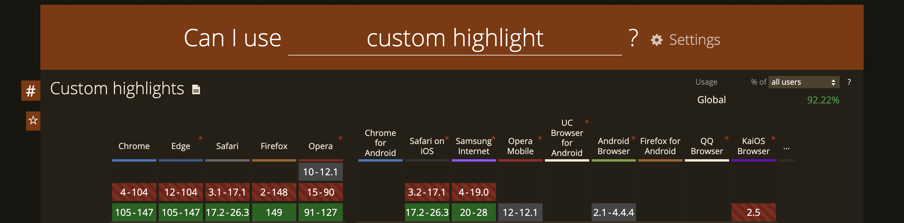
</template>

<v-clicks>

- Узнаешь из статьи/доклада про новую крутую фичу
- Пробуешь внедрить — не работает
- Плачешь в подушку / пишешь полифилл / загоняешь юзеров в один браузер
- ...Хорошо если года через 3 станет доступно везде

</v-clicks>

---
layout: statement
sectionNumber: 4-20
docNumber: "HOLYJS AUTUMN 2026"
---

## Поэтому мы не ждали

<v-click>

### Работа программиста — это борьба со сложностью. А борются со сложностью **дроблением**.

</v-click>

<!--
🎯 НАЧАЛО САМОГО ВАЖНОГО БЛОКА ГЛАВЫ. Идёт сразу после боли Can I Use.
Мысль: любой программист, столкнувшись со сложностью, дробит её на части — модули,
компоненты, области видимости. Это базовый инструмент профессии.
А теперь посмотрим, что было с этим инструментом в вебе.
-->

---
sectionNumber: 4-21
docNumber: "HOLYJS AUTUMN 2026"
title: JS без модулей
---

## JavaScript: модулей не было 20 лет

<v-clicks>

- **1995** — язык появился. Модулей нет. Всё в глобальной области.
- IIFE, пространства имён, `window.MyApp = {}`
- **2009** — CommonJS и AMD/RequireJS. Модули придумало **сообщество**, не платформа.
- **2011+** — Browserify, webpack, Rollup
- **2015** — ES-модули в стандарте. **2017–2018** — наконец в браузерах.

</v-clicks>

<v-click>

<p class="text-center pt-4">Бандлеры существуют <strong>только</strong> потому, что модули опоздали на двадцать лет</p>

</v-click>

---
sectionNumber: 4-22
docNumber: "HOLYJS AUTUMN 2026"
title: CSS без области видимости
---

## CSS: области видимости нет до сих пор

<v-clicks>

- Один глобальный неймспейс на весь документ
- Каскад, специфичность, `!important` — и `.button` из чужого файла
- **2009** — BEM: инкапсуляция **через соглашение об именах**
- **2015** — CSS Modules. **2016** — styled-components. **2017** — Tailwind.
- **2023** — `@scope` в Chrome. Всё ещё не везде.

</v-clicks>

<v-click>

<p class="text-center pt-4">BEM — это не методология. Это <strong>протез</strong> отсутствующей в языке инкапсуляции.</p>

</v-click>

<!--
Сильная и слегка провокационная формулировка — держать уверенно.
Если зал спорит: BEM решает ровно ту задачу, которую в любом другом языке решает
область видимости. Мы 15 лет решали её именами переменных.
-->

---
sectionNumber: 4-23
docNumber: "HOLYJS AUTUMN 2026"
title: HTML без компонентов
---

## HTML: компонентов не было

<v-clicks>

- Разметку нельзя переиспользовать. Копипаста или шаблонизатор на сервере.
- **2011** — идея Web Components
- **2013** — выходит React. Ждать перестали.
- **2016–2018** — Custom Elements и Shadow DOM доезжают до браузеров
- Инкапсуляция приехала, но стилизовать сквозь границу больно до сих пор

</v-clicks>

<v-click>

<p class="text-center pt-4">React победил не потому, что был лучше стандарта.<br>Он приехал <strong>на пять лет раньше</strong>.</p>

</v-click>

---
layout: statement
sectionNumber: 4-24
docNumber: "HOLYJS AUTUMN 2026"
---

## Всё, что мы называем современным фронтендом —

<v-clicks>

# это протезы отсутствующей в платформе модульности

#### Webpack, Babel, BEM, CSS-in-JS, компонентные фреймворки — это не изобретения. Это компенсации.

</v-clicks>

<!--
🎯 ПИК БЛОКА. Пауза. Это самая сильная формулировка доклада после «legacy = цена успеха».
-->

---
layout: statement
sectionNumber: 4-25
docNumber: "HOLYJS AUTUMN 2026"
---

## А почему модульность опоздала?

<v-clicks>

### Потому что договориться о ней должны были **все сразу**

#### Модули в языке — это не фича. Это решение, которое ломает всё, что написано до него.

</v-clicks>

<!--
СВЯЗКА С ТЕЗИСОМ ГЛАВЫ 4. Здесь блок про протезы перестаёт быть жалобой и становится
доказательством: модульность опоздала не потому, что о ней не думали. А потому, что
у продукта нет одного владельца, который мог бы просто нажать Merge.
Отсюда — прямо в «прошло 32 года» и Interop.
-->

---
layout: statement
sectionNumber: 4-26
docNumber: "HOLYJS AUTUMN 2026"
---

# Прошло **32** года

---
layout: two-column
sectionNumber: 4-27
docNumber: "HOLYJS AUTUMN 2026"
---

<template v-slot:left>

# Interop

#### Google, Mozilla, Microsoft, Apple, Bocoup и Igalia — объединились для борьбы с проблемами несовместимости браузеров и стандартизации

<v-click>

</v-click>

</template>

<template v-slot:right>

</template>

<!--
[Переход в Акт 5] Но почему вообще так медленно и осторожно? Почему нельзя было просто
договориться и переписать?
-->

---
layout: section
sectionNumber: '5'
docNumber: "САМОЕ БОЛЬШОЕ ЛЕГАСИ"
---

# Глава 5

## Цена успеха — legacy

<template v-slot:descriptor>
Или почему нельзя просто взять и переписать веб
</template>

---
layout: statement
sectionNumber: 5-1
docNumber: "HOLYJS AUTUMN 2026"
---

# но почему так сложно?

---
layout: image-full
sectionNumber: 5-2
docNumber: "HOLYJS AUTUMN 2026"
---

<template v-slot:image>


</template>

<!--
[REFRAME] Усиливаем: старый веб нельзя удалить — на нём кто-то ещё живёт; нельзя просто
переписать браузер или спеку. Любое изменение не должно сломать миллиарды страниц.
-->

---
layout: statement
sectionNumber: 5-3
docNumber: "HOLYJS AUTUMN 2026"
---

## Хотите увидеть, как выглядит legacy, которое нельзя удалить?

<v-click>

### Оно прямо сейчас уезжает с каждым вашим запросом

</v-click>

<!--
🎯 ЗАХОД НА ГЛАВНЫЙ АРТЕФАКТ ДОКЛАДА. Идёт сразу после «нельзя».
До этого момента зал слышал утверждение «переписать нельзя». Дальше — доказательство,
которое каждый может проверить в девтулзах прямо в зале.
-->

---
sectionNumber: 5-4
docNumber: "HOLYJS AUTUMN 2026"
title: Археология User-Agent
---

## User-Agent: тридцать лет наслоений

```text
1993  NCSA_Mosaic/2.0
1994  Mozilla/1.0                                    Netscape: кодовое имя «Mosaic killer»
1996  Mozilla/2.0 (compatible; MSIE 3.0; Windows 95) IE притворяется Netscape,
                                                     чтобы ему отдавали фреймы
2004  Mozilla/5.0 (...) Gecko/20100101               Firefox: дата в строке — фальшивая
                                                     и намертво замороженная
2003  Mozilla/5.0 (...) AppleWebKit/85.7
      (KHTML, like Gecko) Safari/85.5                Safari притворяется Gecko
2008  Mozilla/5.0 (...) AppleWebKit/525.13
      (KHTML, like Gecko) Chrome/0.2 Safari/525.13   Chrome притворяется всеми сразу
```

<!--
Читать не всё — вести пальцем по цепочке и называть, кто под кого маскируется.
Ритм: Netscape назвался убийцей Mosaic → IE назвался Netscape → Safari назвался Gecko →
Chrome назвался всеми. Каждый следующий врал, потому что иначе сайты его не пускали.
-->

---
layout: statement
sectionNumber: 5-5
docNumber: "HOLYJS AUTUMN 2026"
---

## А вот что ваш Chrome отправляет сегодня

```text
Mozilla/5.0 (Windows NT 10.0; Win64; x64) AppleWebKit/537.36
(KHTML, like Gecko) Chrome/141.0.0.0 Safari/537.36
```

<v-clicks>

#### Он представляется как **Mozilla**, как **AppleWebKit**, как **KHTML**, как **Gecko** и как **Safari**

### Ни одно из этих утверждений не является правдой

#### А `537.36` — это не версия. Это константа, **замороженная с 2013 года**, потому что на неё где-то что-то смотрит.

</v-clicks>

<!--
🎯 Главный панчлайн блока. Пауза после «ни одно не является правдой».
Дополнительно: `537.36` заморожен с 2013 года. Это не версия — это константа, которую
нельзя менять, потому что на неё что-то где-то смотрит.
🚧 Актуализировать номер версии Chrome к дате доклада.
-->

---
sectionNumber: 5-6
docNumber: "HOLYJS AUTUMN 2026"
title: UA починить не смогли
---

## Починить UA-строку не смогли. Её заморозили.

<v-clicks>

- **User-Agent Reduction** в Chrome, 2022–2023
- Минорная версия теперь всегда `0.0.0`
- Версия ОС и модель устройства — огрублены
- Детали переехали в отдельный механизм — Client Hints

</v-clicks>

<v-click>

<p class="text-center pt-6">Менять её оказалось <strong>опаснее</strong>, чем оставить как есть</p>

</v-click>

<!--
⚠️ ВАЖНО: НЕ говорить «Chrome рандомизирует юзерагенты» — это не так, рандомизацией
занимается Brave. Chrome сделал обратное: заморозил и урезал.
И это даже сильнее для тезиса: платформа не смогла исправить свою же ошибку — только
законсервировать её. Вот как выглядит legacy планетарного масштаба.
-->

---
sectionNumber: 5-7
docNumber: "HOLYJS AUTUMN 2026"
title: Браузеры возят патчи под сайты
---

## Браузеры возят с собой патчи под конкретные сайты

<v-clicks>

- **Opera** — файл `browser.js`: список исправлений под отдельные сайты, обновлялся вместе с браузером
- **Firefox** — webcompat interventions: подмена UA и патчи для сайтов, которые иначе не открываются
- **WebKit** — файл `Quirks.cpp` с обходными путями, где прямо перечислены домены

</v-clicks>

<v-click>

<p class="text-center pt-4">Это не костыли отдельных команд. Это <strong>штатный механизм</strong> веб-платформы.</p>

</v-click>

<!--
Мысль: браузер обязан открыть сайт, который сломан или написан под конкурента 15 лет назад.
Не «должен», а обязан — иначе пользователь решит, что сломался браузер.
Классическая ловушка: виноват всегда тот, кто новее.
-->

---
sectionNumber: 5-8
docNumber: "HOLYJS AUTUMN 2026"
title: Legacy, записанное в стандарт
---

## И самое красивое: legacy, записанное **в стандарт**

<v-clicks>

- `document.all` — единственный объект в JavaScript, который **врёт про свой `typeof`**
- Он фальсив по спецификации. В ECMAScript для этого есть отдельный внутренний слот.
- Зачем? Чтобы код детекта Internet Explorer, написанный в **1999 году**, уходил в правильную ветку.
- `<marquee>` не удалён — он **специфицирован** в разделе устаревших возможностей
- Quirks mode: доктайп до сих пор переключает режим рендеринга

</v-clicks>

<v-click>

<p class="text-center pt-4">Устаревание в вебе не удаляют. Его <strong>документируют и поддерживают вечно</strong>.</p>

</v-click>

<!--
🎯 Сильнейший факт блока. `document.all` — это буквально ложь, возведённая в стандарт,
ради обратной совместимости с браузером, которого больше нет.
-->

---
layout: statement
sectionNumber: 5-9
docNumber: "HOLYJS AUTUMN 2026"
---

## А ещё Space Jam 1996 года всё ещё открывается

<v-clicks>

### `spacejam.com/1996` — тот же HTML, тот же дизайн, работает в сегодняшнем Chrome

#### Страница, свёрстанная тридцать лет назад под браузер, которого больше нет

### Ни одна другая платформа в мире так не умеет. В этом одновременно её сила и её приговор.

</v-clicks>

<!--
🎯 КОЛЛБЭК К ГЛАВЕ 1. Мы показывали этот сайт в начале как «сайт как пиар-кампания».
Теперь он возвращается как доказательство: страница, свёрстанная тридцать лет назад
под браузер, которого больше нет, открывается сегодня без единой правки.
Ни одна другая платформа в мире так не умеет. Вот в чём одновременно сила и приговор.
-->

---
layout: statement
sectionNumber: 5-10
docNumber: "HOLYJS AUTUMN 2026"
---

# Для чего создавался веб?

---
layout: image-full
sectionNumber: 5-11
docNumber: "HOLYJS AUTUMN 2026"
---

<template v-slot:image>


</template>

---
layout: statement
sectionNumber: 5-12
docNumber: "HOLYJS AUTUMN 2026"
---

## Legacy — это не про то, что команда плохо работала

<v-click>

### Чаще это про то, что продукт слишком долго был нужен людям

</v-click>

<!--
🚧 ЗАГЛУШКА (мысль слайда): смысловой пик доклада. Здесь тезис из пролога становится
явным. Legacy = цена успешности и масштаба, а не приговор.
-->

---
sectionNumber: 5-13
docNumber: "HOLYJS AUTUMN 2026"
---

### Принципы развития веб-платформы

<p class="opacity-60">по сути — non-functional requirements зрелого продукта</p>

<v-clicks>

- **Не ломай веб.**
- **Интероперабельность** — должно работать везде и одинаково.
- **Расширяй**, а не заменяй.
- **Безопасность по умолчанию.**
- **Доступность по умолчанию.**
- Патентная политика без роялти.

</v-clicks>

<v-click>

<p class="text-center pt-4">Именно поэтому всё так медленно и осторожно — <strong>цена ошибки слишком велика</strong></p>

</v-click>

<!--
[Переход в Акт 6] И вот в этот огромный legacy-продукт приходит новый запрос — и вместе
с ним новый тип пользователя.
-->

---
layout: statement
sectionNumber: 5-14
docNumber: "HOLYJS AUTUMN 2026"
---

## У этих принципов есть цена

<v-click>

### И платим её мы

</v-click>

<!--
🎯 ПОВОРОТ ГЛАВЫ. До этого слайда глава 5 объясняла и оправдывала. Дальше — счёт.
Это то место, где доклад становится личным для зала. Тон меняется: было спокойно —
станет резко. Разрешаю себе резкость на три слайда, потом предохранитель.
-->

---
sectionNumber: 5-15
docNumber: "HOLYJS AUTUMN 2026"
title: На голой тройке писать нельзя
---

## Мы не можем писать на голой тройке

<v-clicks>

- Нет типов
- Нет области видимости в стилях
- Компоненты приехали на пять лет позже React
- Модули опоздали на двадцать лет
- Реактивность, роутинг, формы — собирайте сами

</v-clicks>

<v-click>

### Developer experience веб-платформы — плохой. Это надо просто произнести вслух.

</v-click>

---
layout: statement
sectionNumber: 5-16
docNumber: "HOLYJS AUTUMN 2026"
---

## Мы приезжаем на Порше к даче с трактором

<v-click>

### Тулинг оброс мощностью. Дорога под ним не менялась.

</v-click>

<!--
🚧 ТВОЯ МЕТАФОРА. Ей нужна одна секунда расшифровки, иначе зал не соберёт:
Порше — это наш тулинг и наши ожидания от DX. Дача с трактором — сама платформа.
Не растягивать, один удар и дальше.
-->

---
layout: statement
sectionNumber: 5-17
docNumber: "HOLYJS AUTUMN 2026"
---

## Всё, что хайпует — это сахар вокруг тройки

<v-clicks>

#### JSX компилируется в вызовы функций, которые дёргают DOM

#### Tailwind компилируется в классы. TypeScript — стирается. Svelte и Vue SFC — в тот же JS.

### Ни один фреймворк не заменил платформу. Все они её **обвязка**.

</v-clicks>

<!--
Важно не скатиться в «фреймворки не нужны». Мысль обратная: они необходимы именно потому,
что платформа не даёт достаточного уровня абстракции сама. Обвязка — не оскорбление.
-->

---
sectionNumber: 5-18
docNumber: "HOLYJS AUTUMN 2026"
title: Это не чья-то вина
---

## Но это не чья-то вина

<v-clicks>

- Каждый раз выбор был не «удобно или неудобно»
- Выбор был: **сделать удобно** или **не сломать миллиард страниц**
- Платформа каждый раз выбирала второе
- А ещё договориться должны были все вендоры сразу — и ни у кого нет права нажать Merge

</v-clicks>

<v-click>

### Плохой DX — это счёт за обратную совместимость. И он выставлен нам.

</v-click>

<!--
🎯 ПРЕДОХРАНИТЕЛЬ. Обязателен: без него предыдущие три слайда читаются как нытьё
и конфликтуют с тезисом «legacy — не приговор, а цена успеха».
Здесь резкость превращается в понимание. Это и есть взрослая позиция доклада.
-->

---
layout: statement
sectionNumber: 5-19
docNumber: "HOLYJS AUTUMN 2026"
---

## Некогда ждать милости от природы

<v-click>

### Живём как живём

</v-click>

<!--
🚧 ТВОЯ ФОРМУЛИРОВКА, ироничная (Мичурин). Хорошая точка для выдоха зала после
DX-блока. Дальше — переход в главу про агентов.
-->

---
layout: section
sectionNumber: '6'
docNumber: "САМОЕ БОЛЬШОЕ ЛЕГАСИ"
---

# Глава 6

## Новый пользователь: агент

<template v-slot:descriptor>

~~Заменит ли нас ИИ~~ · или новый change request для legacy-продукта

</template>

---
layout: statement
sectionNumber: 6-1
docNumber: "HOLYJS AUTUMN 2026"
---

## В глобальный продукт пришёл новый пользователь

<v-click>

### Не человек с браузером — а **агент**

</v-click>

<!--
🚧 ЗАГЛУШКА (мысль слайда): рамка главы. AI — не «немного будущих API», а новый change
request: новый класс пользователей → новые интерфейсы, новые ownership-битвы, новые споры
про интероперабельность. Всё начинается заново.
-->

---
layout: statement
sectionNumber: 6-2
docNumber: "HOLYJS AUTUMN 2026"
---

## web MCP

### (не путать с MCP)

---
layout: two-column
sectionNumber: 6-3
docNumber: "HOLYJS AUTUMN 2026"
title: WebMCP
---

### WebMCP (не путать просто с MCP)

<template v-slot:left>

#### без WebMCP

<v-clicks>

- Робот/агент идет на сайт
- парсит его
- протыкивает все кнопки и добивается результата "стучась в каждую дверь"
-
- ... хорошо если еще верстка семантическая

</v-clicks>

</template>

<template v-slot:right>

#### WebMCP

<v-clicks>

- Мы описываем декларативно/императивно агенту как пользоваться сайтом
- Убираем хрупкую автоматизацию кликов
- AI — как новый "потребитель" веб-интерфейсов
- экономия токенов (профит)

</v-clicks>

</template>

---
layout: statement
sectionNumber: 6-4
docNumber: "HOLYJS AUTUMN 2026"
---

## A2UI

---
layout: image-full
sectionNumber: 6-5
docNumber: "HOLYJS AUTUMN 2026"
---

<template v-slot:image>

</template>

---
layout: two-column
title: A2UI как JSON-интерфейс
sectionNumber: 6-6
docNumber: "HOLYJS AUTUMN 2026"
transition: fade
---

<template v-slot:left>

### Идея

- A2UI описывает UI **через JSON**, а не через JavaScript-код.
- Агент отдаёт структуру, данные и действия, а клиент рендерит это своими компонентами.
- Между агентом и клиентом передаётся **данные**, а не код.

</template>

<template v-slot:right>

```json
{
  "surfaceId": "booking",
  "components": [
    {
      "id": "title",
      "component": "Text",
      "text": "Найдите билеты мечты",
      "variant": "h1"
    },
    {
      "id": "datetime",
      "component": "DateTimeInput",
      "value": {
        "path": "/booking/date"
      },
      "enableDate": true
    },
    {
      "id": "submit-btn",
      "component": "Button",
      "variant": "primary",
      "action": {
        "event": {
          "name": "Искать"
        }
      }
    }
  ]
}
```

</template>

---
layout: statement
sectionNumber: 6-7
docNumber: "HOLYJS AUTUMN 2026"
---

JSON — как описание интерфейса

---
sectionNumber: 6-8
docNumber: "HOLYJS AUTUMN 2026"
---

<div style="display: flex; flex-direction: row; align-items: center; justify-content: center">
<div style="flex-grow: 1; width: 40%">

<a href="https://youtu.be/2btBC99seK4?si=jtrum7BTqGnK_E-K">Запись</a>
</div>

<div style="flex-grow: 1; width: 40%">

<a href="https://holyjs.ru/archive/2026%20Spring/talks/20009814-ai-driven-ui-how-the-ui-will-look-like-in-the-age-of-agents/" target="_blank" rel="noreferrer">Доклад</a>
</div>
</div>

---
layout: statement
sectionNumber: 6-9
docNumber: "HOLYJS AUTUMN 2026"
---

# Prompt API

<v-clicks>

- предложен Google весной
- возможность вызвать модель прямо на сайте при помощи js
- быстродействие, одно "окно входа"
- ...
- можно использовать **только** Gemini Nano

</v-clicks>

---
layout: statement
sectionNumber: 6-10
docNumber: "HOLYJS AUTUMN 2026"
---

## position: **negative**

<v-click>

# concerns: **interoperability**

</v-click>

<!--
[СВЯЗКА] Явно связать с Главами 4–5: это та самая старая legacy-боль про
интероперабельность, просто в новом API.
-->

---
layout: image-full
sectionNumber: 6-11
docNumber: "HOLYJS AUTUMN 2026"
---
<template v-slot:image>
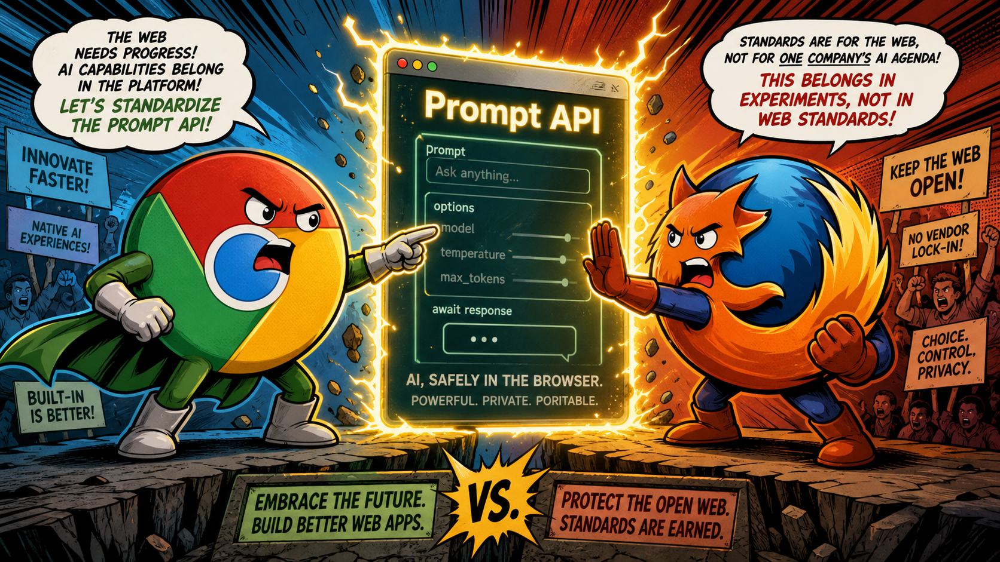
</template>

---
sectionNumber: 6-12
docNumber: "HOLYJS AUTUMN 2026"
---

### Совсем кратко

<v-clicks>

- **WebMCP** — сайт становится удобным для AI-агента
- **A2UI** — интерфейс можно генерировать динамически под задачу на основе json
- **Prompt API** — возможность вызова модели из браузера/js

</v-clicks>

---
layout: statement
sectionNumber: 6-13
docNumber: "HOLYJS AUTUMN 2026"
---

### Мы не хотели семантически верстать и писать документацию для кожаных мешков<v-click>, но хотим это делать для агентов </v-click>

---
layout: statement
sectionNumber: 6-14
docNumber: "HOLYJS AUTUMN 2026"
---

## А может, новый веб — это они?

<v-clicks>

#### Агенту не нужен наш developer experience. Не нужны фреймворки и сборка.

#### Ему нужна семантика и описание действий — ровно то, что мы тридцать лет не писали.

</v-clicks>

<!--
🎯 ЗАМЫКАНИЕ ИРОНИИ с предыдущего слайда про кожаных мешков — и одновременно ответ
на вопрос «а будет ли новый веб?».
Мысль держать как вопрос, не как прогноз. Мы не знаем. Но впервые за тридцать лет
у платформы появился пользователь, которому наши протезы не нужны вообще.
-->

---
layout: statement
sectionNumber: 6-15
docNumber: "HOLYJS AUTUMN 2026"
---

## Мы не знаем, каким будет следующий веб

<v-click>

### Но мы точно знаем, что старый никуда не денется

</v-click>

<!--
Открытый финал без контрфактики «а если бы веб был модульным» — сознательное решение:
её нечем подкрепить и она уводит в спор.
Вместо этого — честное «не знаем» плюс возврат к главному тезису. Дальше выводы.
-->

---
sectionNumber: 6-16
docNumber: "HOLYJS AUTUMN 2026"
---

### Выводы

<v-clicks>

- веб — самый большой живой **legacy-продукт** в мире
- он рос как любой продукт: сначала просто, потом срочно, потом сложно, потом легаси — только в масштабе всей планеты
- рост требований изменил не только фронт, но и **дизайн**, и **бэкенд**
- ownership дробится, потому что продукт огромный — **комитеты это следствие, а не причина**
- разработчики всегда впереди платформы: всё, что мы называем фронтендом — **протезы** отсутствующей модульности
- плохой DX — это **счёт за обратную совместимость**, и он выставлен нам
- устаревание в вебе не удаляют — его документируют и поддерживают вечно
- и всё же система живёт **36+ лет** и развивается — legacy как цена успеха

</v-clicks>

---
layout: statement
sectionNumber: 6-17
docNumber: "HOLYJS AUTUMN 2026"
---

## Послесловие

<v-click>

### Обычный продукт делает одна компания. Веб — весь мир. Разница только в масштабе.

</v-click>

<!--
🚧 ЗАГЛУШКА (мысль слайда): финальный личный акцент. Место под твою мысль/призыв.
-->

---
layout: end
sectionNumber: 7
docNumber: "HOLYJS AUTUMN 2026"
classification: HOLYJS AUTUMN 2026
unit: HQ, DEPT OF THE PRESENTATION

---

<template v-slot:title>Спасибо</template>
<template v-slot:contact>
</template>
