# Автостопом по веб-платформе

<template v-slot:subtitle>
Мария Кондаурова · BIOCAD
</template>

<template v-slot:image>

</template>

---
layout: two-column
title: Обо мне
sectionNumber: 0-1
docNumber: "CODE FEST"
transition: fade
---

## Обо мне

<v-clicks>

- FrontLead в Департаменте Вычислительной Биологии в BIOCAD
- Член программного комитета HolyJS
- Соорганизовывала SPB Frontend
- Живу в Питере, крашу Warhammer и занимаюсь фехтованием

</v-clicks>

::right::

  

---
layout: section
docNumber: "Автостопом по веб-платформе"
---

# Глава 1

## Что такое веб-платформа?

<template v-slot:descriptor>
Или как зарождался веб
</template>

---
sectionNumber: 1-1
docNumber: "CODE FEST"

---

Веб-платформа = Браузер + API + стандарты + тесты + комитеты

---
layout: statement
sectionNumber: 1-2
docNumber: "CODE FEST"
---

# Но с чего всё начиналось?
---
layout: image-full
sectionNumber: 1-2
docNumber: "CODE FEST"
---
<template v-slot:image>

</template>

# Первый в мире компьютер Eniac (1945)

---
title: ENIAC
sectionNumber: 1-4
docNumber: "CODE FEST"
---

## ENIAC: фан-факты

<v-clicks>

- Содержал около 18 000 вакуумных трубок.
- Занимал целую комнату и весил около 30 тонн.
- Новая задача -> перекоммутировать проводами и переключателями.

</v-clicks>

---
layout: image-full
sectionNumber: 1-5
docNumber: "CODE FEST"
---
<template v-slot:image>

</template>

# Современный компьютер
---
sectionNumber: 1-6
docNumber: "CODE FEST"
---

| Параметр            | ENIAC (1946)                                | iPhone 17 Pro (2025)                      |
|:--------------------|:--------------------------------------------|:------------------------------------------|
| Операций в секунду  | ≈5 000 сложений/сек ≈357 умножений/сек   | ≥6 000 000 000 000 операций/сек           |
| Память              | **20 слов** (10‑разрядные десятичные числа) | **6–8 ГБ** ОЗУ, до 1 ТБ постоянной памяти |
| Потребление энергии | ≈174 кВт                                    | ~10 Вт (пиковая нагрузка SoC)             |

---
layout: statement
sectionNumber: 1-7
docNumber: "CODE FEST"
---
## World Wide Web
---
layout: image-right
sectionNumber: 1-8
docNumber: "CODE FEST"
figNumber: 1-1
figLabel: TIM BERNERS-LEE — CREATOR OF THE WORLD WIDE WEB
---

# Тим Бернерс-Ли

## Создал первый браузер в **1990 году**

<template v-slot:image>
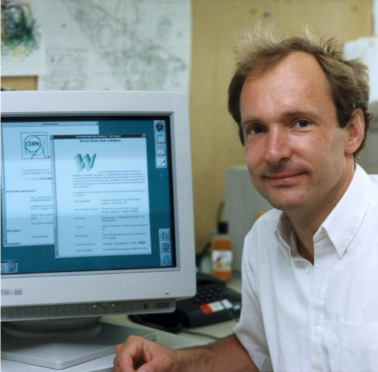
</template>

---
docNumber: "CODE FEST"
sectionNumber: 1-9
---

## Первый в мире сайт

---
layout: statement
sectionNumber: 1-10
docNumber: "CODE FEST"
---
## Изначальная идея веба как **гипертекстовой системы** для обмена знаниями
---
layout: image-right
sectionNumber: 1-11
docNumber: "CODE FEST"
figNumber: 1-2
figLabel: EARLY WEB — TABLE-BASED LAYOUTS
---

## Эра «Невинного» веба

<v-clicks>

- Статичные HTML-страницы
- Документы, ссылки, немного картинок
- Табличная вёрстка

</v-clicks>

<template v-slot:image>

</template>

---
sectionNumber: 1-12
docNumber: "CODE FEST"
---

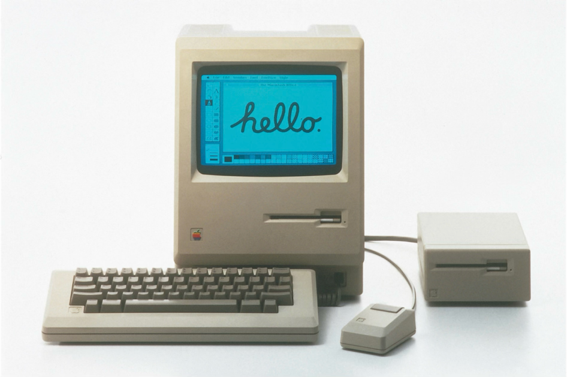

## ПК —> Веб стал доступен каждому

---
layout: statement
sectionNumber: 1-13
docNumber: "CODE FEST"
---

## Люди стали генерировать контент и самовыражаться

---
sectionNumber: 1-14
---

<SlidevVideo autoplay>
  <source src="./mov/cameron1.mov"  />
</SlidevVideo>

---
layout: image-full
sectionNumber: 1-15
docNumber: "CODE FEST"
---
<template v-slot:image>

</template>

# Сайт — как пиар компания фильма: Space Jam(1996)

---
layout: image-full
sectionNumber: 1-16
docNumber: "CODE FEST"
---

<template v-slot:image>

</template>

# Сайт — как заработок: The million dollars homepage (2005)

---
layout: statement
sectionNumber: 1-17
docNumber: "CODE FEST"
---

## Интернет взрослеет

### Самовыражение → сервис

---
layout: statement
sectionNumber: 1-18
docNumber: "CODE FEST"
---

## Веб перестаёт быть просто страницами и становится средой для жизни

<v-click>

### Браузер уже не тянет «старым» способом

</v-click>

---
layout: section
sectionNumber: '2'
docNumber: "Автостопом по веб-платформе"
---

# Глава 2

## Эволюция веб-платформы

<template v-slot:descriptor>
Или как веб пытался догнать ожидания пользователей
</template>

---
layout: statement
sectionNumber: 2-1
docNumber: "CODE FEST"
---

### "Фронтенд развивается скачкообразно"

---
layout: image-full
---

<template v-slot:image>
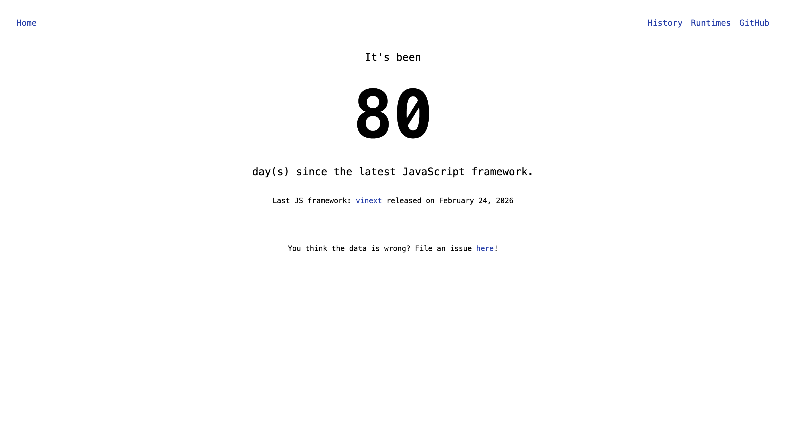
</template>

---
sectionNumber: 2-2
docNumber: "CODE FEST"
---

## Скачок 1:  Статичный HTML → Динамический веб

[//]: # (TODO: добавить анимацию клика для всего)

  

    

      До 2004
    

      - Каждое действие — новая страница
      - Обновить статус — рефреш

  

  

    

      Gmail + AJAX
    

      - Частичное обновление страницы
      - Мгновенные ответы

  

---
sectionNumber: 2-3
docNumber: "CODE FEST"
---

## AJAX дал скорость, но создал свои проблемы

<v-clicks>

- Управление состоянием вручную
- "Спагетти‑код" повсюду  **(привет, jquery!)**
- Каждый разработчик делает свой велосипед

</v-clicks>

<v-click>

### Нужна реиспользуемость

</v-click>

---
sectionNumber: 2-4
docNumber: "CODE FEST"
---

## Скачок 2: Страницы → SPA и фреймворки

  

    

      Было (MPA)
    

      - Каждый экран — отдельный HTML
      - Сервер рендерит всю страницу
      - Ограниченная интерактивность
      - Много кода

  

  

    

      Стало (SPA)
    

      - Angular/React/Vue
      - Клиент — UI-машина
      - Сервер — только API

  

---
layout: default
sectionNumber: 2-5
docNumber: "CODE FEST"
---

## Но телефоны не стояли на месте

  

    <h2 class="text-2xl font-bold text-rose-400">
      Кнопочные (2000–2007)
    </h2>
    

      
      
      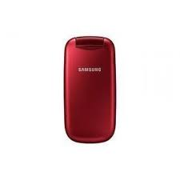
      
    

  

  

    <h2 class="text-2xl font-bold text-cyan-300">
      Сенсорные (2007+)
    </h2>
    

      
      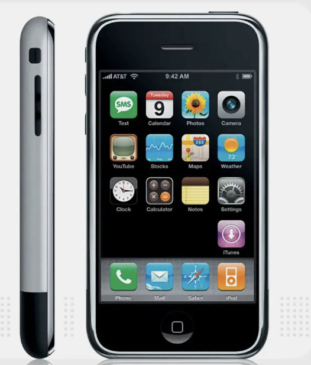
      
      
    

  

---
sectionNumber: 2-6
docNumber: "CODE FEST"
---

## С мобильностью пришли новые вызовы

<v-clicks>

- Тяжёлый JS тормозит на слабых устройствах
- Touch UI вместо hover/click
- 3G/4G вместо оптоволокна
- Экраны от 320px до 4K

</v-clicks>

---
sectionNumber: 2-7

---

## Скачок 3: Десктоп → Mobile-first

sectionNumber: 2-7
docNumber: "CODE FEST"

  

    

      Десктоп-first (2010)
    

      - Фиксированная ширина 1024px
      - Hover и курсор мыши
      - Быстрый интернет (DSL)
      - Мощные ПК

  

  

    

      Mobile-first (2012+)
    

      - Адаптивность 320px–4K
      - Touch интерфейсы (Material UI)
      - Производительность (lazy load)
      - Сети 3G/4G

  

---
sectionNumber: 2-8
docNumber: "CODE FEST"
---

[//]: # (TODO: добавить про развитие мобильных приложений &#40;бизнес хочет приложение для всего, есть стереотип что приложение стабильнее и тд)

## Mobile-first дал адаптивность, но хотелось нативности

<v-clicks>

- App Store модерация (недели)
- Обновления только через стор
- Офлайн недоступен
- Push только через натив

</v-clicks>

---
sectionNumber: 2-9
docNumber: "CODE FEST"
---

## Скачок 4: Веб → PWA

  

    

      Обычный веб
    

      - Только онлайн
      - Не устанавливается
      - Нет push
      - Зависит от сети

  

  

    

      PWA
    

      - Offline-first
      - Установка без стора
      - Push уведомления
      - Кэш + Service Workers

  

<v-click>

Service Worker = прокси между сетью и кэшем

</v-click>

---
sectionNumber: 2-10
docNumber: "CODE FEST"
---

## ...но вылезли рендерные боли (опять)

<v-clicks>

- Тяжёлый JS на клиенте
- SEO страдает (SPA)
- TTFB (Time to First Byte) медленный
- Размытая ответственность между сервером и клиентом

</v-clicks>

---
sectionNumber: 2-11
docNumber: "CODE FEST"
---

## Скачок 5: Клиент/Сервер → Server Components

  

    

      Классика
    

      - Всё на клиенте (SPA)
      - Или всё на сервере (MPA)
      - Два кода
      - SEO или скорость

  

  

    

      RSC (React Server Components)
    

      - Серверный рендер статичного
      - Клиентский только интерактив
      - Один код (async/await)
      - SEO + скорость + PWA

  

<v-click>

Сервер рендерит → Streaming → Клиент "оживляет"

</v-click>

---
layout: timeline
sectionNumber: 2-12
docNumber: "CODE FEST"
title: ЭВОЛЮЦИЯ ВЕБА — ХРОНОЛОГИЯ
direction: horizontal
---

  

  

    
1990

    
Статичный веб

  

  

  

    
2004

    
Ajax

    
Gmail заложил тренд веба как сервиса

  

  

  

    
2010

    
SPA‑бум

    
AngularJS (2010), React(2013), Vue(2014)

  

  

  

    
2010

    
First-mobile

    
Развитие смартфонов

  

  

  

    
2015+

    
PWA

    
Офлайн, установка, пуш‑уведомления

  

  

  

    
2020-2023

    
Server Components

    
Гибрид сервер/клиент

  

---
layout: statement
sectionNumber: 2-13
docNumber: "CODE FEST"
---

# Всего за 20 лет

---
sectionNumber: 2-14
docNumber: "CODE FEST"
---

---
sectionNumber: 2-15
docNumber: "CODE FEST"
---

---
sectionNumber: 2-16
docNumber: "CODE FEST"
---

---
sectionNumber: 2-17
docNumber: "CODE FEST"
---

  <video
    src="./mov/samokat.mov"
    autoplay
    muted
    loop
    playsinline
    controls={false}
    style="width: 100%; height: auto; display: block;"
  ></video>

3D музей в браузере &#40;React и Three.js) <a href="https://museum.samokat.ru">https://museum.samokat.ru</a>

---
sectionNumber: 2-18
docNumber: "CODE FEST"
---

  <video
    src="./mov/messanger.mov"
    autoplay
    muted
    loop
    playsinline
    controls={false}
    style="width: 100%; height: auto; display: block;"
  ></video>

Многопользовательская игра в браузере (webGL) <a href="https://messenger.abeto.co">https://messenger.abeto.co</a>

---
sectionNumber: 2-19
docNumber: "CODE FEST"
---

  <video
    src="./mov/doom.mov"
    autoplay
    muted
    loop
    playsinline
    controls={false}
    style="width: 100%; height: auto; display: block;"
  ></video>

DOOM на CSS и JS <a href="https://cssdoom.wtf/">https://cssdoom.wtf/</a>

---
layout: two-column
sectionNumber: 2-20
docNumber: "CODE FEST"
title: "Web API в действии"
---

<template v-slot:left>

### 150+ браузерных Web API с доступом к

<v-clicks>

- телефону (контакты, вибрация, bluetooth, уведомления)
- железу (GPU)
- AI (конец 2025-го)
- ..и много чему еще

</v-clicks>

</template>

<template v-slot:right>

  <video
    src="./mov/mdn.mov"
    autoplay
    muted
    loop
    playsinline
    controls={false}
    style="width: 100%; height: auto; display: block;"
  ></video>

</template>

---
layout: statement
sectionNumber: 2-21
docNumber: "CODE FEST"
---

# Это уже полноценная платформа

---
layout: section
sectionNumber: '3'
docNumber: "Автостопом по веб-платформе"
---

# Глава 3

## Кто делает веб?

<template v-slot:descriptor>
Или зоопарк комитетов
</template>

---
layout: chart-full
sectionNumber: 3-1
docNumber: "CODE FEST"
title: КАРТА ВЛИЯНИЯ
figNumber: 3-1
figLabel: КТО КОНТРИБЬЮТИТ В WEB PLATFORM
transition: slide-left
---
<template v-slot:chart>

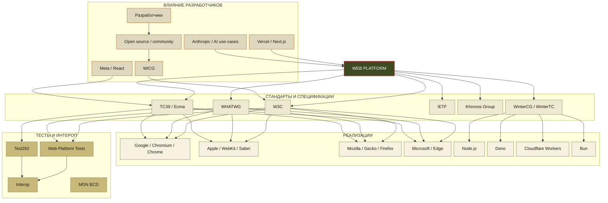
```mermaid
%%{init: {'flowchart': {'curve': 'basis', 'nodeSpacing': 10, 'rankSpacing': 45}}}%%

flowchart TD

  WEB["WEB PLATFORM"]

  subgraph STDS["СТАНДАРТЫ И СПЕЦИФИКАЦИИ"]
    W3C["W3C"]
    WHATWG["WHATWG"]
    TC39["TC39 / Ecma"]
    IETF["IETF"]
    KHR["Khronos Group"]
    WINTER["WinterCG / WinterTC"]
  end

  subgraph IMPL["РЕАЛИЗАЦИИ"]
    CHROME["Google / Chromium / Chrome"]
    WEBKIT["Apple / WebKit / Safari"]
    MOZ["Mozilla / Gecko / Firefox"]
    EDGE["Microsoft / Edge"]
    NODE["Node.js"]
    DENO["Deno"]
    CF["Cloudflare Workers"]
    BUN["Bun"]
  end

  subgraph TESTS["ТЕСТЫ И ИНТЕРОП"]
    WPT["Web Platform Tests"]
    TEST262["Test262"]
    INTEROP["Interop"]
    MDNBCD["MDN BCD"]
  end

  subgraph ECO["ВЛИЯНИЕ РАЗРАБОТЧИКОВ"]
    WICG["WICG"]
    VERCEL["Vercel / Next.js"]
    META["Meta / React"]
    OSS["Open source / community"]
    DEVS["Разработчики"]
    ANTH["Anthropic / AI use-cases"]
  end

  WEB --> W3C
  WEB --> WHATWG
  WEB --> TC39
  WEB --> IETF
  WEB --> KHR
  WEB --> WINTER

  W3C --> CHROME
  W3C --> WEBKIT
  W3C --> MOZ
  W3C --> EDGE

  WHATWG --> CHROME
  WHATWG --> WEBKIT
  WHATWG --> MOZ
  WHATWG --> EDGE

  TC39 --> CHROME
  TC39 --> WEBKIT
  TC39 --> MOZ
  TC39 --> EDGE

  W3C --> WPT
  WHATWG --> WPT
  TC39 --> TEST262
  WPT --> INTEROP
  TEST262 --> INTEROP

  WICG --> W3C
  DEVS --> OSS
  OSS --> WICG
  META --> TC39
  VERCEL --> WEB
  ANTH --> WEB
  WINTER --> NODE
  WINTER --> DENO
  WINTER --> CF
  WINTER --> BUN

  classDef main fill:#3d4a22,stroke:#bf2020,color:#fff,stroke-width:2px;
  classDef standards fill:#ede8d0,stroke:#8a7a50,color:#1a1a14;
  classDef impl fill:#f5f0e0,stroke:#7a7a45,color:#1a1a14;
  classDef tests fill:#c8b87a,stroke:#8a7a50,color:#1a1a14;
  classDef eco fill:#e0d8be,stroke:#b05e10,color:#1a1a14;

  class WEB main;
  class W3C,WHATWG,TC39,IETF,KHR,WINTER standards;
  class CHROME,WEBKIT,MOZ,EDGE,NODE,DENO,CF,BUN impl;
  class WPT,TEST262,INTEROP,MDNBCD tests;
  class WICG,VERCEL,META,OSS,DEVS,ANTH eco;
```

</template>

<template v-slot:source>
ОБЗОР: стандарты, реализации, тесты и экосистема на одной карте. 
</template>

---
layout: chart-full
sectionNumber: 3-2
docNumber: "CODE FEST"
title: СЛОЙ 1 — СТАНДАРТЫ
figNumber: 3-2
figLabel: ОСНОВНЫЕ ПЛОЩАДКИ СТАНДАРТИЗАЦИИ
transition: slide-left
---

<template v-slot:chart>

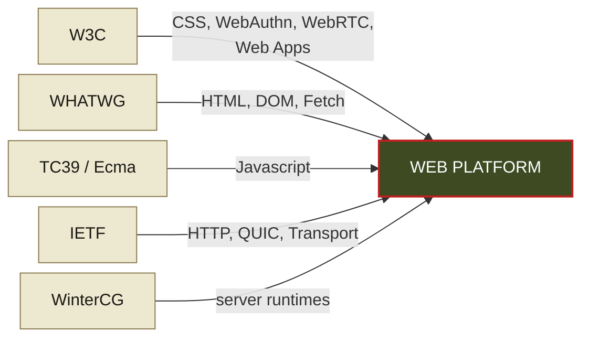
```mermaid
%%{init: {'flowchart': {'curve': 'basis', 'nodeSpacing': 10, 'rankSpacing': 10}}}%%
flowchart LR

  W3C["W3C"] -->|CSS, WebAuthn, WebRTC,\nWeb Apps| WEB["WEB PLATFORM"]
  WHATWG["WHATWG"] -->|HTML, DOM, Fetch| WEB
  TC39["TC39 / Ecma"] -->|Javascript| WEB
  IETF["IETF"] -->|HTTP, QUIC, Transport| WEB
  WINTER["WinterCG"] -->|server runtimes| WEB

  classDef web fill:#3d4a22,stroke:#bf2020,color:#fff,stroke-width:2px;
  classDef org fill:#ede8d0,stroke:#8a7a50,color:#1a1a14;

  class WEB web;
  class W3C,WHATWG,TC39,IETF,WINTER org;
```

</template>

<template v-slot:source>
WHATWG ведёт HTML Living Standard; TC39 отвечает за JavaScript; W3C и IETF покрывают значительную часть веб-платформы и сетевого стека. 
</template>

---
layout: chart-full
sectionNumber: 3-3
docNumber: "CODE FEST"
title: СЛОЙ 2 — W3C И ИНКУБАЦИЯ
figNumber: 3-3
figLabel: ВНУТРЕННЯЯ СТРУКТУРА W3C
transition: slide-left
---

<template v-slot:chart>

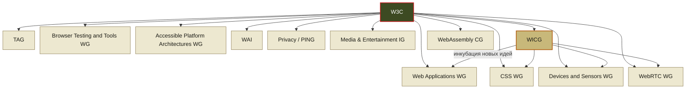
```mermaid
%%{init: {'flowchart': {'curve': 'basis', 'nodeSpacing': 15, 'rankSpacing': 15}}}%%

flowchart TD

  W3C["W3C"]

  TAG["TAG"]
  WEBAPPS["Web Applications WG"]
  CSSWG["CSS WG"]
  BTT["Browser Testing and Tools WG"]
  DAS["Devices and Sensors WG"]
  WEBRTCWG["WebRTC WG"]
  APA["Accessible Platform Architectures WG"]
  WAI["WAI"]
  PATWG["Privacy / PING"]
  MEIG["Media & Entertainment IG"]
  WICG["WICG"]
  WASMCG["WebAssembly CG"]

  W3C --> TAG
  W3C --> WEBAPPS
  W3C --> CSSWG
  W3C --> BTT
  W3C --> DAS
  W3C --> WEBRTCWG
  W3C --> APA
  W3C --> WAI
  W3C --> PATWG
  W3C --> MEIG
  W3C --> WICG
  W3C --> WASMCG

  WICG -->|инкубация новых идей| WEBAPPS
  WICG --> CSSWG
  WICG --> DAS
  WICG --> WEBRTCWG

  classDef core fill:#3d4a22,stroke:#bf2020,color:#fff,stroke-width:2px;
  classDef group fill:#ede8d0,stroke:#8a7a50,color:#1a1a14;
  classDef incubator fill:#c8b87a,stroke:#b05e10,color:#1a1a14,stroke-width:2px;

  class W3C core;
  class TAG,WEBAPPS,CSSWG,BTT,DAS,WEBRTCWG,APA,WAI,PATWG,MEIG,WASMCG group;
  class WICG incubator;
```

</template>

<template v-slot:source>
WICG — инкубатор новых веб-идей; внутри W3C множество рабочих и community groups с разной ответственностью. 
</template>

---
transition: slide-left
sectionNumber: 3-4
docNumber: "CODE FEST"
---

---
layout: two-column
sectionNumber: 3-5
docNumber: "CODE FEST"
title: История HTML как стандарта
transition: fade
---

<template v-slot:left>

# Если кратко

<v-clicks>

- очень много комитетов и рабочих групп
- в том числе поставщики браузеров
- не всегда прозрачные обязанности
- внутренняя "кухня" и политика

</v-clicks>

</template>

<template v-slot:right>

</template>

---
layout: statement
sectionNumber: 3-6
docNumber: "CODE FEST"
---

# Спецификации

---
layout: statement
sectionNumber: 3-6
docNumber: "CODE FEST"
---

Кто из вас читал спецификации по JS/HTML/CSS?

<v-click>

### ...и не сбежал через минуту?

</v-click>

---
layout: two-column
sectionNumber: 3-7
docNumber: "CODE FEST"
title: История HTML как стандарта
transition: fade
---

<template v-slot:left>

### Краткая история спеки

<v-clicks>

- **1989–1991** — HTML рождается в CERN вместе с Web.
- **1994–1999** — W3C формализует HTML как набор версий и рекомендаций.
- **2004** — **реализация опередила стандарт** и появился комитет WHATWG — как реакция браузерных вендоров.
- **2012** — у индустрии **две версии** HTML: W3C и WHATWG.
- **2019** — W3C и WHATWG договариваются о единой версии HTML и DOM, HTML как **living standard**.

</v-clicks>

</template>

<template v-slot:right>

</template>

---
sectionNumber: 3-8
docNumber: "CODE FEST"
---

---
sectionNumber: 3-9
docNumber: "CODE FEST"
---

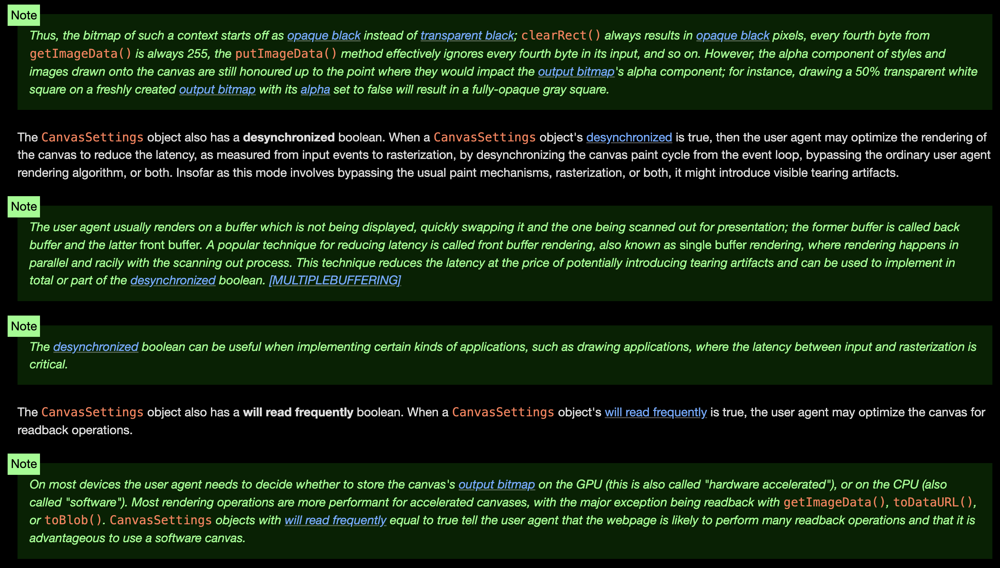

---
sectionNumber: 3-10
docNumber: "CODE FEST"
---

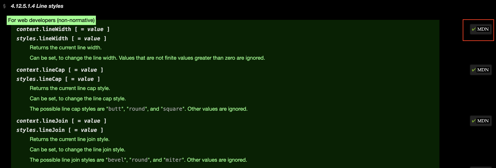

---
sectionNumber: 3-11
docNumber: "CODE FEST"
---

## HTML Living Standard (Last Updated 11 May 2026)

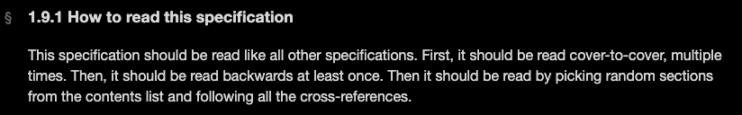

<v-clicks>

- **Эту спецификацию следует читать так же, как и все другие спецификации.**
- Сначала — **от корки до корки**, несколько раз.
- Потом — в **обратном** направлении, как минимум один раз.
- Затем — выбирая случайные разделы в оглавлении и переходя по всем перекрёстным ссылкам.

</v-clicks>

---
sectionNumber: 3-12
docNumber: "CODE FEST"
---

## Раскол CSS

<v-click>

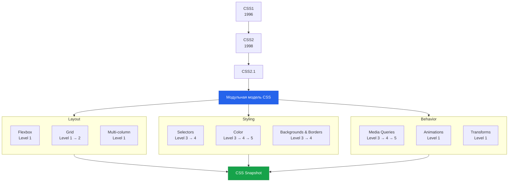
```mermaid
flowchart TD
    A["CSS1<br/>1996"] --> B["CSS2<br/>1998"]
    B --> C["CSS2.1"]

    C --> D["Модульная модель CSS"]

    D --> S1

    subgraph S1["Layout"]
        direction TB
        I["Flexbox<br/>Level 1"]
        J["Grid<br/>Level 1 → 2"]
        K["Multi-column<br/>Level 1"]
    end

    D --> S2

    subgraph S2["Styling"]
        direction TB
        E["Selectors<br/>Level 3 → 4"]
        F["Color<br/>Level 3 → 4 → 5"]
        G["Backgrounds & Borders<br/>Level 3 → 4"]
    end

    D --> S3

    subgraph S3["Behavior"]
        direction TB
        H["Media Queries<br/>Level 3 → 4 → 5"]
        L["Animations<br/>Level 1"]
        M["Transforms<br/>Level 1"]
    end

    S1 --> N["CSS Snapshot"]
    S2 --> N
    S3 --> N

    style D fill:#2563eb,stroke:#1d4ed8,color:#fff
    style N fill:#16a34a,stroke:#15803d,color:#fff
```

</v-click>

---
layout: two-column
sectionNumber: 3-13
docNumber: "CODE FEST"
title: TC39 и proposal-driven JavaScript
---

<template v-slot:left>  

### Javascript

<v-clicks>

- **ECMAScript 6** — последняя большая версия (2015)
- Новые фичи теперь проходят через **proposal stages**
- Cовременный JavaScript —  **непрерывный поток улучшений** c ежегодными мини-релизами
- Почти **10 лет** понадобилось чтобы "починить время" в вебе

</v-clicks>
</template>

<template v-slot:right>
  
</template>

---
layout: statement
sectionNumber: 3-14
docNumber: "CODE FEST"
---
Все спецификации пришли к философии микрорелизов

---
layout: statement
sectionNumber: 3-15
docNumber: "CODE FEST"
---

Браузерные войны

---
layout: two-column
sectionNumber: 3-16
docNumber: "CODE FEST"
---
<template v-slot:left>

## Браузерные войны

### Анархия и отсутствие стандартов между браузерами

</template>

<template v-slot:right>
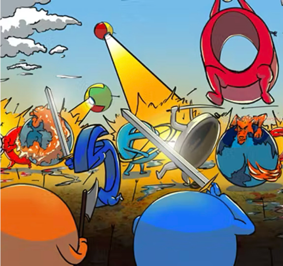
</template>

---
layout: image-top
sectionNumber: 3-17
docNumber: "CODE FEST"
---

<template v-slot:image>

</template>

<v-clicks>

- Узнаешь из статьи/доклада про новую крутую фичу
- Пробуешь внедрить — не работает
- Плачешь в подушку / пишешь полифилл / загоняешь юзеров в один браузер
- ...Хорошо если года через 3 станет доступно везде

</v-clicks>

---
layout: statement
sectionNumber: 3-18
docNumber: "CODE FEST"
---

# Прошло **32** года

---
layout: two-column
sectionNumber: 3-19
docNumber: "CODE FEST"
---

<template v-slot:left>

# Interop

#### Google, Mozilla, Microsoft, Apple, Bocoup и Igalia — объединились для борьбы с проблемами несовместимости браузеров и стандартизации

<v-click>
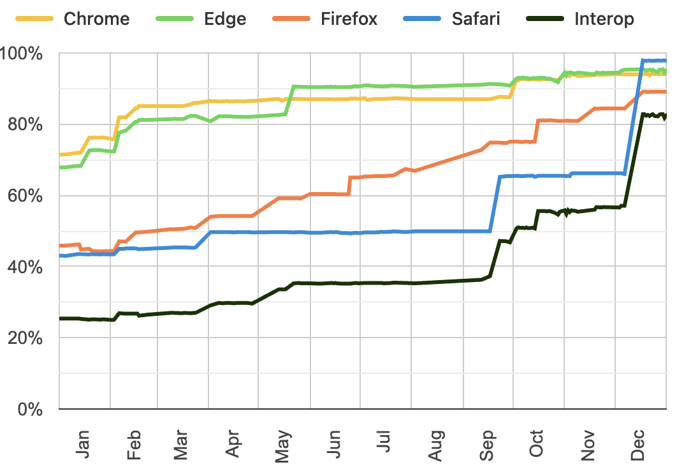
</v-click>

</template>

<template v-slot:right>
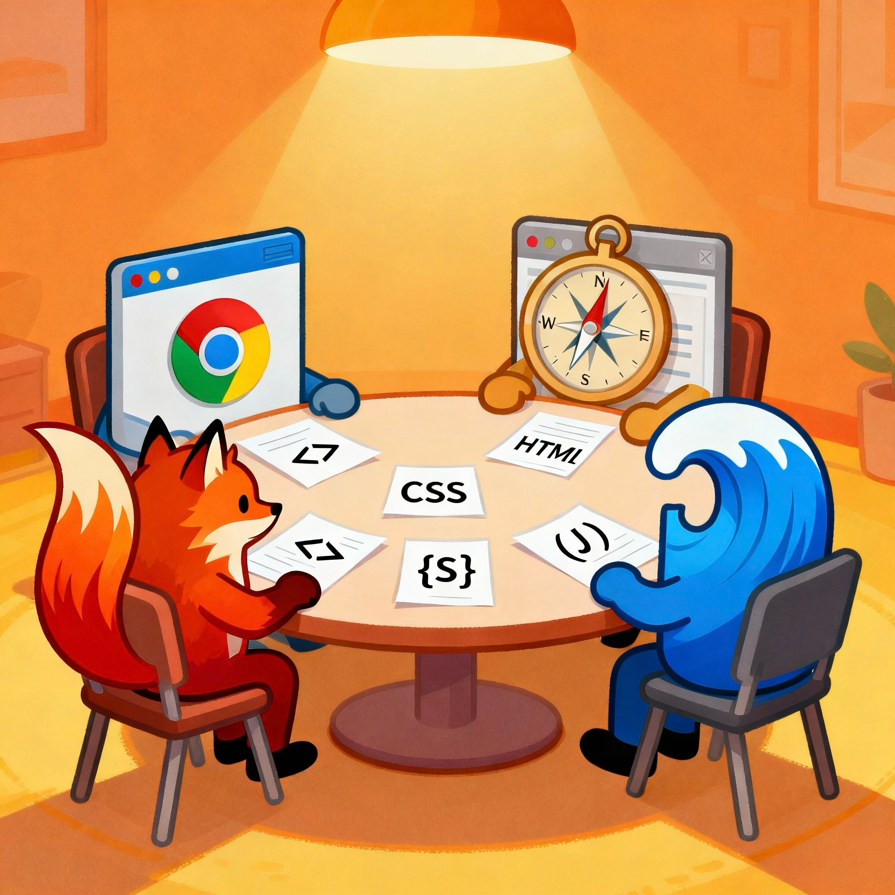
</template>

---
layout: statement
sectionNumber: 3-20
docNumber: "CODE FEST"
---

# но почему так сложно?

---
layout: image-full
sectionNumber: 3-21
docNumber: "CODE FEST"
---

<template v-slot:image>

</template>

---
layout: statement
sectionNumber: 3-22
docNumber: "CODE FEST"
---

# Для чего создавался веб?

---
layout: image-full
sectionNumber: 3-23
docNumber: "CODE FEST"
---

<template v-slot:image>

</template>

---
sectionNumber: 3-24
---

### Принципы развития веб-платформы

<v-clicks>

- **Не ломай веб.**
- **Интероперабельность** — должно работать везде и одинаково.
- **Расширяй**, а не заменяй.
- **Безопасность по умолчанию.**
- **Доступность по умолчанию.**
- Патентная политика без роялти.

</v-clicks>

---
layout: section
sectionNumber: '4'
docNumber: "Автостопом по веб-платформе"
---

# Глава 4

## Немного будущих API

<template v-slot:descriptor>

~~Заменит ли нас ИИ~~

</template>

---
layout: statement
sectionNumber: 4-1
docNumber: "CODE FEST"
---

## web MCP

### (не путать с MCP)

---
layout: two-column
sectionNumber: 4-2
docNumber: "CODE FEST"
title: WebMCP
---

### WebMCP (не путать просто с MCP)

<template v-slot:left>

#### без WebMCP

<v-clicks>

- Робот/агент идет на сайт
- парсит его
- протыкивает все кнопки и добивается результата "стучась в каждую дверь"
-
- ... хорошо если еще верстка семантическая

</v-clicks>

</template>

<template v-slot:right>

#### WebMCP

<v-clicks>

- Мы описываем декларативно/императивно агенту как пользоваться сайтом
- Убираем хрупкую автоматизацию кликов
- AI — как новый "потребитель" веб-интерфейсов
- экономия токенов (профит)

</v-clicks>

</template>

---
layout: statement
sectionNumber: 4-3
docNumber: "CODE FEST"
---

## A2UI

---
layout: image-full
sectionNumber: 4-4
docNumber: "CODE FEST"
---

<template v-slot:image>
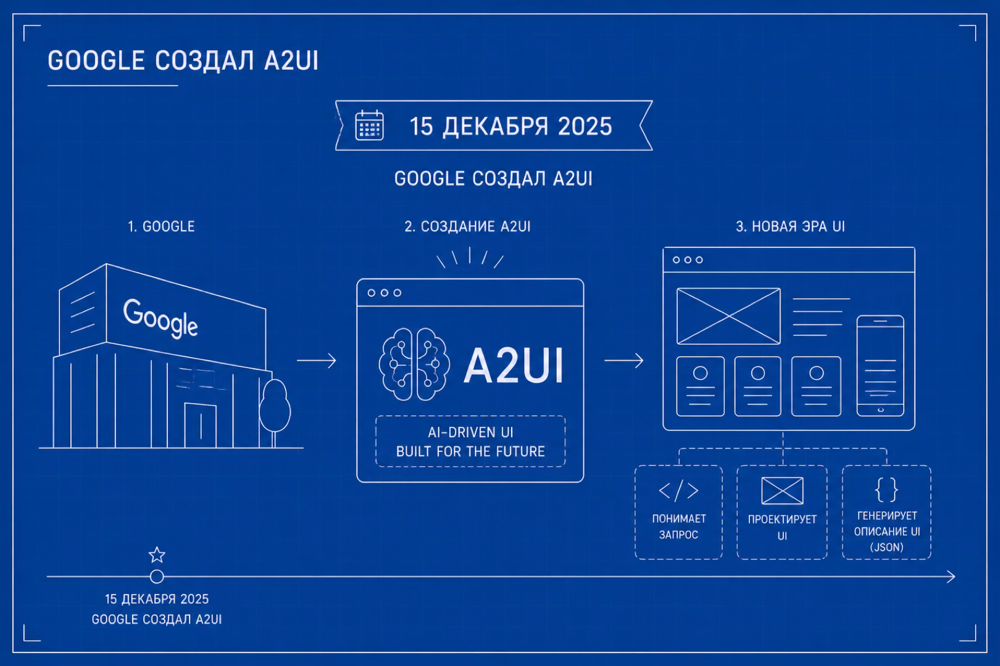
</template>

---
layout: statement
sectionNumber: 4-5
docNumber: "CODE FEST"
---

JSON — как описание интерфейса

---
sectionNumber: 4-6
---

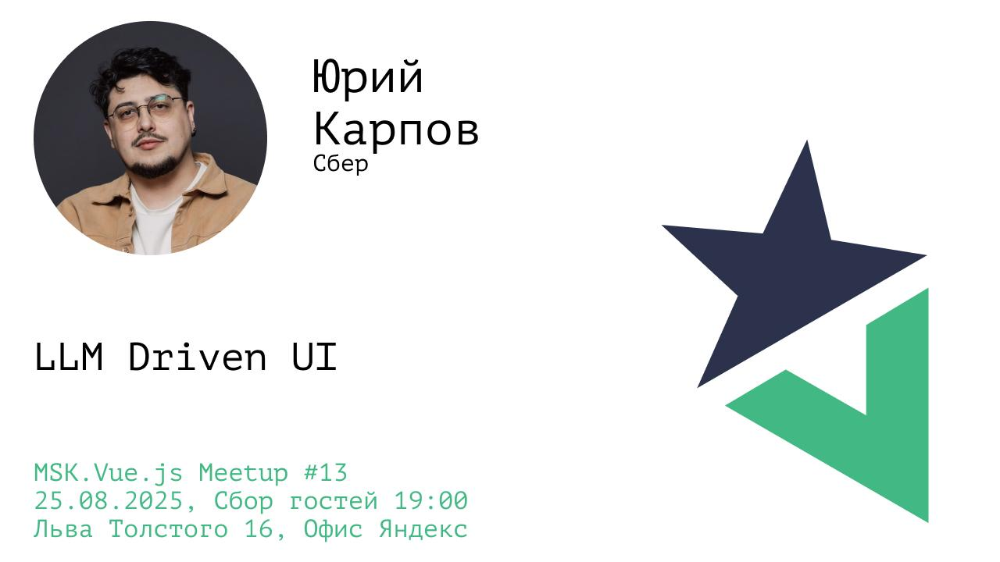
<a href="https://youtu.be/2btBC99seK4?si=jtrum7BTqGnK_E-K">Запись</a>

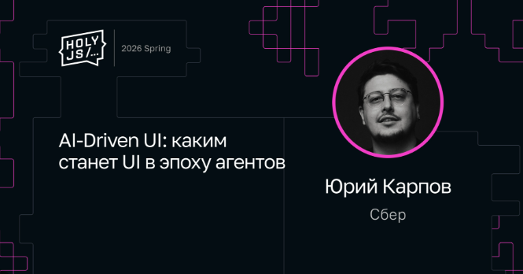
<a href="https://holyjs.ru/archive/2026%20Spring/talks/20009814-ai-driven-ui-how-the-ui-will-look-like-in-the-age-of-agents/" target="_blank" rel="noreferrer">Доклад</a>

---
layout: statement
sectionNumber: 4-7
docNumber: "CODE FEST"
---

# Prompt API

<v-clicks>

- предложен Google весной
- возможность вызвать модель прямо на сайте при помощи js
- быстродействие, одно "окно входа"
- ...
- можно использовать **только** Gemini Nano

</v-clicks>

---
layout: statement
sectionNumber: 4-8
---

## position: **negative**

<v-click>

# concerns: **interoperability**

</v-click>

---
layout: image-full
sectionNumber: 4-9
docNumber: "CODE FEST"
---
<template v-slot:image>

</template>

---
sectionNumber: 4-10
---

### Совсем кратко

<v-clicks>

- **WebMCP** — сайт становится удобным для AI-агента
- **A2UI** — интерфейс можно генерировать динамически под задачу на основе json
- **Prompt API** — возможность вызова модели из браузера/js

</v-clicks>

---
sectionNumber: 4-11
docNumber: "CODE FEST"
---

### Выводы

<v-clicks>

- веб-платформа — это **зеркало**. Отражает то, как мы хотим жить, работать и взаимодействовать с интернетом.
- веб платформа — это самое большое **легаси** интернета
- в веб-платформе много хаоса — зоопарк комитетов и технологий
- нормально **договариваться** браузеры и комитеты начали только лет **7 назад** (условно)
- Chrome всё равно "грешит" и **проталкивает** своё влияние при помощи API
- Но эта система существует более **36 лет** и развивается

</v-clicks>

---
layout: statement
sectionNumber: 4-12
docNumber: "CODE FEST"
---

## Послесловие

---
layout: end
sectionNumber: 5
docNumber: "CODE FEST"
classification: CODEFEST
unit: HQ, DEPT OF THE PRESENTATION
photo: ./img/qr.png

---

<template v-slot:title>Спасибо</template>
