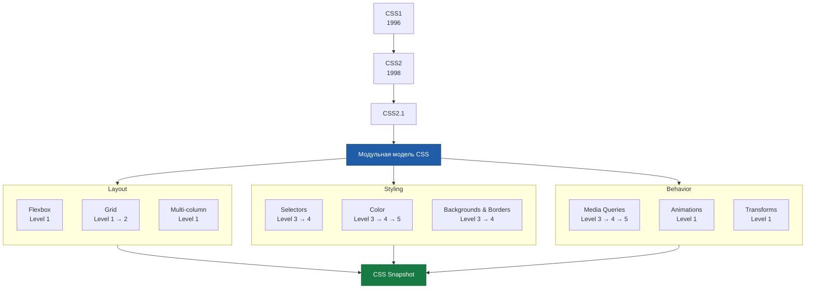
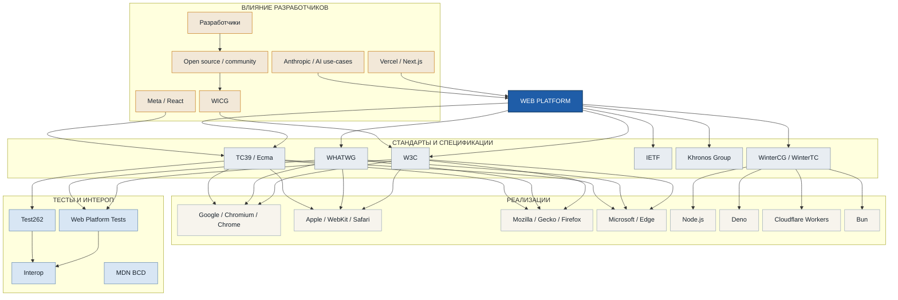
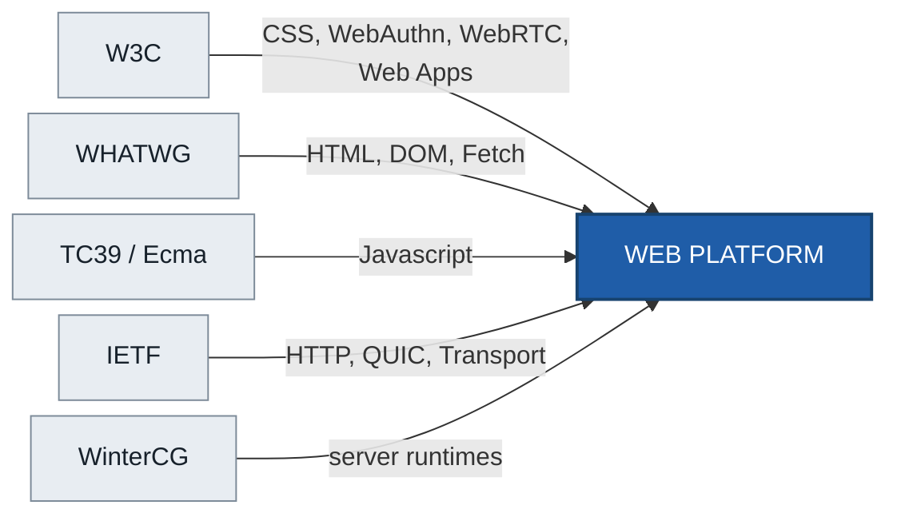
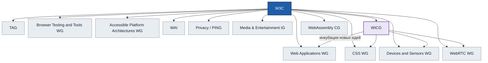

# Самое большое легаси,<br>с которым мы работаем

<template v-slot:subtitle>
Веб-платформа · Мария Кондаурова · BIOCAD
</template>

<template v-slot:image>

</template>

<!--
Всем привет! Меня зовут Мария Кондаурова, я из BIOCAD. Сегодня мы поговорим про самое большое легаси, с которым работает каждый в этом зале. Не про ваш монолит, не про проект, который вы боитесь трогать. Про веб-платформу. И к концу доклада я хочу, чтобы слово «легаси» перестало для вас звучать как ругательство.
-->

---
layout: two-column
title: Обо мне
sectionNumber: 0-1
docNumber: "HOLYJS AUTUMN 2026"
transition: fade
---

## Обо мне

<v-clicks>

- FrontLead в Департаменте Вычислительной Биологии в BIOCAD
- Член программного комитета HolyJS
- Соорганизовывала SPB Frontend
- Живу в Питере, крашу Warhammer и занимаюсь фехтованием

</v-clicks>

::right::

  

<!--
Пару слов о себе. Я FrontLead в Департаменте вычислительной биологии в BIOCAD, состою в программном комитете HolyJS, соорганизовывала SPB Frontend. Живу в Питере, в свободное время крашу Warhammer и занимаюсь фехтованием.
-->

---
layout: section
sectionNumber: '0'
docNumber: "САМОЕ БОЛЬШОЕ ЛЕГАСИ"
---

# Пролог

## Продукт, который вырос

<template v-slot:descriptor>
Или как мировой MVP превратился в проект, который нельзя переписать
</template>

---
layout: default
sectionNumber: 0-2
docNumber: "HOLYJS AUTUMN 2026"
title: Как растут продукты
---

## Как растёт любой продукт

<v-clicks>

- Сначала — маленький **scope**: простая полезная штука
- Потом приходят **пользователи**
- За ними — **новые требования** и **бизнес**
- Потом — **новые команды**, костыли, обратная совместимость
- И вот вы работаете с огромным **legacy**, которое нельзя просто переписать

</v-clicks>

<!--
Начнём не с веба. Начнём с того, что каждый из нас видел своими глазами.

Есть типичная история любого продукта в компании. Сначала — маленький scope: простая полезная штука, которую можно сделать за пару недель. Потом приходят пользователи. За ними — новые требования. Потом бизнес, потом новые команды. Появляются костыли, обратная совместимость, «это трогать нельзя — сломается». И в какой-то момент вы обнаруживаете, что работаете с огромным legacy-проектом, который невозможно просто взять и переписать.

Знакомо? Так вот.
-->

---
layout: statement
sectionNumber: 0-3
docNumber: "HOLYJS AUTUMN 2026"
---

## Веб прошёл этот же путь — <br>только в масштабе всего мира

<v-click>

### Веб-платформа — самый большой живой **legacy-продукт** человечества

</v-click>

<!--
Веб прошёл ровно этот же путь. Только в масштабе всего мира.

Мой главный тезис на сегодня: **веб-платформа — это самый большой живой legacy-продукт человечества.** И слово «легаси» здесь — не ругательство. Это цена того, что продукт оказался слишком успешным и слишком долго был нужен людям. Дальше весь доклад — это история одного продукта: как из крошечного MVP он вырос в глобальную платформу и почему он до сих пор не развалился.
-->

---
sectionNumber: 0-4
docNumber: "HOLYJS AUTUMN 2026"
---


<p v-click style="margin: 0 auto">Веб-платформа = Браузер + API + стандарты + тесты + комитеты</p>

<!--
И сразу договоримся о терминах. Веб-платформа — это не только браузер. Это браузер + API + стандарты + тесты + комитеты. Смотрите на это не как на скучное определение, а как на **оглавление большого продукта**: вот код, вот инфраструктура, вот процессы, вот оргструктура. Всё как у любого зрелого продукта — только распределено по всей планете. Чтобы понять, почему он стал таким, вернёмся к самой первой его версии.
-->

---
layout: section
docNumber: "САМОЕ БОЛЬШОЕ ЛЕГАСИ"
sectionNumber: '1'
---

# Глава 1

## MVP, который оказался слишком успешным

<template v-slot:descriptor>
Или как веб начинался с простого гипертекста
</template>


---
sectionNumber: 1-1
docNumber: "HOLYJS AUTUMN 2026"
title: Масштаб за 80 лет
---

## На секунду — про масштаб

<div class="grid grid-cols-2 gap-6 items-center mt-4">


</div>

| Параметр            | ENIAC (1946)                              | iPhone 17 Pro (2025)            |
|:--------------------|:------------------------------------------|:--------------------------------|
| Операций в секунду  | ≈5 000 сложений/сек                       | ≥6 000 000 000 000 операций/сек |
| Память              | **20 слов**                               | **6–8 ГБ** ОЗУ                   |
| Потребление         | ≈174 кВт                                  | ~10 Вт                          |

<p v-click class="text-center">За 80 лет — разница на порядки. Но железо — это половина истории.</p>

<!--
Один быстрый флэшбек для масштаба. Вот первый компьютер — ENIAC, 1946-й: комната, 30 тонн, тысячи операций в секунду, и под новую задачу его перекоммутировали проводами. А вот то, что лежит у вас в кармане: триллионы операций в секунду и гигабайты памяти. За 80 лет — разница на порядки. Но железо — это только половина истории. Вторая половина — как мы этим железом обмениваемся информацией.
-->

---
layout: statement
sectionNumber: 1-2
docNumber: "HOLYJS AUTUMN 2026"
---
## World Wide Web

<!--
И тут появляется World Wide Web.
-->

---
layout: image-right
sectionNumber: 1-3
docNumber: "HOLYJS AUTUMN 2026"
figNumber: 1-1
figLabel: TIM BERNERS-LEE — CREATOR OF THE WORLD WIDE WEB
---

# Тим Бернерс-Ли

## Создал первый браузер в **1990 году**

<template v-slot:image>

</template>

<!--
Тим Бернерс-Ли создаёт первый браузер в 1990 году. Один человек — и целая новая среда.
-->

---
docNumber: "HOLYJS AUTUMN 2026"
sectionNumber: 1-4
title: Первый в мире сайт
status: "1 document · 0 images"
---

<BrowserFrame
  url="http://info.cern.ch/hypertext/WWW/TheProject.html"
  tab="The World Wide Web project"
  year="1991"
  status="Done"
  class="h-full"
>
  
</BrowserFrame>

<!--
Вот он, первый сайт в мире. Никакого дизайна — текст и ссылки. Но именно это и было идеей.
-->


---
layout: statement
sectionNumber: 1-5
docNumber: "HOLYJS AUTUMN 2026"
---

## Это и был **MVP**: гипертекстовая система для обмена знаниями

<v-click>

### Удачный минимальный scope: открыть можно почти везде, ссылка ведёт на документ, автору не нужно разрешение платформы

</v-click>

<!--
Веб задумывался как гипертекстовая система для обмена знаниями: документы, связанные ссылками. По сути это был идеальный MVP — очень удачный минимальный scope. Открыть страницу можно почти откуда угодно. Ссылка ведёт на документ. А чтобы что-то опубликовать, автору не нужно спрашивать разрешения у платформы. Запомните этот минимализм — к нему мы вернёмся, когда будем говорить про принципы.
-->

---
layout: image-right
sectionNumber: 1-6
docNumber: "HOLYJS AUTUMN 2026"
figNumber: 1-2
figLabel: EARLY WEB — TABLE-BASED LAYOUTS
---

## Эра «Невинного» веба

<v-clicks>

- Статичные HTML-страницы
- Документы, ссылки, немного картинок
- Табличная вёрстка

</v-clicks>

<template v-slot:image>

</template>

<!--
Ранний веб был невинным: статичные HTML-страницы, документы, ссылки, немного картинок, вёрстка на таблицах. Всё просто.
-->

---
sectionNumber: 1-7
docNumber: "HOLYJS AUTUMN 2026"
---


## ПК —> Веб стал доступен каждому

<!--
Персональные компьютеры вынесли веб из лабораторий к обычным людям. Он стал доступен каждому.
-->

---
layout: statement
sectionNumber: 1-8
docNumber: "HOLYJS AUTUMN 2026"
---

## Люди стали генерировать контент и самовыражаться

<!--
И как только веб попал к людям, они начали генерировать контент и самовыражаться.
-->

---
sectionNumber: 1-9
docNumber: "HOLYJS AUTUMN 2026"
title: Атмосфера раннего пользовательского веба
---

<SlidevVideo autoplay>
  <source src="./assets/mov/cameron1.mov"  />
</SlidevVideo>


---
layout: image-full
sectionNumber: 1-10
docNumber: "HOLYJS AUTUMN 2026"
---
<template v-slot:image>

</template>

# Сайт — как пиар компания фильма: Space Jam(1996)

<!--
Сайт как пиар-кампания фильма — легендарный Space Jam 1996 года, живой до сих пор в оригинальном виде. Веб стал маркетинговым инструментом.
-->

---
layout: image-full
sectionNumber: 1-11
docNumber: "HOLYJS AUTUMN 2026"
---

<template v-slot:image>

</template>

# Сайт — как заработок: The million dollars homepage (2005)

<!--
Сайт как способ заработка — The Million Dollar Homepage, 2005. Миллион пикселей по доллару за штуку. Веб стал бизнесом.
-->

---
layout: statement
sectionNumber: 1-12
docNumber: "HOLYJS AUTUMN 2026"
---

## Интернет взрослеет

### Самовыражение → сервис

<!--
Интернет взрослеет: самовыражение превращается в сервис. Веб перестаёт быть просто страницами и становится средой для жизни. И тут — первый звоночек: браузер уже не тянет старым, страничным способом.

А потом в этот маленький MVP пришли все сразу — пользователи, авторы, бизнес, медиа, сервисы. И начался рост требований.
-->

---
layout: statement
sectionNumber: 1-13
docNumber: "HOLYJS AUTUMN 2026"
---

## Веб перестаёт быть просто страницами и становится средой для жизни

<v-click>

### Браузер уже не тянет «старым» способом

</v-click>

<!--
Интернет взрослеет: самовыражение превращается в сервис. Веб перестаёт быть просто страницами и становится средой для жизни. И тут — первый звоночек: браузер уже не тянет старым, страничным способом.

А потом в этот маленький MVP пришли все сразу — пользователи, авторы, бизнес, медиа, сервисы. И начался рост требований.
-->

---
layout: section
sectionNumber: '2'
docNumber: "САМОЕ БОЛЬШОЕ ЛЕГАСИ"
---

# Глава 2

## Требования росли — веб отвечал

<template v-slot:descriptor>
Или как пользователи хотели X, а веб отвечал Y
</template>


---
layout: statement
sectionNumber: 2-1
docNumber: "HOLYJS AUTUMN 2026"
---

### "Фронтенд развивается скачкообразно"

<v-click>

#### Каждый скачок — это накопившееся давление **требований**

</v-click>

<!--
Есть наблюдение: фронтенд развивается скачкообразно — не плавно, а рывками. Но давайте посмотрим на это как продуктовые люди. Каждый скачок — это не «вышла новая технология». Это накопившееся давление требований, которое в какой-то момент прорывается. Пользователи хотят X — и веб отвечает Y. Пройдёмся по этим требованиям.
-->

---
layout: image-full
sectionNumber: 2-1a
docNumber: "HOLYJS AUTUMN 2026"
title: Динамика скачков
---

<template v-slot:image>

</template>


---
sectionNumber: 2-2
docNumber: "HOLYJS AUTUMN 2026"
---

## Захотели взаимодействовать, а не читать
<RequirementCard year="2004" demand="Взаимодействовать, а не читать"
  response="AJAX / XMLHttpRequest" effect="Состояние — вручную, спагетти-код" />

<div class="grid grid-cols-2 gap-6 mt-4 items-stretch">
  <div
    v-click
    class="rounded-2xl border border-red-200/60 bg-red-50/40 px-6 py-5"
  >
    <div class="text-sm uppercase tracking-widest text-red-500 font-bold mb-4">
      До 2004
    </div>

      - Каждое действие — новая страница
      - Обновить статус — рефреш

  </div>
  <div
    v-click
    class="rounded-2xl border border-teal-200/60 bg-teal-50/40 px-6 py-5"
  >
    <div class="text-sm uppercase tracking-widest text-teal-600 font-bold mb-4">
      Gmail + AJAX
    </div>

      - Частичное обновление страницы
      - Мгновенные ответы

  </div>
</div>

<!--
Первое требование: люди захотели не читать страницы, а взаимодействовать. До 2004-го каждое действие — новая страница, обновить статус — полный рефреш. И тут выходит Gmail с AJAX: частичное обновление, мгновенные ответы. Страница перестаёт перезагружаться целиком.
-->

---
sectionNumber: 2-3
docNumber: "HOLYJS AUTUMN 2026"
---

## AJAX дал скорость,<br>но создал свои проблемы

<v-clicks>

- Управление состоянием вручную
- "Спагетти‑код" повсюду  **(привет, jquery!)**
- Каждый разработчик делает свой велосипед

</v-clicks>

<v-click>

### Нужна реиспользуемость

</v-click>

<!--
Обратная сторона: состоянием управляем вручную, спагетти-код повсюду (привет, jQuery), каждый пишет свой велосипед. Назрело требование к переиспользуемости.
-->


---
sectionNumber: 2-4
docNumber: "HOLYJS AUTUMN 2026"
---

## Захотели богатый UI и скорость разработки
<RequirementCard year="2010" demand="Богатый UI и скорость разработки"
  response="SPA: Angular, React, Vue" effect="Тяжёлый клиент, SEO ломается" />

<div class="grid grid-cols-2 gap-6 mt-4 items-stretch">
  <div
    v-click
    class="rounded-2xl border border-red-200/60 bg-red-50/40 px-6 py-5"
  >
    <div class="text-sm uppercase tracking-widest text-red-500 font-bold mb-4">
      Было (MPA)
    </div>

      - Каждый экран — отдельный HTML
      - Сервер рендерит всю страницу
      - Ограниченная интерактивность
      - Много кода

  </div>
  <div
    v-click
    class="rounded-2xl border border-teal-200/60 bg-teal-50/40 px-6 py-5"
  >
    <div class="text-sm uppercase tracking-widest text-teal-600 font-bold mb-4">
      Стало (SPA)
    </div>

      - Angular/React/Vue
      - Клиент — UI-машина
      - Сервер — только API

  </div>
</div>

<!--
Второе требование: продукты захотели богатый интерфейс и высокую скорость разработки. Было — MPA: каждый экран отдельный HTML, сервер рендерит всю страницу, много кода. Стало — SPA: Angular, React, Vue. Клиент становится UI-машиной, сервер — только API.
-->

---
layout: default
sectionNumber: 2-5
docNumber: "HOLYJS AUTUMN 2026"
---

## Но телефоны не стояли на месте

<div class="grid grid-cols-2 gap-12 mt-10 items-start">

  <div
    v-click
    class="flex flex-col gap-1"
  >
    <h2 class="text-2xl font-bold text-rose-400">
      Кнопочные <span class="opacity-70">(2000–2007)</span>
    </h2>
    <div class="grid grid-cols-2 gap-1">
      
      
      
      
    </div>
  </div>

  <div
    v-click
    class="flex flex-col gap-1"
  >
    <h2 class="text-2xl font-bold text-cyan-300">
      Сенсорные <span class="opacity-70">(2007+)</span>
    </h2>
    <div class="grid grid-cols-2 gap-1">
      
      
      
      
    </div>
  </div>
</div>

<!--
Параллельно менялись устройства. Кнопочные 2000–2007 — Nokia, Motorola, Samsung, BlackBerry. Сенсорные с 2007-го — Xperia, iPhone, Android. Смена парадигмы взаимодействия.
-->

---
sectionNumber: 2-6
docNumber: "HOLYJS AUTUMN 2026"
---

## С мобильностью пришли новые вызовы

<v-clicks>

- Тяжёлый JS тормозит на слабых устройствах
- Touch UI вместо hover/click
- 3G/4G вместо оптоволокна
- Экраны от 320px до 4K

</v-clicks>

<!--
Мобильность принесла вызовы: тяжёлый JS тормозит на слабых устройствах, touch вместо hover, 3G/4G вместо оптоволокна, экраны от 320 пикселей до 4K.
-->

---
sectionNumber: 2-7
docNumber: "HOLYJS AUTUMN 2026"
---

## Мир стал мобильным
<RequirementCard year="2012" demand="Мир стал мобильным"
  response="Mobile-first, адаптивность 320px–4K" effect="Хочется нативности" />

<div class="grid grid-cols-2 gap-6 mt-4 items-stretch">
  <div
    v-click
    class="rounded-2xl border border-red-200/60 bg-red-50/40 px-6 py-5"
  >
    <div class="text-sm uppercase tracking-widest text-red-500 font-bold mb-4">
      Десктоп-first (2010)
    </div>

      - Фиксированная ширина 1024px
      - Hover и курсор мыши
      - Быстрый интернет (DSL)
      - Мощные ПК

  </div>
  <div
    v-click
    class="rounded-2xl border border-teal-200/60 bg-teal-50/40 px-6 py-5"
  >
    <div class="text-sm uppercase tracking-widest text-teal-600 font-bold mb-4">
      Mobile-first (2012+)
    </div>

      - Адаптивность 320px–4K
      - Touch интерфейсы (Material UI)
      - Производительность (lazy load)
      - Сети 3G/4G

  </div>
</div>

<!--
Третье требование: мир стал мобильным. Десктоп-first 2010-го — фиксированные 1024, hover и мышь, быстрый DSL. Mobile-first 2012+ — адаптивность 320px–4K, touch и Material UI, забота о производительности, сети 3G/4G. Мы начинаем проектировать с мобильного.
-->

---
sectionNumber: 2-8
docNumber: "HOLYJS AUTUMN 2026"
---

## Mobile-first дал адаптивность, но хотелось нативности

<v-clicks>

- App Store модерация (недели)
- Обновления только через стор
- Офлайн недоступен
- Push только через натив

</v-clicks>

<!--
Адаптивность получили — но захотелось нативности. А у веба ограничения: модерация в App Store неделями, обновления только через стор, офлайн недоступен, push только через натив.
-->

---
sectionNumber: 2-9
docNumber: "HOLYJS AUTUMN 2026"
---

## Захотели возможности приложений
<RequirementCard year="2015" demand="То же, что умеют нативные приложения"
  response="PWA: Service Workers, offline, push" effect="Рендерные боли — опять" />

<div class="grid grid-cols-2 gap-6 mt-4 items-stretch">
  <div
    v-click
    class="rounded-2xl border border-red-200/60 bg-red-50/40 px-6 py-5"
  >
    <div class="text-sm uppercase tracking-widest text-red-500 font-bold mb-4">
      Обычный веб
    </div>

      - Только онлайн
      - Не устанавливается
      - Нет push
      - Зависит от сети

  </div>
  <div
    v-click
    class="rounded-2xl border border-teal-200/60 bg-teal-50/40 px-6 py-5"
  >
    <div class="text-sm uppercase tracking-widest text-teal-600 font-bold mb-4">
      PWA
    </div>

      - Offline-first
      - Установка без стора
      - Push уведомления
      - Кэш + Service Workers

  </div>
</div>

<v-click>

<p class="text-center pt-5">
Service Worker = прокси между сетью и кэшем
</p>

</v-click>

<!--
Четвёртое требование: хотим то же, что умеют нативные приложения. PWA: offline-first, установка без стора, push-уведомления, кэш и Service Workers. Ключевая идея — Service Worker как прокси между сетью и кэшем.
-->

---
sectionNumber: 2-10
docNumber: "HOLYJS AUTUMN 2026"
---

## ...но вылезли рендерные боли (опять)

<v-clicks>

- Тяжёлый JS на клиенте
- SEO страдает (SPA)
- TTFB (Time to First Byte) медленный
- Размытая ответственность между сервером и клиентом

</v-clicks>

<!--
И снова обратная сторона: тяжёлый JS на клиенте, SEO страдает у SPA, медленный TTFB, размытая ответственность между сервером и клиентом. История повторяется по спирали.
-->

---
sectionNumber: 2-11
docNumber: "HOLYJS AUTUMN 2026"
---

## Нужны интерактив + скорость + SEO
<RequirementCard year="2020" demand="Интерактив + скорость + SEO сразу"
  response="React Server Components" effect="Границы сервер/клиент размыты" />

<div class="grid grid-cols-2 gap-6 mt-4 items-stretch">
  <div
    v-click
    class="rounded-2xl border border-red-200/60 bg-red-50/40 px-6 py-5"
  >
    <div class="text-sm uppercase tracking-widest text-red-500 font-bold mb-4">
      Классика
    </div>

      - Всё на клиенте (SPA)
      - Или всё на сервере (MPA)
      - Два кода
      - SEO или скорость

  </div>
  <div
    v-click
    class="rounded-2xl border border-teal-200/60 bg-teal-50/40 px-6 py-5"
  >
    <div class="text-sm uppercase tracking-widest text-teal-600 font-bold mb-4">
      RSC (React Server Components)
    </div>

      - Серверный рендер статичного
      - Клиентский только интерактив
      - Один код (async/await)
      - SEO + скорость + PWA

  </div>
</div>

<v-click>

<p class="mt-16 text-center">
Сервер рендерит → Streaming → Клиент "оживляет"
</p>

</v-click>

<!--
Пятое требование: хотим всё сразу — и интерактив, и скорость, и SEO. RSC, React Server Components: статику рендерит сервер, интерактив — клиент, один код на async/await. Формула: сервер рендерит → стриминг → клиент оживляет.
-->

---
layout: timeline
sectionNumber: 2-12
docNumber: "HOLYJS AUTUMN 2026"
title: ЭВОЛЮЦИЯ ВЕБА — ХРОНОЛОГИЯ
direction: horizontal
---

<div class="tl-entry">
  <div class="tl-entry-marker"><div class="tl-entry-dot"></div></div>
  <div class="tl-entry-body">
    <div class="tl-entry-date fm-label">1990</div>
    <div class="tl-entry-title">Статичный веб</div>
  </div>
</div>

<div class="tl-entry">
  <div class="tl-entry-marker"><div class="tl-entry-dot"></div></div>
  <div class="tl-entry-body">
    <div class="tl-entry-date fm-label">2004</div>
    <div class="tl-entry-title">Ajax</div>
    <div class="tl-entry-desc">Gmail заложил тренд веба как сервиса</div>
  </div>
</div>

<div class="tl-entry">
  <div class="tl-entry-marker"><div class="tl-entry-dot"></div></div>
  <div class="tl-entry-body">
    <div class="tl-entry-date fm-label">2010</div>
    <div class="tl-entry-title">SPA‑бум</div>
    <div class="tl-entry-desc">AngularJS (2010), React(2013), Vue(2014)</div>
  </div>
</div>

<div class="tl-entry">
  <div class="tl-entry-marker"><div class="tl-entry-dot"></div></div>
  <div class="tl-entry-body">
    <div class="tl-entry-date fm-label">2010</div>
    <div class="tl-entry-title">First-mobile</div>
    <div class="tl-entry-desc">Развитие смартфонов</div>
  </div>
</div>

<div class="tl-entry">
  <div class="tl-entry-marker"><div class="tl-entry-dot"></div></div>
  <div class="tl-entry-body">
    <div class="tl-entry-date fm-label">2015+</div>
    <div class="tl-entry-title">PWA</div>
    <div class="tl-entry-desc">Офлайн, установка, пуш‑уведомления</div>
  </div>
</div>

<div class="tl-entry">
  <div class="tl-entry-marker"><div class="tl-entry-dot"></div></div>
  <div class="tl-entry-body">
    <div class="tl-entry-date fm-label">2020-2023</div>
    <div class="tl-entry-title">Server Components</div>
    <div class="tl-entry-desc">Гибрид сервер/клиент</div>
  </div>
</div>

<!--
Соберём на одной таймлинии: 1990 — статичный веб, 2004 — Ajax и Gmail, 2010 — SPA-бум и одновременно mobile-first, 2015+ — PWA, 2020–2023 — Server Components.
-->

---
layout: statement
sectionNumber: 2-13
docNumber: "HOLYJS AUTUMN 2026"
---

# Всего за 20 лет

<v-click>

### Темп колоссальный

</v-click>

<!--
И всё это — всего за 20 лет. Темп колоссальный.
-->

---
layout: statement
sectionNumber: 2-14
docNumber: "HOLYJS AUTUMN 2026"
---

## Но у каждого из этих скачков был один и тот же автор

<v-click>

### И это были не браузеры

</v-click>

<!--
Только смотрите, что здесь интересно. У каждого из этих скачков был один и тот же автор. И это были не браузеры.
-->

---
sectionNumber: 2-15
docNumber: "HOLYJS AUTUMN 2026"
title: Платформа догоняет библиотеки
---

## Платформа догоняет. Всегда.

| Мы выжимали из того, что было | Платформа догнала | Разрыв |
|:---|:---|:---|
| Вёрстка таблицами | Flexbox (2012), Grid (2017) | ~15 лет |
| `$('.item')` в jQuery | `querySelector` | ~7 лет |
| `$.ajax` | `fetch` | ~10 лет |
| moment.js | `Temporal` | ~10 лет |
| lodash | нативные методы массивов | ~10 лет |
| Свой lazy-load на скролле | `loading="lazy"` | ~10 лет |
| JS-хаки под ширину блока | `@container` (2023) | ~13 лет |

<!--
Вёрстку таблицами придумали не потому, что кто-то любил таблицы, а потому что в языке не было средств для раскладки. Flexbox приехал в 2012-м, Grid — в 2017-м. Разрыв — пятнадцать лет.

`$('.item')` в jQuery — а потом `querySelector`. `$.ajax` — а потом `fetch`, десять лет спустя. Moment.js — и `Temporal`, на который ушло почти десять лет, чтобы просто починить работу с датами. Lodash — и нативные методы массивов. Свой ленивый скролл — и `loading="lazy"`. JS-хаки, чтобы узнать ширину блока — и `@container` в 2023-м.
-->

---
layout: statement
sectionNumber: 2-16
docNumber: "HOLYJS AUTUMN 2026"
---

## Разработчики всегда впереди платформы

<v-clicks>

### Мы выжимаем максимум из того, что есть сейчас — и делаем хак

### Платформа **легитимизирует** этот хак. Через десять лет.

</v-clicks>

<!--
Схема одна и та же. Мы выжимаем максимум из того, что есть прямо сейчас, и делаем хак. А платформа потом легитимизирует этот хак. Через десять лет.

Пока просто запомните это. Вернёмся к этому в конце, и там будет уже не смешно.
-->

---
layout: statement
sectionNumber: 2-16a
docNumber: "HOLYJS AUTUMN 2026"
---

## Посмотрим, к чему это привело

<!--
Посмотрим, к чему это привело. VK — полноценное приложение в браузере. Игры и графика прямо в вебе. Медиа-сервисы. 3D-музей Самоката на React и Three.js. Многопользовательская игра на WebGL — real-time прямо на веб-платформе. И вишенка — DOOM на CSS и JS, потому что можем. А за всем этим — больше 150 браузерных Web API: доступ к телефону, к железу (GPU), к AI (с конца 2025-го) и много к чему ещё.
-->

---
sectionNumber: 2-17
docNumber: "HOLYJS AUTUMN 2026"
---


<!--
Посмотрим, к чему это привело. VK — полноценное приложение в браузере. Игры и графика прямо в вебе. Медиа-сервисы. 3D-музей Самоката на React и Three.js. Многопользовательская игра на WebGL — real-time прямо на веб-платформе. И вишенка — DOOM на CSS и JS, потому что можем. А за всем этим — больше 150 браузерных Web API: доступ к телефону, к железу (GPU), к AI (с конца 2025-го) и много к чему ещё.
-->

---
sectionNumber: 2-18
docNumber: "HOLYJS AUTUMN 2026"
---


<!--
Посмотрим, к чему это привело. VK — полноценное приложение в браузере. Игры и графика прямо в вебе. Медиа-сервисы. 3D-музей Самоката на React и Three.js. Многопользовательская игра на WebGL — real-time прямо на веб-платформе. И вишенка — DOOM на CSS и JS, потому что можем. А за всем этим — больше 150 браузерных Web API: доступ к телефону, к железу (GPU), к AI (с конца 2025-го) и много к чему ещё.
-->

---
sectionNumber: 2-19
docNumber: "HOLYJS AUTUMN 2026"
---


<!--
Посмотрим, к чему это привело. VK — полноценное приложение в браузере. Игры и графика прямо в вебе. Медиа-сервисы. 3D-музей Самоката на React и Three.js. Многопользовательская игра на WebGL — real-time прямо на веб-платформе. И вишенка — DOOM на CSS и JS, потому что можем. А за всем этим — больше 150 браузерных Web API: доступ к телефону, к железу (GPU), к AI (с конца 2025-го) и много к чему ещё.
-->

---
sectionNumber: 2-20
docNumber: "HOLYJS AUTUMN 2026"
---

<div style="width: 100%; border-radius: 12px; overflow: hidden;">
  <video
    src="./assets/mov/samokat.mov"
    autoplay
    muted
    loop
    playsinline
    style="width: 100%; height: auto; display: block;"
  ></video>
</div>
<p class="text-center">3D музей в браузере &#40;React и Three.js) <a href="https://museum.samokat.ru">https://museum.samokat.ru</a></p>

<!--
Посмотрим, к чему это привело. VK — полноценное приложение в браузере. Игры и графика прямо в вебе. Медиа-сервисы. 3D-музей Самоката на React и Three.js. Многопользовательская игра на WebGL — real-time прямо на веб-платформе. И вишенка — DOOM на CSS и JS, потому что можем. А за всем этим — больше 150 браузерных Web API: доступ к телефону, к железу (GPU), к AI (с конца 2025-го) и много к чему ещё.
-->

---
sectionNumber: 2-21
docNumber: "HOLYJS AUTUMN 2026"
---

<div style="width: 100%; border-radius: 12px; overflow: hidden;">
  <video
    src="./assets/mov/messanger.mov"
    autoplay
    muted
    loop
    playsinline
    style="width: 100%; height: auto; display: block;"
  ></video>
</div>
<p class="text-center">Многопользовательская игра в браузере (webGL) <a href="https://messenger.abeto.co">https://messenger.abeto.co</a></p>

<!--
Посмотрим, к чему это привело. VK — полноценное приложение в браузере. Игры и графика прямо в вебе. Медиа-сервисы. 3D-музей Самоката на React и Three.js. Многопользовательская игра на WebGL — real-time прямо на веб-платформе. И вишенка — DOOM на CSS и JS, потому что можем. А за всем этим — больше 150 браузерных Web API: доступ к телефону, к железу (GPU), к AI (с конца 2025-го) и много к чему ещё.
-->

---
sectionNumber: 2-22
docNumber: "HOLYJS AUTUMN 2026"
---


<div style="width: 100%; border-radius: 12px; overflow: hidden;">
  <video
    src="./assets/mov/doom.mov"
    autoplay
    muted
    loop
    playsinline
    style="width: 100%; height: auto; display: block;"
  ></video>
</div>
<p class="text-center">DOOM на CSS и JS <a href="https://cssdoom.wtf/">https://cssdoom.wtf/</a></p>

<!--
Посмотрим, к чему это привело. VK — полноценное приложение в браузере. Игры и графика прямо в вебе. Медиа-сервисы. 3D-музей Самоката на React и Three.js. Многопользовательская игра на WebGL — real-time прямо на веб-платформе. И вишенка — DOOM на CSS и JS, потому что можем. А за всем этим — больше 150 браузерных Web API: доступ к телефону, к железу (GPU), к AI (с конца 2025-го) и много к чему ещё.
-->


---
layout: two-column
sectionNumber: 2-23
docNumber: "HOLYJS AUTUMN 2026"
title: "Web API в действии"
---

<template v-slot:left>

### 150+ браузерных Web API с доступом к

<v-clicks>

- телефону (контакты, вибрация, bluetooth, уведомления)
- железу (GPU)
- AI (конец 2025-го)
- ..и много чему еще

</v-clicks>

</template>

<template v-slot:right>

<div style="width: 100%;">
  <video
    src="./assets/mov/mdn.mov"
    autoplay
    muted
    loop
    playsinline
    style="width: 100%; height: auto; display: block;"
  ></video>
</div>

</template>

<!--
Посмотрим, к чему это привело. VK — полноценное приложение в браузере. Игры и графика прямо в вебе. Медиа-сервисы. 3D-музей Самоката на React и Three.js. Многопользовательская игра на WebGL — real-time прямо на веб-платформе. И вишенка — DOOM на CSS и JS, потому что можем. А за всем этим — больше 150 браузерных Web API: доступ к телефону, к железу (GPU), к AI (с конца 2025-го) и много к чему ещё.
-->

---
layout: statement
sectionNumber: 2-24
docNumber: "HOLYJS AUTUMN 2026"
---

# Это уже полноценная платформа

<!--
Вывод: это уже не «странички». Это полноценная платформа.

Но вот что важно и что часто упускают. Когда продукт растёт, меняется не только его код. Каждое из этих требований расходилось волной по всей системе — далеко за пределы фронтенда.
-->

---
layout: section
sectionNumber: '3'
docNumber: "САМОЕ БОЛЬШОЕ ЛЕГАСИ"
---

# Глава 3

## Веб переписал не только фронтенд

<template v-slot:descriptor>
Или та же история глазами дизайна и бэкенда
</template>


---
layout: statement
sectionNumber: 3-1
docNumber: "HOLYJS AUTUMN 2026"
---

## Когда продукт растёт, меняется не только его код

<v-click>

### Меняются интерфейсы, инфраструктура, процессы — <br>и даже то, **кто считается пользователем**

</v-click>

<!--
Когда продукт растёт, меняется не только его код. Меняются интерфейсы, инфраструктура, процессы — и даже то, кто считается пользователем.
-->

---
layout: statement
sectionNumber: 3-2
docNumber: "HOLYJS AUTUMN 2026"
---

## Сейчас мы пройдём этот же путь ещё дважды

<v-clicks>

### Те же требования, те же годы — но не глазами фронтендера

#### Арка 1 — **дизайн**. Арка 2 — **бэкенд**.

</v-clicks>

<!--
И сейчас я сделаю странную вещь. Мы пройдём этот же путь ещё дважды. Те же требования, те же годы — но не глазами фронтендера.

Я специально возвращаюсь в те же годы, потому что интересно не *что* случилось. Интересно, *сколько профессий* это переписало. Арка первая — дизайн. Арка вторая — бэкенд.
-->

---
layout: statement
sectionNumber: 3-3
docNumber: "HOLYJS AUTUMN 2026"
---

# Арка 1 — Дизайн

<v-click>

## От картинки к системе правил

</v-click>

<!--
Арка первая. Дизайн: от картинки к системе правил.
-->

---
layout: two-column
sectionNumber: 3-4
docNumber: "HOLYJS AUTUMN 2026"
title: Дизайн = документ
---

<template v-slot:left>

## Шаг 1. Дизайн = документ

<v-clicks>

- Макет — **картинка фиксированной ширины**: 640 → 800 → 1024
- Типографика, таблицы, `<font>`, `<center>`
- «Отдали в вёрстку» → **pixel perfect**
- Дизайнер точно знает, как это будет выглядеть у пользователя

</v-clicks>

</template>

<template v-slot:right>

</template>

<!--
В начале работа дизайнера выглядела так: макет — это картинка фиксированной ширины. Сначала 640, потом 800, потом «делаем под 1024». Типографика, таблицы, теги `<font>` и `<center>`. Макет отдавали в вёрстку, и слово дня — pixel perfect.

Обратите внимание на главное свойство этой эпохи: **дизайнер точно знает, как это будет выглядеть у пользователя.** Дальше вся арка — это история о том, как он это знание терял.
-->

---
layout: statement
sectionNumber: 3-5
docNumber: "HOLYJS AUTUMN 2026"
title: Табличная вёрстка не умерла
tone: legacy
status: "RENDERER: MICROSOFT WORD"
---

## Табличная вёрстка не умерла

<v-clicks>

### Она переехала в почту

#### Outlook с 2007-го рендерит письма движком **Microsoft Word** — поэтому email-вёрстка до сих пор на вложенных `<table>` и inline-стилях

<div class="flex items-center justify-center gap-6">
  <LegacySticker>Deprecated but supported</LegacySticker>
  <p class="m-0 text-left">Первый legacy-артефакт доклада: слой, который нельзя выкинуть, потому что на нём кто-то живёт</p>
</div>

</v-clicks>

<!--
Кстати, маленькая остановка. Табличная вёрстка ведь не умерла. Она переехала в почту.

Outlook с 2007 года рендерит письма движком Microsoft Word. Поэтому email-вёрстка до сих пор живёт на вложенных `<table>` и inline-стилях. Кто верстал письма — вы знаете, о чём я.

И это первый legacy-артефакт в нашем докладе. Вот как выглядит слой, который нельзя выкинуть — потому что на нём кто-то живёт.
-->

---
sectionNumber: 3-6
docNumber: "HOLYJS AUTUMN 2026"
title: Дизайн начал рисовать состояния
---

## Шаг 2. Появилось поведение — и дизайн стал рисовать состояния

<div class="grid grid-cols-2 gap-8 mt-8 items-stretch">
  <div v-click class="rounded-2xl border border-red-200/60 bg-red-50/40 px-6 py-5">
    <div class="text-sm uppercase tracking-widest text-red-500 font-bold mb-4">
      Было
    </div>

      - Один макет = один экран
      - Страница либо есть, либо её нет

  </div>
  <div v-click class="rounded-2xl border border-teal-200/60 bg-teal-50/40 px-6 py-5">
    <div class="text-sm uppercase tracking-widest text-teal-600 font-bold mb-4">
      Стало (после AJAX)
    </div>

      - loading / empty / error / partial
      - Переходы и анимации
      - Оптимистичный UI

  </div>
</div>

<v-clicks>

<p class="text-center pt-6">Дизайнер впервые описывает не картинку, а <strong>поведение во времени</strong></p>

<p class="text-center">И тут же родилась боль, которая не решена до сих пор: <strong>«макет счастливого пути»</strong></p>

</v-clicks>

<!--
Дальше пришёл AJAX — и у интерфейса впервые появилось поведение. Было: один макет — один экран, страница либо есть, либо её нет. Стало: loading, empty, error, partial, переходы, оптимистичный UI.

Дизайнер впервые описывает не картинку, а **поведение во времени**. И тут же родилась боль, которая не решена до сих пор: «макет счастливого пути». [Можно спросить зал: у кого в проекте нарисован empty state? А error state? А оба сразу?]
-->

---
sectionNumber: 3-7
docNumber: "HOLYJS AUTUMN 2026"
title: Дизайн симулировал то, чего не было
---

## И параллельно дизайн симулировал то, чего в платформе не было

<v-clicks>

- Нативный `<select>` **нельзя было застилить** — и индустрия начала писать свои селекты
- Нет модального окна — свой оверлей, focus trap, блокировка скролла
- Нет тултипа — своя обёртка с позиционированием
- Нет кнопки нужной формы — `<div role="button">`
- А ещё дизайн симулировал **нативные интерфейсы ОС**: объёмные кнопки, кожа, полки, скевоморфизм

</v-clicks>

<v-click>

<p class="text-center pt-4">Дизайнер рисовал не то, что умеет веб. Он рисовал то, что умеет всё остальное.</p>

</v-click>

<!--
И параллельно с этим дизайн занимался ещё одной вещью: он симулировал то, чего в платформе просто не было.

Нативный `<select>` нельзя было застилить — и индустрия начала писать свои селекты. Нет модального окна — значит свой оверлей, свой focus trap, своя блокировка скролла. Нет тултипа — своя обёртка с позиционированием. Нужна кнопка нестандартной формы — `<div role="button">`.

А ещё дизайн симулировал сами нативные интерфейсы операционных систем: объёмные кнопки, текстуры, кожа, полки для книг. Скевоморфизм.

То есть дизайнер рисовал не то, что умеет веб. Он рисовал то, что умеет всё остальное вокруг.
-->

---
layout: statement
sectionNumber: 3-8
docNumber: "HOLYJS AUTUMN 2026"
---

## Платформа догнала

<v-clicks>

#### `<dialog>` — **2022**. `popover` — **2023**. `appearance: base-select` — **2025**.

### Двадцать лет индустрия писала свои селекты, потому что платформа не давала стилизовать нативный

</v-clicks>

<!--
И платформа догнала. `<dialog>` — 2022 год. `popover` — 2023-й. `appearance: base-select`, чтобы наконец стилизовать нативный селект — 2025-й.

Двадцать лет индустрия писала свои селекты, потому что платформа не давала застилить свой.
-->

---
layout: two-column
sectionNumber: 3-9
docNumber: "HOLYJS AUTUMN 2026"
title: Mobile-first — макет перестал быть картинкой
---

<template v-slot:left>

## Шаг 3. Макет перестал быть картинкой

<v-clicks>

- **2010**, Ethan Marcotte, A List Apart — «Responsive Web Design»
- Число экранов больше **не конечно**
- Комбинаторный взрыв: состояния × экраны × плотности × ориентации
- Нарисовать все макеты стало **физически невозможно**

</v-clicks>

</template>

<template v-slot:right>

<v-click>

### 5 состояний × 4 брейкпоинта × 2 темы

### = 40 макетов на один экран

</v-click>

<v-click>

<p class="pt-6">Это <strong>перелом арки</strong>. До этой точки дизайн мог нарисовать результат. После — уже нет.</p>

</v-click>

</template>

<!--
2010 год, Ethan Marcotte публикует в A List Apart статью «Responsive Web Design». И число экранов перестаёт быть конечным.

Дальше начинается арифметика. Пять состояний, четыре брейкпоинта, две темы — это сорок макетов на **один** экран. Нарисовать все макеты стало физически невозможно.

Это перелом арки. До этой точки дизайн мог нарисовать результат. После — уже нет.
-->

---
sectionNumber: 3-10
docNumber: "HOLYJS AUTUMN 2026"
title: Ответ индустрии — дизайн-системы
---

## Шаг 4. Ответ индустрии: дизайн перестал быть картинками

<v-clicks>

- **2011** — Bootstrap: готовая сетка и компоненты
- **2013** — Atomic Design (Brad Frost): интерфейс как набор атомов
- **2014** — Material Design: дизайн как **спецификация с правилами**
- **2016** — Figma: макет как общий редактируемый исходник
- **Design tokens** — дизайн-решения становятся данными

</v-clicks>

<v-click>

<p class="text-center pt-4">Дизайн стал кодом. И у него появились <strong>версии, релизы и обратная совместимость</strong></p>

</v-click>

<v-click>

<p class="text-center opacity-70">Дизайн-системы выросли не из моды. Они выросли из арифметики с предыдущего слайда.</p>

</v-click>

<!--
И индустрия ответила. 2011 — Bootstrap: готовая сетка и компоненты. 2013 — Atomic Design Брэда Фроста: интерфейс как набор атомов. 2014 — Material Design, и это уже не макет, а **спецификация с правилами**. 2016 — Figma: макет становится общим редактируемым исходником. Потом design tokens — дизайн-решения превращаются в данные.

Дизайн стал кодом. И вместе с этим у него появились версии, релизы и обратная совместимость. Заметьте: дизайн-системы выросли не из моды. Они выросли из арифметики с предыдущего слайда.
-->

---
layout: statement
sectionNumber: 3-11
docNumber: "HOLYJS AUTUMN 2026"
---

## И даже дизайн-токены уехали в комитет

<v-click>

### W3C **Design Tokens Community Group** — чтобы токены работали одинаково в Figma, в вебе и в мобилке

</v-click>

<!--
И ещё одна деталь, которая нам понадобится через десять минут. У дизайн-токенов есть **W3C Design Tokens Community Group**. Чтобы токены работали одинаково в Figma, в вебе и в мобилке.

То есть как только что-то в вебе становится важным для всех — вокруг этого немедленно появляется комитет. Дизайн прошёл ровно тот же путь, что HTML и CSS. Запомните это.
-->

---
sectionNumber: 3-12
docNumber: "HOLYJS AUTUMN 2026"
---

## Тот же процесс — но в языке оформления

<v-click>


```mermaid
flowchart TD
    A["CSS1<br/>1996"] --> B["CSS2<br/>1998"]
    B --> C["CSS2.1"]

    C --> D["Модульная модель CSS"]

    D --> S1

    subgraph S1["Layout"]
        direction TB
        I["Flexbox<br/>Level 1"]
        J["Grid<br/>Level 1 → 2"]
        K["Multi-column<br/>Level 1"]
    end

    D --> S2

    subgraph S2["Styling"]
        direction TB
        E["Selectors<br/>Level 3 → 4"]
        F["Color<br/>Level 3 → 4 → 5"]
        G["Backgrounds & Borders<br/>Level 3 → 4"]
    end

    D --> S3

    subgraph S3["Behavior"]
        direction TB
        H["Media Queries<br/>Level 3 → 4 → 5"]
        L["Animations<br/>Level 1"]
        M["Transforms<br/>Level 1"]
    end

    S1 --> N["CSS Snapshot"]
    S2 --> N
    S3 --> N

    style D fill:#1f5da8,stroke:#17436f,color:#fff
    style N fill:#177a42,stroke:#115c32,color:#fff
```

</v-click>

<v-click>

<p class="text-center text-sm opacity-70">Layout / Styling / Behavior — это буквально те три вещи, которые дизайнер перестал держать в одной картинке</p>

</v-click>

<!--
И вот здесь очень к месту история CSS. От монолитных CSS1 и CSS2 индустрия перешла к модульной модели: Layout — Flexbox, Grid, Multi-column. Styling — Selectors, Color, Backgrounds. Behavior — Media Queries, Animations, Transforms.

Посмотрите на форму этой схемы. Layout, Styling, Behavior — это буквально те три вещи, которые дизайнер перестал держать в одной картинке. Язык оформления разросся теми же слоями, что и работа дизайнера.
-->

---
sectionNumber: 3-13
docNumber: "HOLYJS AUTUMN 2026"
title: Решение отдали пользователю
---

## Шаг 5. Дизайн больше не решает, как это выглядит

<v-clicks>

- `prefers-color-scheme` — тёмная тема это **не макет**, а согласие с настройкой ОС
- `prefers-reduced-motion` — анимацию может отменить пользователь
- `prefers-contrast`, `forced-colors` — цвета может переопределить система
- Accessibility: экранный ридер строит **свой** интерфейс из вашей разметки

</v-clicks>

<v-click>

<p class="text-center pt-4">Дизайн описывает <strong>намерение</strong>. Решение принимают пользователь и устройство.</p>

</v-click>

<!--
И финал арки. Сегодня дизайн больше не решает, как это выглядит.

`prefers-color-scheme` — тёмная тема это не макет, а согласие с настройкой операционной системы. `prefers-reduced-motion` — вашу анимацию может отменить пользователь. `prefers-contrast` и `forced-colors` — цвета может переопределить система. А экранный ридер вообще строит свой собственный интерфейс из вашей разметки.

Дизайн описывает **намерение**. Решение принимают пользователь и устройство.
-->

---
layout: statement
sectionNumber: 3-14
docNumber: "HOLYJS AUTUMN 2026"
---

## Дизайнер перестал рисовать результат — <br>и начал описывать правила

<v-click>

### И это было не решение дизайнеров. Это давление веба.

</v-click>

<!--
Дизайнер перестал рисовать результат — и начал описывать правила. И это было не решение дизайнеров. Это давление веба. [пауза]
-->

---
layout: statement
sectionNumber: 3-15
docNumber: "HOLYJS AUTUMN 2026"
---

# Арка 2 — Бэкенд

<v-click>

## От файлового сервера до edge

</v-click>

<!--
Арка вторая. Бэкенд: от файлового сервера до edge.
-->

---
sectionNumber: 3-16
docNumber: "HOLYJS AUTUMN 2026"
title: Сервер отдаёт файл
---

## Шаг 1. Сервер отдаёт файл → сервер собирает страницу

<v-clicks>

- **1991** — httpd отдаёт файл с диска. И всё.
- **1993** — CGI: первая динамика, процесс на каждый запрос
- **1995+** — PHP, Perl, JSP: шаблоны на сервере, состояние в сессии
- HTML — это **результат работы бэкенда**

</v-clicks>

<v-click>

<p class="text-center pt-6">В этой точке бэкенд владеет интерфейсом целиком</p>

</v-click>

<!--
1991 год: httpd отдаёт файл с диска. И всё, это весь бэкенд. 1993 — CGI, первая динамика, отдельный процесс на каждый запрос. С 1995-го — PHP, Perl, JSP: шаблоны на сервере, состояние в сессии.

HTML в этой точке — это **результат работы бэкенда**. То есть бэкенд владеет интерфейсом целиком.
-->

---
sectionNumber: 3-17
docNumber: "HOLYJS AUTUMN 2026"
title: Сервер начал отдавать данные
---

## Шаг 2. Сервер начал отдавать данные, а не страницы

<v-clicks>

- **1999** — XMLHttpRequest. Написан Microsoft **для веб-версии Outlook**
- **2000** — REST, диссертация Роя Филдинга
- **2005** — появляется само слово «AJAX»
- Рендеринг уехал на клиент. Сессия → **токен**.

</v-clicks>

<v-click>

<p class="pt-6">А ещё родился <strong>CORS</strong> — целый механизм безопасности, который существует только потому, что фронтенд стал отдельным приложением на другом origin</p>

</v-click>

<v-click>

<p class="text-center opacity-70">Корпоративный продукт для корпоративной почты случайно родил весь современный фронтенд</p>

</v-click>

<!--
1999 год. Microsoft пишет XMLHttpRequest — чтобы работала веб-версия Outlook. Корпоративный продукт для корпоративной почты случайно родил весь современный фронтенд. 2000-й — Рой Филдинг защищает диссертацию, в которой описан REST. 2005-й — появляется само слово «AJAX».

Рендеринг уехал на клиент. Сессия превратилась в токен. А ещё родился CORS — целый механизм безопасности, который существует только потому, что фронтенд стал отдельным приложением, живущим на другом origin.
-->

---
sectionNumber: 3-18
docNumber: "HOLYJS AUTUMN 2026"
title: Один бэкенд — много клиентов
---

## Шаг 3. Один бэкенд — много клиентов

<v-clicks>

- Веб + iOS + Android + партнёрское API — из одного бэкенда
- **2015** — Facebook открывает GraphQL, придуманный под мобильную ленту
- **BFF**: у каждого клиента свой backend-for-frontend
- Версионирование API, потому что старое приложение у пользователя **не обновится**

</v-clicks>

<v-click>

<p class="pt-4">Это буквально <strong>«не ломай веб»</strong>, только на уровне вашего API. Бэкенд получил ту же проблему обратной совместимости, что и браузеры.</p>

</v-click>

<v-click>

<p class="text-center">Форму бэкенда теперь диктует клиент</p>

</v-click>

<!--
Дальше требование меняется снова: веб, iOS, Android и партнёрское API — всё из одного бэкенда. 2015 — Facebook открывает GraphQL, придуманный, между прочим, под мобильную ленту. Появляется паттерн BFF: у каждого клиента свой backend-for-frontend.

И появляется версионирование API — потому что старое приложение у пользователя на телефоне **не обновится**. Обратите внимание: это буквально «не ломай веб», только на уровне вашего API. Бэкенд получил ту же самую проблему обратной совместимости, что и браузеры.

Форму бэкенда теперь диктует клиент.
-->

---
sectionNumber: 3-19
docNumber: "HOLYJS AUTUMN 2026"
title: Мобильность как бэкенд-требование
---

## Шаг 4. Мобильность — это тоже бэкенд-требование

<v-clicks>

- Вес ответа стал **продуктовой метрикой**
- `srcset` / `<picture>`: картинки по размерам, WebP, AVIF
- CDN превращается из оптимизации в обязательный слой
- **HTTP/2** (2015) и **HTTP/3** — работа IETF
- Brotli вместо gzip
- Performance budgets прямо в CI

</v-clicks>

<v-click>

<p class="text-center pt-4">«Мир стал мобильным» — это был change request и для бэкенда тоже</p>

</v-click>

<!--
«Мир стал мобильным» — это был change request и для бэкенда тоже. Вес ответа стал продуктовой метрикой. `srcset` и `<picture>` — картинки по размерам, WebP, AVIF. CDN превращается из оптимизации в обязательный слой. HTTP/2 в 2015-м и потом HTTP/3 — и это работа IETF, запомните это имя, мы к нему вернёмся. Brotli вместо gzip. Performance budgets прямо в CI.
-->

---
sectionNumber: 3-20
docNumber: "HOLYJS AUTUMN 2026"
title: Сервер вернулся
---

## Шаг 5. Сервер вернулся — но не в датацентр

<v-clicks>

- SSR и стриминг: рендер **снова на сервере**
- Edge и serverless: сервер в сотнях точек рядом с пользователем
- Гибридный рендеринг: часть страницы с сервера, часть с клиента

</v-clicks>

<v-click>

<p class="text-center pt-8">Круг замкнулся: рендер ушёл к клиенту и вернулся назад.<br>Только за это время веб-платформа <strong>переписала обе стороны</strong>.</p>

</v-click>

<!--
И пятый шаг: сервер вернулся. Но не в датацентр. SSR и стриминг — рендер снова на сервере. Edge и serverless — сервер в сотнях точек рядом с пользователем. Гибридный рендеринг — часть страницы с сервера, часть с клиента.

Круг замкнулся: рендер ушёл к клиенту и вернулся назад. Только за это время веб-платформа переписала обе стороны.
-->

---
layout: two-column
sectionNumber: 3-21
docNumber: "HOLYJS AUTUMN 2026"
title: Веб навязал бэкенду свой API
---

<template v-slot:left>

## Веб не просто изменил бэкенд.<br>Он навязал ему свой API.

<v-clicks>

- В Node.js из коробки: `fetch`, `Request`, `Response`, `Headers`, `URL`, `AbortController`, Web Streams
- Это API, спроектированные **для браузера** комитетом WHATWG
- Deno, Bun, Cloudflare Workers построены на них **изначально**
- Есть даже комитет, который договаривается, какие браузерные API обязан иметь серверный рантайм — **WinterCG / WinterTC**

</v-clicks>

</template>

<template v-slot:right>

```js
// Node.js 18+, Deno, Bun,
// Cloudflare Workers — один и тот же код

const res = await fetch(url)
const data = await res.json()

export default {
  // Request — из спеки WHATWG Fetch
  async fetch(request) {
    // Response — оттуда же
    return new Response('hello', {
      headers: {
        'content-type': 'text/plain',
      },
    })
  },
}
```

</template>

<!--
И вот здесь самое интересное за всю главу. Веб не просто изменил бэкенд. Он навязал ему свой API.

Смотрите: в Node.js сегодня из коробки есть `fetch`, `Request`, `Response`, `Headers`, `URL`, `AbortController`, Web Streams. Это API, спроектированные **для браузера** — комитетом WHATWG. Deno, Bun и Cloudflare Workers построены на них изначально. И есть даже отдельный комитет, который договаривается, какие браузерные API обязан иметь серверный рантайм — WinterCG, сейчас WinterTC.

То есть бэкенд-разработчик на Node сегодня пишет код по спецификации, которую WHATWG написала для браузера. Веб-платформа дотянулась даже туда, где никакого браузера нет.
-->

---
layout: statement
sectionNumber: 3-22
docNumber: "HOLYJS AUTUMN 2026"
---

## Бэкенд перестал владеть интерфейсом — <br>и начал обслуживать платформу

<v-click>

### Со своей обратной совместимостью, своими комитетами и своим legacy

</v-click>

<!--
Бэкенд перестал владеть интерфейсом — и начал обслуживать платформу. Со своей обратной совместимостью, своими комитетами и своим legacy.
-->

---
layout: statement
sectionNumber: 3-23
docNumber: "HOLYJS AUTUMN 2026"
---

## Одно требование к вебу — <br>и его переписывают три профессии

<v-click>

### Legacy веба — это legacy всей индустрии

</v-click>

<!--
Итог. Одно требование к вебу — и его переписывают три профессии. Legacy веба — это legacy всей индустрии, а не только фронтенда.

И заметьте — у всех этих изменений не было одного архитектора. Ни дизайн-системы, ни `fetch` в Node никто не планировал централизованно. Так кто же вообще всё это согласует?
-->

---
layout: section
sectionNumber: '4'
docNumber: "САМОЕ БОЛЬШОЕ ЛЕГАСИ"
---

# Глава 4

## У мирового продукта нет одного владельца

<template v-slot:descriptor>
Или зоопарк комитетов как закономерность масштаба
</template>


---
layout: statement
sectionNumber: 4-1
docNumber: "HOLYJS AUTUMN 2026"
title: Global architecture review
status: "MERGE: PERMISSION DENIED"
---

## В обычном продукте вы собираете architecture review

<v-click>

<WarningDialog title="GLOBAL ARCHITECTURE REVIEW" tone="platform" icon="⚙" ok="Merge" :ok-disabled="true" cancel="Обсуждать ещё 10 лет" class="text-left">
  Participants: Chrome, Safari, Firefox, W3C, WHATWG, TC39, IETF, разработчики, пользователи<br>
  Affected users: <strong>billions</strong> · Rollback: <strong>unavailable</strong>
</WarningDialog>

</v-click>

<v-click>

### Ни у кого нет права нажать **Merge**

</v-click>

<!--
В обычном продукте, когда вы вносите большое изменение, вы собираете architecture review: пара архитекторов, тимлид, кто-то принимает решение и нажимает Merge. А теперь представьте, что architecture review вашего продукта проводят одновременно Chrome, Safari, Firefox, W3C, WHATWG, TC39, IETF, тысячи разработчиков и миллиарды пользователей — и **ни у кого нет права просто нажать Merge**. Вот это и есть управление вебом. То, что дальше выглядит как хаос, на самом деле закономерность масштаба: когда продукт огромный, ownership неизбежно дробится.
-->

---
layout: chart-full
sectionNumber: 4-2
docNumber: "HOLYJS AUTUMN 2026"
title: КАРТА ВЛИЯНИЯ
figNumber: 4-1
figLabel: КТО КОНТРИБЬЮТИТ В WEB PLATFORM
transition: slide-left
---
<template v-slot:chart>


```mermaid
%%{init: {'flowchart': {'curve': 'basis', 'nodeSpacing': 10, 'rankSpacing': 45}}}%%

flowchart TD

  WEB["WEB PLATFORM"]

  subgraph STDS["СТАНДАРТЫ И СПЕЦИФИКАЦИИ"]
    W3C["W3C"]
    WHATWG["WHATWG"]
    TC39["TC39 / Ecma"]
    IETF["IETF"]
    KHR["Khronos Group"]
    WINTER["WinterCG / WinterTC"]
  end

  subgraph IMPL["РЕАЛИЗАЦИИ"]
    CHROME["Google / Chromium / Chrome"]
    WEBKIT["Apple / WebKit / Safari"]
    MOZ["Mozilla / Gecko / Firefox"]
    EDGE["Microsoft / Edge"]
    NODE["Node.js"]
    DENO["Deno"]
    CF["Cloudflare Workers"]
    BUN["Bun"]
  end

  subgraph TESTS["ТЕСТЫ И ИНТЕРОП"]
    WPT["Web Platform Tests"]
    TEST262["Test262"]
    INTEROP["Interop"]
    MDNBCD["MDN BCD"]
  end

  subgraph ECO["ВЛИЯНИЕ РАЗРАБОТЧИКОВ"]
    WICG["WICG"]
    VERCEL["Vercel / Next.js"]
    META["Meta / React"]
    OSS["Open source / community"]
    DEVS["Разработчики"]
    ANTH["Anthropic / AI use-cases"]
  end

  WEB --> W3C
  WEB --> WHATWG
  WEB --> TC39
  WEB --> IETF
  WEB --> KHR
  WEB --> WINTER

  W3C --> CHROME
  W3C --> WEBKIT
  W3C --> MOZ
  W3C --> EDGE

  WHATWG --> CHROME
  WHATWG --> WEBKIT
  WHATWG --> MOZ
  WHATWG --> EDGE

  TC39 --> CHROME
  TC39 --> WEBKIT
  TC39 --> MOZ
  TC39 --> EDGE

  W3C --> WPT
  WHATWG --> WPT
  TC39 --> TEST262
  WPT --> INTEROP
  TEST262 --> INTEROP

  WICG --> W3C
  DEVS --> OSS
  OSS --> WICG
  META --> TC39
  VERCEL --> WEB
  ANTH --> WEB
  WINTER --> NODE
  WINTER --> DENO
  WINTER --> CF
  WINTER --> BUN

  classDef main fill:#1f5da8,stroke:#17436f,color:#fff,stroke-width:2px;
  classDef standards fill:#e8edf2,stroke:#7d8b99,color:#17212b;
  classDef impl fill:#f7f4ed,stroke:#98a8b6,color:#17212b;
  classDef tests fill:#d8e6f4,stroke:#5d84ad,color:#17212b;
  classDef eco fill:#f2e8d8,stroke:#c57712,color:#17212b;

  class WEB main;
  class W3C,WHATWG,TC39,IETF,KHR,WINTER standards;
  class CHROME,WEBKIT,MOZ,EDGE,NODE,DENO,CF,BUN impl;
  class WPT,TEST262,INTEROP,MDNBCD tests;
  class WICG,VERCEL,META,OSS,DEVS,ANTH eco;
```

</template>

<template v-slot:source>
ОБЗОР: стандарты, реализации, тесты и экосистема на одной карте. 
</template>

<!--
Вот общая карта. Четыре слоя: стандарты (W3C, WHATWG, TC39, IETF, Khronos, WinterCG), реализации (Chrome, WebKit, Firefox, Edge, Node, Deno, Cloudflare, Bun), тесты и интероп (WPT, Test262, Interop, MDN BCD), влияние разработчиков (WICG, Vercel, Meta, open source, AI-кейсы). Разберём по слоям.
-->

---
layout: chart-full
sectionNumber: 4-3
docNumber: "HOLYJS AUTUMN 2026"
title: СЛОЙ 1 — СТАНДАРТЫ
figNumber: 4-2
figLabel: ОСНОВНЫЕ ПЛОЩАДКИ СТАНДАРТИЗАЦИИ
transition: slide-left
---

<template v-slot:chart>


```mermaid
%%{init: {'flowchart': {'curve': 'basis', 'nodeSpacing': 10, 'rankSpacing': 10}}}%%
flowchart LR

  W3C["W3C"] -->|CSS, WebAuthn, WebRTC,\nWeb Apps| WEB["WEB PLATFORM"]
  WHATWG["WHATWG"] -->|HTML, DOM, Fetch| WEB
  TC39["TC39 / Ecma"] -->|Javascript| WEB
  IETF["IETF"] -->|HTTP, QUIC, Transport| WEB
  WINTER["WinterCG"] -->|server runtimes| WEB

  classDef web fill:#1f5da8,stroke:#17436f,color:#fff,stroke-width:2px;
  classDef org fill:#e8edf2,stroke:#7d8b99,color:#17212b;

  class WEB web;
  class W3C,WHATWG,TC39,IETF,WINTER org;
```

</template>

<template v-slot:source>
WHATWG ведёт HTML Living Standard; TC39 отвечает за JavaScript; W3C и IETF покрывают значительную часть веб-платформы и сетевого стека. 
</template>

<!--
WHATWG ведёт HTML, DOM, Fetch. TC39 — JavaScript. W3C — CSS, WebAuthn, WebRTC, веб-приложения. IETF — сеть: HTTP, QUIC. WinterCG — серверные рантаймы. У каждого своя зона ответственности.
-->

---
layout: chart-full
sectionNumber: 4-4
docNumber: "HOLYJS AUTUMN 2026"
title: СЛОЙ 2 — W3C И ИНКУБАЦИЯ
figNumber: 4-3
figLabel: ВНУТРЕННЯЯ СТРУКТУРА W3C
transition: slide-left
---

<template v-slot:chart>


```mermaid
%%{init: {'flowchart': {'curve': 'basis', 'nodeSpacing': 15, 'rankSpacing': 15}}}%%

flowchart TD

  W3C["W3C"]

  TAG["TAG"]
  WEBAPPS["Web Applications WG"]
  CSSWG["CSS WG"]
  BTT["Browser Testing and Tools WG"]
  DAS["Devices and Sensors WG"]
  WEBRTCWG["WebRTC WG"]
  APA["Accessible Platform Architectures WG"]
  WAI["WAI"]
  PATWG["Privacy / PING"]
  MEIG["Media & Entertainment IG"]
  WICG["WICG"]
  WASMCG["WebAssembly CG"]

  W3C --> TAG
  W3C --> WEBAPPS
  W3C --> CSSWG
  W3C --> BTT
  W3C --> DAS
  W3C --> WEBRTCWG
  W3C --> APA
  W3C --> WAI
  W3C --> PATWG
  W3C --> MEIG
  W3C --> WICG
  W3C --> WASMCG

  WICG -->|инкубация новых идей| WEBAPPS
  WICG --> CSSWG
  WICG --> DAS
  WICG --> WEBRTCWG

  classDef core fill:#1f5da8,stroke:#17436f,color:#fff,stroke-width:2px;
  classDef group fill:#e8edf2,stroke:#7d8b99,color:#17212b;
  classDef incubator fill:#ece5f5,stroke:#7055a8,color:#17212b,stroke-width:2px;

  class W3C core;
  class TAG,WEBAPPS,CSSWG,BTT,DAS,WEBRTCWG,APA,WAI,PATWG,MEIG,WASMCG group;
  class WICG incubator;
```

</template>

<template v-slot:source>
WICG — инкубатор новых веб-идей; внутри W3C множество рабочих и community groups с разной ответственностью. 
</template>

<!--
Внутри W3C — множество рабочих и community-групп: TAG, CSS WG, WebRTC WG, группы по устройствам, приватности, доступности. Отдельно выделю WICG — инкубатор новых веб-идей.
-->

---
transition: slide-left
sectionNumber: 4-5
docNumber: "HOLYJS AUTUMN 2026"
---


---
layout: two-column
sectionNumber: 4-6
docNumber: "HOLYJS AUTUMN 2026"
title: Кухня стандартизации
transition: fade
---

<template v-slot:left>

# Если кратко

<v-clicks>

- очень много комитетов и рабочих групп
- в том числе поставщики браузеров
- не всегда прозрачные обязанности
- внутренняя "кухня" и политика

</v-clicks>

</template>

<template v-slot:right>

</template>

<!--
Если совсем кратко про эту кухню: очень много комитетов, в том числе сами вендоры браузеров, не всегда прозрачные зоны ответственности, внутренняя политика. Немного Game of Thrones, но про стандарты.
-->

---
layout: statement
sectionNumber: 4-7
docNumber: "HOLYJS AUTUMN 2026"
---

# Спецификации

<!--
Теперь про спецификации. Вопрос в зал: кто из вас читал спеки по JS, HTML или CSS? …И не сбежал через минуту? [пауза на реакцию]
-->

---
layout: statement
sectionNumber: 4-8
docNumber: "HOLYJS AUTUMN 2026"
---

Кто из вас читал спецификации по JS/HTML/CSS?

<v-click>

### ...и не сбежал через минуту?

</v-click>

<!--
Теперь про спецификации. Вопрос в зал: кто из вас читал спеки по JS, HTML или CSS? …И не сбежал через минуту? [пауза на реакцию]
-->

---
layout: two-column
sectionNumber: 4-9
docNumber: "HOLYJS AUTUMN 2026"
title: История HTML как стандарта
transition: fade
---

<template v-slot:left>

### Краткая история спеки

<v-clicks>

- **1989–1991** — HTML рождается в CERN вместе с Web.
- **1994–1999** — W3C формализует HTML как набор версий и рекомендаций.
- **2004** — **реализация опередила стандарт** и появился комитет WHATWG — как реакция браузерных вендоров.
- **2012** — у индустрии **две версии** HTML: W3C и WHATWG.
- **2019** — W3C и WHATWG договариваются о единой версии HTML и DOM, HTML как **living standard**.

</v-clicks>

</template>

<template v-slot:right>

</template>

<!--
Проследим на HTML. 1989–1991 — рождается в CERN вместе с вебом. 1994–1999 — W3C формализует версии и рекомендации. 2004 — реализация опережает стандарт, вендоры создают WHATWG. 2012 — две версии HTML: W3C и WHATWG. 2019 — договариваются о единой версии, HTML становится living standard.
-->

---
sectionNumber: 4-10
docNumber: "HOLYJS AUTUMN 2026"
---


---
sectionNumber: 4-11
docNumber: "HOLYJS AUTUMN 2026"
---


---
sectionNumber: 4-12
docNumber: "HOLYJS AUTUMN 2026"
---


---
sectionNumber: 4-13
docNumber: "HOLYJS AUTUMN 2026"
---

## HTML Living Standard (Last Updated 11 May 2026)


<v-clicks>

- **Эту спецификацию следует читать так же, как и все другие спецификации.**
- Сначала — **от корки до корки**, несколько раз.
- Потом — в **обратном** направлении, как минимум один раз.
- Затем — выбирая случайные разделы в оглавлении и переходя по всем перекрёстным ссылкам.

</v-clicks>

<!--
Актуальная HTML Living Standard, обновлена в мае 2026-го. И там есть чудесная инструкция «как это читать»: сначала от корки до корки несколько раз, потом в обратном направлении хотя бы раз, а затем выбирая случайные разделы и переходя по всем перекрёстным ссылкам. Это ирония авторов — но она отлично передаёт масштаб.
-->

---
layout: statement
sectionNumber: 4-14
docNumber: "HOLYJS AUTUMN 2026"
---

## CSS: модульная модель = философия **микрорелизов**

<v-click>

### Каждый модуль — свои уровни, состояние фиксирует CSS Snapshot

</v-click>

<!--
Про CSS мы уже говорили в предыдущей главе, поэтому здесь только вывод: модульная модель — это, по сути, философия микрорелизов. Каждый модуль развивается по своим уровням, а состояние на момент времени фиксируется в CSS Snapshot.
-->

---
layout: two-column
sectionNumber: 4-15
docNumber: "HOLYJS AUTUMN 2026"
title: TC39 и proposal-driven JavaScript
---

<template v-slot:left>  

### Javascript

<v-clicks>

- **ECMAScript 6** — последняя большая версия (2015)
- Новые фичи теперь проходят через **proposal stages**
- Cовременный JavaScript —  **непрерывный поток улучшений** c ежегодными мини-релизами
- Почти **10 лет** понадобилось чтобы "починить время" в вебе

</v-clicks>
</template>

<template v-slot:right>
  
</template>

<!--
JavaScript пошёл тем же путём. ES6 в 2015-м — последняя большая версия. Дальше — proposal stages и непрерывный поток улучшений с ежегодными мини-релизами. Для иллюстрации: почти 10 лет ушло, чтобы «починить время» в вебе (Temporal).
-->

---
layout: statement
sectionNumber: 4-16
docNumber: "HOLYJS AUTUMN 2026"
---
Все спецификации пришли к философии микрорелизов

<!--
Вывод: все спецификации пришли к одной философии — микрорелизы вместо больших версий.
-->

---
layout: statement
sectionNumber: 4-17
docNumber: "HOLYJS AUTUMN 2026"
tone: legacy
status: "INTEROPERABILITY: FAILED"
---

Браузерные войны

<!--
Но чтобы прийти к этому, веб прошёл через браузерные войны — анархию и отсутствие стандартов между браузерами. Каждый тянул одеяло на себя.
-->

---
layout: two-column
sectionNumber: 4-18
docNumber: "HOLYJS AUTUMN 2026"
tone: legacy
status: "INTEROPERABILITY: FAILED"
---
<template v-slot:left>

## Браузерные войны

### Анархия и отсутствие стандартов между браузерами

</template>

<template v-slot:right>

</template>

<!--
Но чтобы прийти к этому, веб прошёл через браузерные войны — анархию и отсутствие стандартов между браузерами. Каждый тянул одеяло на себя.
-->

---
layout: image-top
sectionNumber: 4-19
docNumber: "HOLYJS AUTUMN 2026"
tone: legacy
status: "FEATURE NOT AVAILABLE"
---

<template v-slot:image>

</template>

<v-clicks>

- Узнаешь из статьи/доклада про новую крутую фичу
- Пробуешь внедрить — не работает
- Плачешь в подушку / пишешь полифилл / загоняешь юзеров в один браузер
- ...Хорошо если года через 3 станет доступно везде

</v-clicks>

<!--
Знакомая боль: узнаёшь про крутую новую фичу, пробуешь внедрить — не работает. Плачешь в подушку, пишешь полифилл или загоняешь юзеров в один браузер. И хорошо, если года через три фича станет доступна везде.
-->

---
layout: statement
sectionNumber: 4-20
docNumber: "HOLYJS AUTUMN 2026"
---

## Поэтому мы не ждали

<v-click>

### Работа программиста — это борьба со сложностью. А борются со сложностью **дроблением**.

</v-click>

<!--
Так вот — поэтому мы и не ждали.

Работа программиста — это борьба со сложностью. А со сложностью борются одним способом: дроблением. Модули, компоненты, области видимости, границы. Это базовый инструмент профессии.

А теперь давайте посмотрим, что было с этим инструментом в вебе.
-->

---
sectionNumber: 4-21
docNumber: "HOLYJS AUTUMN 2026"
title: JS без модулей
---

## JavaScript: модулей не было 20 лет

<v-clicks>

- **1995** — язык появился. Модулей нет. Всё в глобальной области.
- IIFE, пространства имён, `window.MyApp = {}`
- **2009** — CommonJS и AMD/RequireJS. Модули придумало **сообщество**, не платформа.
- **2011+** — Browserify, webpack, Rollup
- **2015** — ES-модули в стандарте. **2017–2018** — наконец в браузерах.

</v-clicks>

<v-click>

<p class="text-center pt-4">Бандлеры существуют <strong>только</strong> потому, что модули опоздали на двадцать лет</p>

</v-click>

<!--
JavaScript появился в 1995-м. Модулей нет. Вообще. Всё живёт в глобальной области видимости. Мы обходились IIFE, самодельными пространствами имён, `window.MyApp = {}`.

В 2009-м появляются CommonJS и AMD с RequireJS — обратите внимание, модули придумало **сообщество**, а не платформа. Дальше Browserify, webpack, Rollup. В 2015-м ES-модули попадают в стандарт, а до браузеров без флагов доезжают только к 2017–2018 году.

Двадцать лет. И вывод: бандлеры существуют **только** потому, что модули опоздали на двадцать лет.
-->

---
sectionNumber: 4-22
docNumber: "HOLYJS AUTUMN 2026"
title: CSS без области видимости
---

## CSS: области видимости нет до сих пор

<v-clicks>

- Один глобальный неймспейс на весь документ
- Каскад, специфичность, `!important` — и `.button` из чужого файла
- **2009** — BEM: инкапсуляция **через соглашение об именах**
- **2015** — CSS Modules. **2016** — styled-components. **2017** — Tailwind.
- **2023** — `@scope` в Chrome. Всё ещё не везде.

</v-clicks>

<v-click>

<p class="text-center pt-4">BEM — это не методология. Это <strong>протез</strong> отсутствующей в языке инкапсуляции.</p>

</v-click>

<!--
С CSS ещё интереснее — там области видимости нет до сих пор. Один глобальный неймспейс на весь документ. Каскад, специфичность, `!important` и `.button`, приехавший из чужого файла.

Что мы сделали? В 2009-м появился BEM — инкапсуляция через соглашение об именах. Потом CSS Modules, styled-components, Tailwind. А `@scope` появился в Chrome только в 2023-м и до сих пор не везде.

И вот моя формулировка: BEM — это не методология. Это **протез** отсутствующей в языке инкапсуляции. Мы пятнадцать лет решали именами переменных ту задачу, которую в любом другом языке решает область видимости.
-->

---
sectionNumber: 4-23
docNumber: "HOLYJS AUTUMN 2026"
title: HTML без компонентов
---

## HTML: компонентов не было

<v-clicks>

- Разметку нельзя переиспользовать. Копипаста или шаблонизатор на сервере.
- **2011** — идея Web Components
- **2013** — выходит React. Ждать перестали.
- **2016–2018** — Custom Elements и Shadow DOM доезжают до браузеров
- Инкапсуляция приехала, но стилизовать сквозь границу больно до сих пор

</v-clicks>

<v-click>

<p class="text-center pt-4">React победил не потому, что был лучше стандарта.<br>Он приехал <strong>на пять лет раньше</strong>.</p>

</v-click>

<!--
HTML. Разметку нельзя переиспользовать — только копипаста или шаблонизатор на сервере. Идея Web Components появляется в 2011-м. В 2013-м выходит React, и ждать перестают. Custom Elements и Shadow DOM доезжают до браузеров в 2016–2018 годах, а стилизовать сквозь границу больно до сих пор.

React победил не потому, что он лучше стандарта. Он приехал на пять лет раньше.
-->

---
layout: statement
sectionNumber: 4-24
docNumber: "HOLYJS AUTUMN 2026"
---

## Всё, что мы называем современным фронтендом —

<v-clicks>

# это протезы отсутствующей в платформе модульности

#### Webpack, Babel, BEM, CSS-in-JS, компонентные фреймворки — это не изобретения. Это компенсации.

</v-clicks>

<!--
Соберём. Всё, что мы называем современным фронтендом — это протезы отсутствующей в платформе модульности.

Webpack, Babel, BEM, CSS-in-JS, компонентные фреймворки — это не изобретения. Это компенсации. [пауза]
-->

---
layout: statement
sectionNumber: 4-25
docNumber: "HOLYJS AUTUMN 2026"
---

## А почему модульность опоздала?

<v-clicks>

### Потому что договориться о ней должны были **все сразу**

#### Модули в языке — это не фича. Это решение, которое ломает всё, что написано до него.

</v-clicks>

<!--
И теперь главный вопрос: а почему она опоздала?

Потому что договориться о ней должны были все сразу. Модули в языке — это не фича, которую можно выкатить в патче. Это решение, которое ломает всё, что написано до него. А у веба, как мы только что выяснили, нет одного владельца, который мог бы просто нажать Merge.
-->

---
layout: statement
sectionNumber: 4-26
docNumber: "HOLYJS AUTUMN 2026"
---

# Прошло **32** года

<!--
Прошло 32 года — и кое-что изменилось.
-->

---
layout: two-column
sectionNumber: 4-27
docNumber: "HOLYJS AUTUMN 2026"
---

<template v-slot:left>

# Interop

#### Google, Mozilla, Microsoft, Apple, Bocoup и Igalia — объединились для борьбы с проблемами несовместимости браузеров и стандартизации

<v-click>

</v-click>

</template>

<template v-slot:right>

</template>

<!--
Появился Interop. Google, Mozilla, Microsoft, Apple, Bocoup и Igalia объединились ради борьбы с несовместимостью. Каждый год — общий список приоритетов и измеримый прогресс. Конкуренты сели за один стол.

Но почему вообще так медленно и осторожно? Почему нельзя было просто договориться и переписать?
-->

---
layout: section
sectionNumber: '5'
docNumber: "САМОЕ БОЛЬШОЕ ЛЕГАСИ"
---

# Глава 5

## Цена успеха — legacy

<template v-slot:descriptor>
Или почему нельзя просто взять и переписать веб
</template>


---
layout: statement
sectionNumber: 5-1
docNumber: "HOLYJS AUTUMN 2026"
---

# но почему так сложно?

<!--
Возникает главный вопрос: почему так сложно?
-->

---
layout: image-full
sectionNumber: 5-2
docNumber: "HOLYJS AUTUMN 2026"
tone: legacy
status: "REMOVAL STATUS: IMPOSSIBLE"
---

<template v-slot:image>


</template>

<!--
Потому что старый веб нельзя просто удалить — на нём всё ещё кто-то живёт. Нельзя просто взять и переписать браузер или спецификацию. Любое изменение должно не сломать миллиарды уже существующих страниц.
-->

---
layout: statement
sectionNumber: 5-3
docNumber: "HOLYJS AUTUMN 2026"
tone: legacy
---

## Хотите увидеть, как выглядит legacy, которое нельзя удалить?

<v-click>

### Оно прямо сейчас уезжает с каждым вашим запросом

</v-click>

<!--
Хотите увидеть, как выглядит legacy, которое нельзя удалить? Оно прямо сейчас уезжает с каждым вашим запросом.
-->

---
sectionNumber: 5-4
docNumber: "HOLYJS AUTUMN 2026"
title: Археология User-Agent
tone: legacy
status: "COMPATIBILITY MODE ENABLED"
---

## User-Agent: тридцать лет наслоений

```text
1993  NCSA_Mosaic/2.0
1994  Mozilla/1.0                                    Netscape: кодовое имя «Mosaic killer»
1996  Mozilla/2.0 (compatible; MSIE 3.0; Windows 95) IE притворяется Netscape,
                                                     чтобы ему отдавали фреймы
2004  Mozilla/5.0 (...) Gecko/20100101               Firefox: дата в строке — фальшивая
                                                     и намертво замороженная
2003  Mozilla/5.0 (...) AppleWebKit/85.7
      (KHTML, like Gecko) Safari/85.5                Safari притворяется Gecko
2008  Mozilla/5.0 (...) AppleWebKit/525.13
      (KHTML, like Gecko) Chrome/0.2 Safari/525.13   Chrome притворяется всеми сразу
```

<!--
Смотрите на цепочку.

1993-й — Mosaic представляется как `NCSA_Mosaic`. 1994-й — Netscape называет себя `Mozilla`, потому что внутреннее кодовое имя было «Mosaic killer», убийца Mosaic. Серверы начинают проверять строку на слово «Mozilla», чтобы решить, отдавать ли фреймы.

1996-й — выходит Internet Explorer и пишет про себя `Mozilla/2.0 (compatible; MSIE 3.0)`. То есть притворяется Netscape, иначе ему не отдают нормальную версию сайта.

Firefox — `Mozilla/5.0 ... Gecko/20100101`. Эта дата в строке фальшивая и намертво замороженная.

2003-й — Safari на движке KHTML пишет `AppleWebKit (KHTML, like Gecko)`. «Как Gecko» — чтобы получать контент, который отдают Firefox.

2008-й — приходит Chrome и дописывает себя ко всему этому, оставив в конце `Safari`.
-->

---
layout: statement
sectionNumber: 5-5
docNumber: "HOLYJS AUTUMN 2026"
tone: legacy
status: "FROZEN SINCE 2013"
---

## А вот что ваш Chrome отправляет сегодня

```text
Mozilla/5.0 (Windows NT 10.0; Win64; x64) AppleWebKit/537.36
(KHTML, like Gecko) Chrome/141.0.0.0 Safari/537.36
```

<v-clicks>

#### Он представляется как **Mozilla**, как **AppleWebKit**, как **KHTML**, как **Gecko** и как **Safari**

### Ни одно из этих утверждений не является правдой

#### А `537.36` — это не версия. Это константа, **замороженная с 2013 года**, потому что на неё где-то что-то смотрит.

</v-clicks>

<!--
А вот что отправляет ваш Chrome сегодня:

`Mozilla/5.0 (Windows NT 10.0; Win64; x64) AppleWebKit/537.36 (KHTML, like Gecko) Chrome/141.0.0.0 Safari/537.36`

Он представляется как Mozilla, как AppleWebKit, как KHTML, как Gecko и как Safari. **Ни одно из этих утверждений не является правдой.** [пауза]

И `537.36` — это не версия. Это константа, замороженная с 2013 года, потому что на неё где-то что-то смотрит.
-->

---
sectionNumber: 5-6
docNumber: "HOLYJS AUTUMN 2026"
title: UA починить не смогли
tone: legacy
status: "UA REDUCTION 2022-2023"
---

## Починить UA-строку не смогли. Её заморозили.

<v-clicks>

- **User-Agent Reduction** в Chrome, 2022–2023
- Минорная версия теперь всегда `0.0.0`
- Версия ОС и модель устройства — огрублены
- Детали переехали в отдельный механизм — Client Hints

</v-clicks>

<v-click>

<p class="text-center pt-6">Менять её оказалось <strong>опаснее</strong>, чем оставить как есть</p>

</v-click>

<!--
И вот финал этой истории. UA-строку не починили. Её заморозили.

User-Agent Reduction в Chrome, 2022–2023: минорная версия теперь всегда `0.0.0`, версия ОС и модель устройства огрублены, а детали переехали в отдельный механизм — Client Hints.

Менять её оказалось опаснее, чем оставить как есть.
-->

---
sectionNumber: 5-7
docNumber: "HOLYJS AUTUMN 2026"
title: Браузеры возят патчи под сайты
tone: legacy
status: "SITE-SPECIFIC PATCHES LOADED"
---

## Браузеры возят с собой патчи под конкретные сайты

<v-clicks>

- **Opera** — файл `browser.js`: список исправлений под отдельные сайты, обновлялся вместе с браузером
- **Firefox** — webcompat interventions: подмена UA и патчи для сайтов, которые иначе не открываются
- **WebKit** — файл `Quirks.cpp` с обходными путями, где прямо перечислены домены

</v-clicks>

<v-click>

<p class="text-center pt-4">Это не костыли отдельных команд. Это <strong>штатный механизм</strong> веб-платформы.</p>

</v-click>

<!--
Дальше. Браузеры возят с собой патчи под конкретные сайты.

У Opera это был файл `browser.js` — список исправлений под отдельные сайты, который обновлялся вместе с браузером. У Firefox это webcompat interventions: подмена UA и патчи для сайтов, которые иначе просто не откроются. У WebKit есть файл `Quirks.cpp`, где обходные пути перечислены прямо по доменам.

Это не костыли отдельных команд. Это штатный механизм веб-платформы. Потому что браузер обязан открыть сайт, который сломан или написан под конкурента пятнадцать лет назад — иначе пользователь решит, что сломался браузер. Виноват всегда тот, кто новее.
-->

---
sectionNumber: 5-8
docNumber: "HOLYJS AUTUMN 2026"
title: Legacy, записанное в стандарт
tone: legacy
status: "COMPATIBILITY EXCEPTION"
---

## И самое красивое: legacy, записанное **в стандарт**

<v-clicks>

- `document.all` — единственный объект в JavaScript, который **врёт про свой `typeof`**
- Он фальсив по спецификации. В ECMAScript для этого есть отдельный внутренний слот.
- Зачем? Чтобы код детекта Internet Explorer, написанный в **1999 году**, уходил в правильную ветку.
- `<marquee>` не удалён — он **специфицирован** в разделе устаревших возможностей
- Quirks mode: доктайп до сих пор переключает режим рендеринга

</v-clicks>

<v-click>

<div class="flex items-center justify-center gap-6 pt-4">
  <LegacySticker>Do not delete</LegacySticker>
  <p class="m-0">Устаревание в вебе не удаляют. Его <strong>документируют и поддерживают вечно</strong>.</p>
</div>

</v-click>

<!--
И самое красивое. Legacy, записанное в стандарт.

`document.all` — единственный объект в JavaScript, который врёт про свой `typeof`. Он фальсив по спецификации, и в ECMAScript для этого есть отдельный внутренний слот. Зачем? Чтобы код детекта Internet Explorer, написанный в 1999 году, уходил в правильную ветку.

`<marquee>` не удалён — он специфицирован в разделе устаревших возможностей. Quirks mode до сих пор жив: доктайп переключает режим рендеринга.

Устаревание в вебе не удаляют. Его документируют и поддерживают вечно.
-->

---
layout: statement
sectionNumber: 5-9
docNumber: "HOLYJS AUTUMN 2026"
title: Space Jam всё ещё открывается
tone: legacy
status: "HTTP 200 · 1996"
---

## А ещё Space Jam 1996 года всё ещё открывается

<v-clicks>

<BrowserFrame
  url="https://www.spacejam.com/1996/"
  tab="Space Jam"
  year="1996"
  status="Done — без единой правки"
  tone="legacy"
>
  
</BrowserFrame>

#### Тот же HTML, тот же дизайн — работает в сегодняшнем Chrome. Страница, свёрстанная тридцать лет назад под браузер, которого больше нет.

### Ни одна другая платформа в мире так не умеет. В этом одновременно её сила и её приговор.

</v-clicks>

<!--
И помните Space Jam из начала доклада? Он всё ещё открывается. `spacejam.com/1996` — тот же HTML, тот же дизайн, работает в сегодняшнем Chrome.

Страница, свёрстанная тридцать лет назад под браузер, которого больше нет. Ни одна другая платформа в мире так не умеет. И в этом одновременно её сила и её приговор.
-->

---
layout: statement
sectionNumber: 5-10
docNumber: "HOLYJS AUTUMN 2026"
---

# Для чего создавался веб?

<!--
Чтобы это понять, вспомним, для чего вообще создавался веб. Как открытая библиотека знаний, доступная всем. А это накладывает обязательства.
-->

---
layout: image-full
sectionNumber: 5-11
docNumber: "HOLYJS AUTUMN 2026"
---

<template v-slot:image>


</template>

<!--
Чтобы это понять, вспомним, для чего вообще создавался веб. Как открытая библиотека знаний, доступная всем. А это накладывает обязательства.
-->

---
layout: statement
sectionNumber: 5-12
docNumber: "HOLYJS AUTUMN 2026"
tone: legacy
---

## Legacy — это не про то, что команда плохо работала

<v-click>

### Чаще это про то, что продукт слишком долго был нужен людям

</v-click>

<!--
И вот здесь — главная мысль доклада. Legacy — это не признак того, что команда плохо работала. Чаще всего это следствие того, что продукт слишком долго был нужен людям. Веб не может себе позволить сломать обратную совместимость именно потому, что он слишком успешен.
-->

---
sectionNumber: 5-13
docNumber: "HOLYJS AUTUMN 2026"
tone: legacy
---

### Принципы развития веб-платформы

<p class="opacity-60">по сути — non-functional requirements зрелого продукта</p>

<v-clicks>

- **Не ломай веб.**
- **Интероперабельность** — должно работать везде и одинаково.
- **Расширяй**, а не заменяй.
- **Безопасность по умолчанию.**
- **Доступность по умолчанию.**
- Патентная политика без роялти.

</v-clicks>

<v-click>

<p class="text-center pt-4">Именно поэтому всё так медленно и осторожно — <strong>цена ошибки слишком велика</strong></p>

</v-click>

<!--
Отсюда и принципы — по сути, non-functional requirements зрелого продукта планетарного масштаба. Не ломай веб. Интероперабельность — должно работать везде и одинаково. Расширяй, а не заменяй. Безопасность по умолчанию. Доступность по умолчанию. Патентная политика без роялти. Именно поэтому всё так медленно и осторожно — цена ошибки слишком велика.

И вот в этот огромный legacy-продукт приходит новый запрос — и вместе с ним новый тип пользователя.
-->

---
layout: statement
sectionNumber: 5-14
docNumber: "HOLYJS AUTUMN 2026"
---

## У этих принципов есть цена

<v-click>

### И платим её мы

</v-click>

<!--
Но у этих принципов есть цена. И платим её мы.
-->

---
sectionNumber: 5-15
docNumber: "HOLYJS AUTUMN 2026"
title: На голой тройке писать нельзя
---

## Мы не можем писать на голой тройке

<v-clicks>

- Нет типов
- Нет области видимости в стилях
- Компоненты приехали на пять лет позже React
- Модули опоздали на двадцать лет
- Реактивность, роутинг, формы — собирайте сами

</v-clicks>

<v-click>

### Developer experience веб-платформы — плохой. Это надо просто произнести вслух.

</v-click>

<!--
Мы не можем писать на голой тройке. Нет типов. Нет области видимости в стилях. Компоненты приехали на пять лет позже React. Модули опоздали на двадцать лет. Реактивность, роутинг, формы — собирайте сами.

Developer experience веб-платформы — плохой. Это надо просто произнести вслух.
-->

---
layout: statement
sectionNumber: 5-16
docNumber: "HOLYJS AUTUMN 2026"
---

## Мы приезжаем на Порше к даче с трактором

<v-click>

### Тулинг оброс мощностью. Дорога под ним не менялась.

</v-click>

<!--
Мы приезжаем на Порше к даче с трактором. Тулинг оброс мощностью. Дорога под ним не менялась.
-->

---
layout: statement
sectionNumber: 5-17
docNumber: "HOLYJS AUTUMN 2026"
---

## Всё, что хайпует — это сахар вокруг тройки

<v-clicks>

#### JSX компилируется в вызовы функций, которые дёргают DOM

#### Tailwind компилируется в классы. TypeScript — стирается. Svelte и Vue SFC — в тот же JS.

### Ни один фреймворк не заменил платформу. Все они её **обвязка**.

</v-clicks>

<!--
И если посмотреть честно, всё, что хайпует — это сахар вокруг той же тройки. JSX компилируется в вызовы функций, которые дёргают DOM. Tailwind компилируется в классы. TypeScript стирается. Svelte и Vue SFC — в тот же JavaScript.

Ни один фреймворк не заменил платформу. Все они — её обвязка. И это не оскорбление: они необходимы именно потому, что платформа сама не даёт достаточного уровня абстракции.
-->

---
sectionNumber: 5-18
docNumber: "HOLYJS AUTUMN 2026"
title: Это не чья-то вина
---

## Но это не чья-то вина

<v-clicks>

- Каждый раз выбор был не «удобно или неудобно»
- Выбор был: **сделать удобно** или **не сломать миллиард страниц**
- Платформа каждый раз выбирала второе
- А ещё договориться должны были все вендоры сразу — и ни у кого нет права нажать Merge

</v-clicks>

<v-click>

### Плохой DX — это счёт за обратную совместимость. И он выставлен нам.

</v-click>

<!--
И вот здесь важное. Это не чья-то вина.

Каждый раз выбор был не между «удобно» и «неудобно». Выбор был между «сделать удобно» и «не сломать миллиард страниц». Платформа каждый раз выбирала второе. А ещё договориться должны были все вендоры сразу — и ни у кого нет права нажать Merge.

Плохой DX — это счёт за обратную совместимость. И он выставлен нам.
-->

---
layout: statement
sectionNumber: 5-19
docNumber: "HOLYJS AUTUMN 2026"
---

## Некогда ждать милости от природы

<v-click>

### Живём как живём

</v-click>

<!--
Некогда ждать милости от природы. Живём как живём.
-->

---
layout: section
sectionNumber: '6'
docNumber: "САМОЕ БОЛЬШОЕ ЛЕГАСИ"
---

# Глава 6

## Новый пользователь: агент

<template v-slot:descriptor>

~~Заменит ли нас ИИ~~ · или новый change request для legacy-продукта

</template>


---
layout: statement
sectionNumber: 6-1
docNumber: "HOLYJS AUTUMN 2026"
title: New user detected
tone: agent
status: "NEW USER CLASS DETECTED"
---

## В глобальный продукт пришёл новый пользователь

<v-click>

<AgentPrompt
  user="AGENT"
  :permissions="['Read page semantics', 'Call declared actions', 'Render structured UI']"
  allow="Allow"
  deny="Deny"
  class="text-left"
/>

</v-click>

<v-click>

### Не человек с браузером — а **агент**

</v-click>

<!--
В глобальный продукт пришёл новый пользователь. Не человек с браузером — а агент. И всё начинается заново: новые интерфейсы, новые споры про то, кто это стандартизирует, новые ownership-битвы. Посмотрим на три свежих API.
-->

---
layout: statement
sectionNumber: 6-2
docNumber: "HOLYJS AUTUMN 2026"
tone: agent
---

## web MCP

### (не путать с MCP)

<!--
Первое — WebMCP. Сразу оговорка: не путать с обычным MCP. Без WebMCP агент идёт на сайт, парсит его и протыкивает все кнопки, стучась в каждую дверь — и хорошо, если вёрстка семантическая. С WebMCP мы декларативно описываем агенту, как пользоваться сайтом. Интерфейс становится понятным не только человеку, но и агенту. Убираем хрупкую автоматизацию кликов, плюс экономим токены.
-->

---
layout: two-column
sectionNumber: 6-3
docNumber: "HOLYJS AUTUMN 2026"
title: WebMCP
tone: agent
---

### WebMCP (не путать просто с MCP)

<template v-slot:left>

#### без WebMCP

<v-clicks>

- Робот/агент идет на сайт
- парсит его
- протыкивает все кнопки и добивается результата "стучась в каждую дверь"
-
- ... хорошо если еще верстка семантическая

</v-clicks>

</template>

<template v-slot:right>

#### WebMCP

<v-clicks>

- Мы описываем декларативно/императивно агенту как пользоваться сайтом
- Убираем хрупкую автоматизацию кликов
- AI — как новый "потребитель" веб-интерфейсов
- экономия токенов (профит)

</v-clicks>

</template>

<!--
Первое — WebMCP. Сразу оговорка: не путать с обычным MCP. Без WebMCP агент идёт на сайт, парсит его и протыкивает все кнопки, стучась в каждую дверь — и хорошо, если вёрстка семантическая. С WebMCP мы декларативно описываем агенту, как пользоваться сайтом. Интерфейс становится понятным не только человеку, но и агенту. Убираем хрупкую автоматизацию кликов, плюс экономим токены.
-->

---
layout: statement
sectionNumber: 6-4
docNumber: "HOLYJS AUTUMN 2026"
tone: agent
---

## A2UI

<!--
Второе — A2UI. Идея: описывать UI через JSON, а не через JavaScript-код. Агент отдаёт структуру, данные и действия, клиент рендерит их своими компонентами. Между агентом и клиентом передаются данные, а не код. Ключевая мысль: данные начинают описывать интерфейс.
-->

---
layout: image-full
sectionNumber: 6-5
docNumber: "HOLYJS AUTUMN 2026"
tone: agent
---

<template v-slot:image>

</template>

<!--
Второе — A2UI. Идея: описывать UI через JSON, а не через JavaScript-код. Агент отдаёт структуру, данные и действия, клиент рендерит их своими компонентами. Между агентом и клиентом передаются данные, а не код. Ключевая мысль: данные начинают описывать интерфейс.
-->

---
layout: two-column
title: A2UI как JSON-интерфейс
sectionNumber: 6-6
docNumber: "HOLYJS AUTUMN 2026"
transition: fade
tone: agent
---

<template v-slot:left>

### Идея

- A2UI описывает UI **через JSON**, а не через JavaScript-код.
- Агент отдаёт структуру, данные и действия, а клиент рендерит это своими компонентами.
- Между агентом и клиентом передаётся **данные**, а не код.

</template>

<template v-slot:right>

```json
{
  "surfaceId": "booking",
  "components": [
    {
      "id": "title",
      "component": "Text",
      "text": "Найдите билеты мечты",
      "variant": "h1"
    },
    {
      "id": "datetime",
      "component": "DateTimeInput",
      "value": {
        "path": "/booking/date"
      },
      "enableDate": true
    },
    {
      "id": "submit-btn",
      "component": "Button",
      "variant": "primary",
      "action": {
        "event": {
          "name": "Искать"
        }
      }
    }
  ]
}
```

</template>

<!--
Второе — A2UI. Идея: описывать UI через JSON, а не через JavaScript-код. Агент отдаёт структуру, данные и действия, клиент рендерит их своими компонентами. Между агентом и клиентом передаются данные, а не код. Ключевая мысль: данные начинают описывать интерфейс.
-->

---
layout: statement
sectionNumber: 6-7
docNumber: "HOLYJS AUTUMN 2026"
tone: agent
---

JSON — как описание интерфейса

<!--
Второе — A2UI. Идея: описывать UI через JSON, а не через JavaScript-код. Агент отдаёт структуру, данные и действия, клиент рендерит их своими компонентами. Между агентом и клиентом передаются данные, а не код. Ключевая мысль: данные начинают описывать интерфейс.
-->

---
sectionNumber: 6-8
docNumber: "HOLYJS AUTUMN 2026"
---

<div style="display: flex; flex-direction: row; align-items: center; justify-content: center">
<div style="flex-grow: 1; width: 40%">

<a href="https://youtu.be/2btBC99seK4?si=jtrum7BTqGnK_E-K">Запись</a>
</div>

<div style="flex-grow: 1; width: 40%">

<a href="https://holyjs.ru/archive/2026%20Spring/talks/20009814-ai-driven-ui-how-the-ui-will-look-like-in-the-age-of-agents/" target="_blank" rel="noreferrer">Доклад</a>
</div>
</div>

<!--
Если тема зацепила — вот запись с MSK Vue и доклад с HolyJS про AI-driven UI. Ссылки на слайде.
-->

---
layout: statement
sectionNumber: 6-9
docNumber: "HOLYJS AUTUMN 2026"
tone: agent
---

# Prompt API

<v-clicks>

- предложен Google весной
- возможность вызвать модель прямо на сайте при помощи js
- быстродействие, одно "окно входа"
- ...
- можно использовать **только** Gemini Nano

</v-clicks>

<!--
Третье — Prompt API. Предложен Google весной. Даёт возможность вызвать модель прямо на сайте из JS: быстродействие, одно «окно входа». Но есть большое «но» — использовать можно только Gemini Nano.
-->

---
layout: statement
sectionNumber: 6-10
docNumber: "HOLYJS AUTUMN 2026"
tone: agent
status: "CONCERN: INTEROPERABILITY"
---

## position: **negative**

<v-click>

# concerns: **interoperability**

</v-click>

<!--
И вот тут круг замыкается. По этому API — позиция negative, основной concern: interoperability. Та самая интероперабельность из наших принципов. Это не новая проблема — это старая legacy-боль веба, просто проявившаяся в новом API.
-->

---
layout: image-full
sectionNumber: 6-11
docNumber: "HOLYJS AUTUMN 2026"
tone: agent
status: "VENDOR CONFLICT"
---
<template v-slot:image>

</template>

<!--
Именно поэтому здесь снова расхождение между Chrome и Firefox: один вендор проталкивает, другой сопротивляется. Браузерные войны на новом витке — только теперь на кону AI.
-->

---
sectionNumber: 6-12
docNumber: "HOLYJS AUTUMN 2026"
tone: agent
---

### Совсем кратко

<v-clicks>

- **WebMCP** — сайт становится удобным для AI-агента
- **A2UI** — интерфейс можно генерировать динамически под задачу на основе json
- **Prompt API** — возможность вызова модели из браузера/js

</v-clicks>

<!--
Соберём три технологии вместе. WebMCP — сайт становится удобным для агента. A2UI — интерфейс генерируется под задачу из JSON. Prompt API — вызов модели прямо из браузера. И небольшая ирония напоследок: мы не хотели семантически верстать и писать документацию для живых людей — но, кажется, готовы делать это для агентов.
-->

---
layout: statement
sectionNumber: 6-13
docNumber: "HOLYJS AUTUMN 2026"
tone: agent
---

### Мы не хотели семантически верстать и писать документацию для кожаных мешков<v-click>, но хотим это делать для агентов </v-click>

<!--
Соберём три технологии вместе. WebMCP — сайт становится удобным для агента. A2UI — интерфейс генерируется под задачу из JSON. Prompt API — вызов модели прямо из браузера. И небольшая ирония напоследок: мы не хотели семантически верстать и писать документацию для живых людей — но, кажется, готовы делать это для агентов.
-->

---
layout: statement
sectionNumber: 6-14
docNumber: "HOLYJS AUTUMN 2026"
tone: agent
---

## А может, новый веб — это они?

<v-clicks>

#### Агенту не нужен наш developer experience. Не нужны фреймворки и сборка.

#### Ему нужна семантика и описание действий — ровно то, что мы тридцать лет не писали.

</v-clicks>

<!--
И вот на этой иронии — неожиданная мысль. А может, новый веб — это они?

Агенту не нужен наш developer experience. Не нужны фреймворки и сборка. Ему нужна семантика и описание действий — ровно то, что мы тридцать лет не писали.
-->

---
layout: statement
sectionNumber: 6-15
docNumber: "HOLYJS AUTUMN 2026"
---

## Мы не знаем, каким будет следующий веб

<v-click>

### Но мы точно знаем, что старый никуда не денется

</v-click>

<!--
Мы не знаем, каким будет следующий веб. Но мы точно знаем, что старый никуда не денется.
-->

---
sectionNumber: 6-16
docNumber: "HOLYJS AUTUMN 2026"
---

### Выводы

<v-clicks>

- веб — самый большой живой **legacy-продукт** в мире
- он рос как любой продукт: сначала просто, потом срочно, потом сложно, потом легаси — только в масштабе всей планеты
- рост требований изменил не только фронт, но и **дизайн**, и **бэкенд**
- ownership дробится, потому что продукт огромный — **комитеты это следствие, а не причина**
- разработчики всегда впереди платформы: всё, что мы называем фронтендом — **протезы** отсутствующей модульности
- плохой DX — это **счёт за обратную совместимость**, и он выставлен нам
- устаревание в вебе не удаляют — его документируют и поддерживают вечно
- и всё же система живёт **36+ лет** и развивается — legacy как цена успеха

</v-clicks>

<!--
Соберём всё в одну мысль. Веб — самый большой живой legacy-продукт в мире. Он рос как любой продукт: сначала просто, потом срочно, потом сложно, потом легаси — только в масштабе всей планеты. Рост требований изменил не только фронт, но и дизайн, и бэкенд. Ownership дробится, потому что продукт огромный, — комитеты это следствие, а не причина.

Разработчики всегда впереди платформы: всё, что мы называем современным фронтендом — это протезы отсутствующей в платформе модульности. Плохой DX — это счёт за обратную совместимость, и он выставлен нам. Устаревание в вебе не удаляют — его документируют и поддерживают вечно.

И всё же эта система живёт 36+ лет и развивается. Legacy здесь — не приговор, а цена успеха.
-->

---
layout: statement
sectionNumber: 6-17
docNumber: "HOLYJS AUTUMN 2026"
---

## Послесловие

<v-click>

### Обычный продукт делает одна компания. Веб — весь мир. Разница только в масштабе.

</v-click>

<!--
Обычный продукт делает одна компания. Веб — весь мир. Разница только в масштабе. [личный акцент — доработать по вкусу.]
-->

---
layout: end
sectionNumber: 7
docNumber: "HOLYJS AUTUMN 2026"
classification: HOLYJS AUTUMN 2026
unit: HQ, DEPT OF THE PRESENTATION

---

<template v-slot:title>Спасибо</template>
<template v-slot:contact>
</template>

<!--
Спасибо! Вопросы, контакты и материалы — по QR-коду. Буду рада пообщаться.
-->
